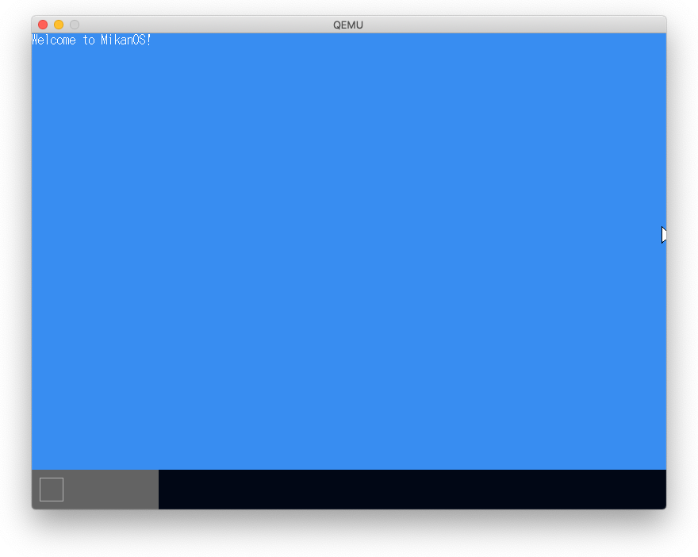
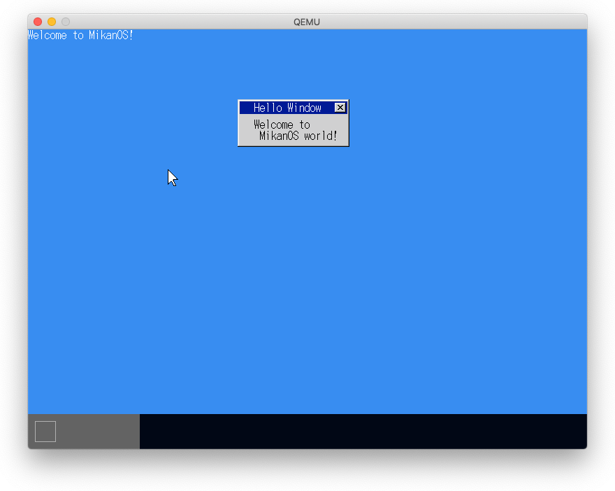
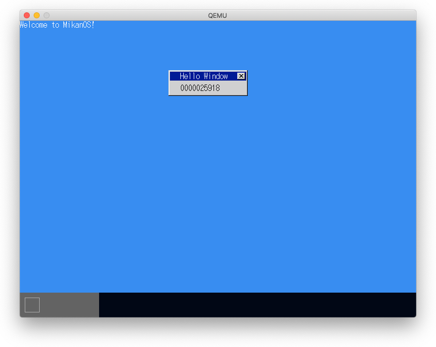
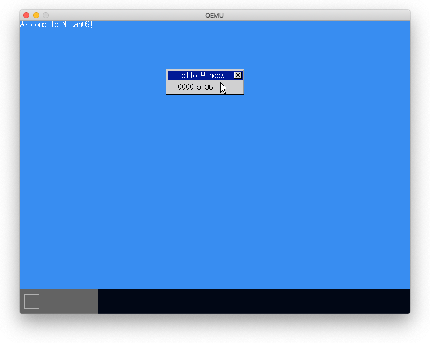
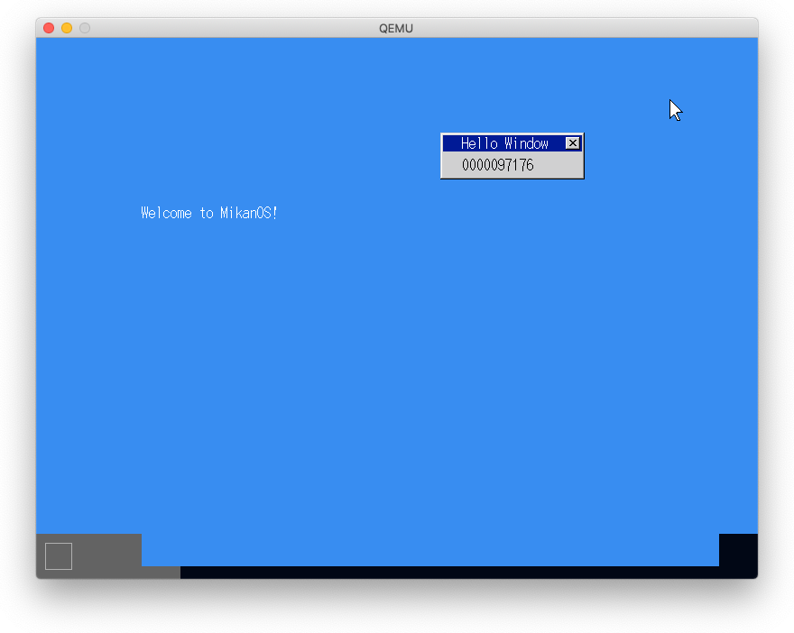
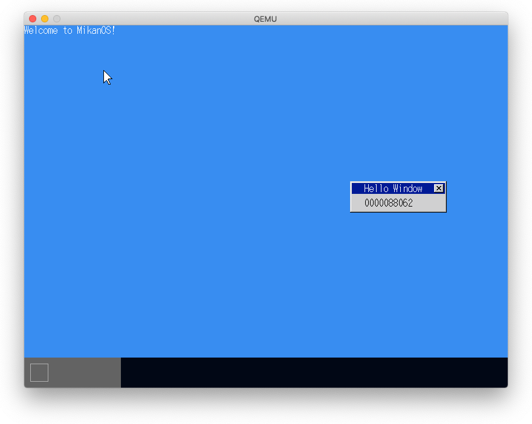

# 10.1 マウスをウィンドウ内に収める

- 右端で止まるがカーソルの右側が画面の左側に描画される


- 次の修正で治った。

```
diff --git a/kernel/window.cpp b/kernel/window.cpp
index 746b909..3e8de12 100644
--- a/kernel/window.cpp
+++ b/kernel/window.cpp
@@ -38,7 +38,7 @@ void Window::DrawTo(FrameBuffer &dst, Vector2D<int> position)
              x < std::min(Width(), writer.Width());
              ++x) {
             const auto c = At(Vector2D<int>{x, y});
-            if (c != tc) {
+            if (c != tc && position.x + x < writer.Width()) {
                 writer.Write(position + Vector2D<int>{x, y}, c);
             }
         }
```

**注**: day10dの修正でこの変更は不要になった。



# 10.2 はじめてのウィンドウ

- ウィンドウは新たなレイヤーに新たなウィンドウを作成すれば良い。



# 10.3 高速カウンタ

- 作成したウィンドウの表示アイテムとしてカウンタをつける。
- カウンタが更新されるたびにウィンドウの再描画が発生し、その処理が重いため画面がチラつく。



# 10.4 チラチラ解消

- 必要のあるウィンドウだけを更新することにより処理を軽減する。
- ウィンドウのinterscetionの計算。
- 更新のあった矩形領域のみFrameBufferにコピー。



# 10.5 バッグバッファ

- 各レイヤーを順に更新するとマウスがあったりなかったりでチラツキ発生。
- バックバッファを用意し、一旦すべてのレイヤーをバックバッファに書き込む。
- 下記も込処理が終わったバックバッファをフレームバッファに転送して画面描画。すべてのレイヤーの書き込みは終わっているのでチラツカない。

# 10.6 ウィンドウのドラッグ移動

- マウスボタンが押された位置にあるウィンドウのレイヤーを特定する。
- そのレイヤー以上のレイヤをマウス相対で移動する。
- 動いては困るレイヤーも移動する。



#  10.7 ウィンドウだけドラッグ移動

- レイヤーにドラッグ可能フラグを設け、可能なレイヤーのみ動かす。
- 今のところ、ウィンドウ内のどこを掴んでもドラッグできる。


