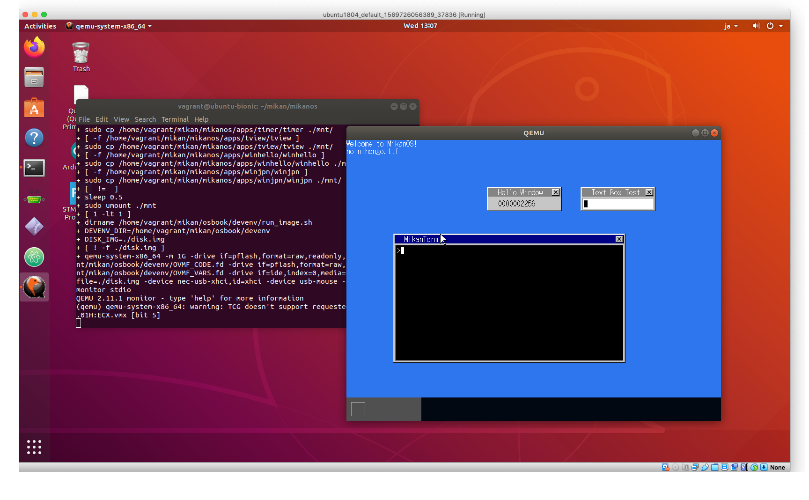

# 開発環境の構築

作業はubuntu18.04で行うことにした。開発環境の高地は[micanos-build](https://github.com/uchan-nos/mikanos-build)に
従った。

```
$ sudo apt update
$ sudo apt upgrade
$ sudo apt install ansible
$ mkdir mikan && cd mikan
$ git clone https://github.com/uchan-nos/mikanos-build.git osbook
$ cd osbook/devenv
$ ansible-playbook -K -i ansible_inventory ansible_provision.yml
SUDO password:

PLAY [all] *********************************************************************

TASK [Gathering Facts] *********************************************************
ok: [localhost]

TASK [ensure development tools are at the latest version] **********************
changed: [localhost]

TASK [check whether qemu-system-gui exists] ************************************
fatal: [localhost]: FAILED! => {"changed": true, "cmd": ["dpkg-query", "--show", "qemu-system-gui"], "delta": "0:00:00.071166", "end": "2021-03-24 11:04:48.819326", "msg": "non-zero return code", "rc": 1, "start": "2021-03-24 11:04:48.748160", "stderr": "dpkg-query: no packages found matching qemu-system-gui", "stderr_lines": ["dpkg-query: no packages found matching qemu-system-gui"], "stdout": "", "stdout_lines": []}
...ignoring

TASK [install qemu gui package if exists] **************************************
skipping: [localhost]

TASK [set llvm 7 as default] ***************************************************
changed: [localhost] => (item=llvm-PerfectShuffle)
~~~~~~
changed: [localhost] => (item=clang-cpp)

TASK [clone EDK II repository] *************************************************
changed: [localhost]

TASK [build EDK II base tools] *************************************************
changed: [localhost]

TASK [download standard libraries] *********************************************
fatal: [localhost]: FAILED! => {"changed": false, "msg": "dest '/home/vagrant/osbook/devenv' must be an existing dir"}
	to retry, use: --limit @/home/vagrant/mikan/osbook/devenv/ansible_provision.retry

PLAY RECAP *********************************************************************
localhost                  : ok=6    changed=5    unreachable=0    failed=1
$
```

- qemu-sys-guiがないのはubuntu-serverパッケージを使っているからだと思う。無視して大丈夫だろ。
- osbookは$HOME直下にあるとansible_provision.ymlに直書きされている。とりあえず素直にディレクトリを移動した。
- retryは同じコマンドに--limit以下を追加すれば良いそうだ。

```
$ cd && mv mikan/osbook osbook
$ cd osbook/devenv
$ ansible-playbook -K -i ansible_inventory ansible_provision.yml --limit @/home/vagrant/mikan/osbook/devenv/ansible_provision.retry
SUDO password:
ERROR! Unexpected Exception, this is probably a bug: [Errno 2] No such file or directory: u'/home/vagrant/mikan/osbook/devenv/ansible_provision.retry'
to see the full traceback, use -vvv
```

- u'/home/vagrant/mikan/osbook/devenv/ansible_provision.retry'がどこかのキャッシュに書かれているのかと探しまくったんが、なんのことはない
  --limitの引数として自分で指定していた。初物は余計な手間がかかる。

```
$ ansible-playbook -K -i ansible_inventory ansible_provision.yml --limit @/home/vagrant/osbook/devenv/ansible_provision.retry
SUDO password:

PLAY [all] *******************************************************************************

TASK [Gathering Facts] *******************************************************************
ok: [localhost]

TASK [ensure development tools are at the latest version] ********************************
ok: [localhost]

TASK [check whether qemu-system-gui exists] **********************************************
fatal: [localhost]: FAILED! => {"changed": true, "cmd": ["dpkg-query", "--show", "qemu-system-gui"], "delta": "0:00:00.033956", "end": "2021-03-24 11:56:24.353975", "msg": "non-zero return code", "rc": 1, "start": "2021-03-24 11:56:24.320019", "stderr": "dpkg-query: no packages found matching qemu-system-gui", "stderr_lines": ["dpkg-query: no packages found matching qemu-system-gui"], "stdout": "", "stdout_lines": []}
...ignoring

TASK [install qemu gui package if exists] ************************************************
skipping: [localhost]

TASK [set llvm 7 as default] *************************************************************
ok: [localhost] => (item=llvm-PerfectShuffle)
~~~~~~
ok: [localhost] => (item=clang-cpp)


TASK [clone EDK II repository] ***********************************************************
ok: [localhost]

TASK [build EDK II base tools] ***********************************************************
changed: [localhost]

TASK [download standard libraries] *******************************************************
changed: [localhost]

TASK [configure display variable if WSL1] ************************************************
skipping: [localhost]

TASK [configure display variable if WSL2] ************************************************
skipping: [localhost]

PLAY RECAP *******************************************************************************
localhost                  : ok=7    changed=3    unreachable=0    failed=0
```

## 環境確認

```
$ iasl -v

Intel ACPI Component Architecture
ASL+ Optimizing Compiler/Disassembler version 20180105
Copyright (c) 2000 - 2018 Intel Corporation
$ ls $HOME/edk2
$ ls $HOME/edk2
ArmPkg            FatPkg               pip-requirements.txt
ArmPlatformPkg    FmpDevicePkg         ReadMe.rst
ArmVirtPkg        IntelFsp2Pkg         RedfishPkg
BaseTools         IntelFsp2WrapperPkg  SecurityPkg
Conf              License-History.txt  ShellPkg
CONTRIBUTING.md   License.txt          SignedCapsulePkg
CryptoPkg         Maintainers.txt      SourceLevelDebugPkg
DynamicTablesPkg  MdeModulePkg         StandaloneMmPkg
edksetup.bat      MdePkg               UefiCpuPkg
edksetup.sh       NetworkPkg           UefiPayloadPkg
EmbeddedPkg       OvmfPkg              UnitTestFrameworkPkg
EmulatorPkg       PcAtChipsetPkg
```

## MikanOSの入手

mikanディレクトリに関連ディレクトリをまとめてからmikanosソースコードを入手

```
$ cd  $HOME && mkdir mikan
$ mv edk2 osbook mikan && cd mikan
$ git clone https://github.com/uchan-nos/mikanos.git
$ ls
edk2  mikanos  osbook
```

# ブートローダーのビルド

```
$ cd edk2
$ ln -s ../mikanos/MikanLoaderPkg ./
$ ls MikanLoaderPkg/Main.c
MikanLoaderPkg/Main.c
$ source edksetup.sh
Using EDK2 in-source Basetools
WORKSPACE: /home/vagrant/mikan/edk2
EDK_TOOLS_PATH: /home/vagrant/mikan/edk2/BaseTools
CONF_PATH: /home/vagrant/mikan/edk2/Conf
Copying $EDK_TOOLS_PATH/Conf/build_rule.template
     to /home/vagrant/mikan/edk2/Conf/build_rule.txt
Copying $EDK_TOOLS_PATH/Conf/tools_def.template
     to /home/vagrant/mikan/edk2/Conf/tools_def.txt
Copying $EDK_TOOLS_PATH/Conf/target.template
     to /home/vagrant/mikan/edk2/Conf/target.txt

$ vi Conf/target.txt
ACTIVE_PLATFORM = MikanLoaderPkg/MikanLoaderPkg.dsc
TARGET = DEBUG
TARGET_ARCH = X64
TOOL_CHAIN_TAG = CLANG38

$ build
Build environment: Linux-4.15.0-128-generic-x86_64-with-Ubuntu-18.04-bionic
Build start time: 12:32:07, Mar.24 2021

WORKSPACE        = /home/vagrant/mikan/edk2
EDK_TOOLS_PATH   = /home/vagrant/mikan/edk2/BaseTools
CONF_PATH        = /home/vagrant/mikan/edk2/Conf
PYTHON_COMMAND   = /usr/bin/python3.6


Architecture(s)  = X64
Build target     = DEBUG
Toolchain        = CLANG38

Processing meta-data .
Active Platform          = /home/vagrant/mikan/edk2/MikanLoaderPkg/MikanLoaderPkg.dsc
 done!
Building ... /home/vagrant/mikan/edk2/MdePkg/Library/UefiApplicationEntryPoint/UefiApplicationEntryPoint.inf [X64]
~~~~

- Done -
Build end time: 12:32:16, Mar.24 2021
Build total time: 00:00:10

$ ls -l Build/MikanLoaderX64/DEBUG_CLANG38/X64/Loader.efi
-rw-rw-r-- 1 vagrant vagrant 12032 Mar 24 12:32 Build/MikanLoaderX64/DEBUG_CLANG38/X64/Loader.efi
```

# MikanOSのビルド

```
$ cd $HOME/mikan/mikanos
$ git checkout -b working
$ vi build.sh
$ git diff
diff --git a/build.sh b/build.sh
index bdb803a..1ea04a0 100755
--- a/build.sh
+++ b/build.sh
@@ -9,9 +9,9 @@ do
   make ${MAKE_OPTS:-} -C $APP_DIR $APP
 done

-DISK_IMG=./disk.img MIKANOS_DIR=$PWD $HOME/osbook/devenv/make_mikanos_image.sh
+DISK_IMG=./disk.img MIKANOS_DIR=$PWD $HOME/mikan/osbook/devenv/make_mikanos_image.sh

 if [ "${1:-}" = "run" ]
 then
-  $HOME/osbook/devenv/run_image.sh ./disk.img
+  $HOME/mikan/osbook/devenv/run_image.sh ./disk.img
 fi

 $ ./build.sh
make: Entering directory '/home/vagrant/mikan/mikanos/kernel'
clang++ -I. -O2 -Wall -g --target=x86_64-elf -ffreestanding -mno-red-zone -fno-exceptions -fno-rtti -std=c++17 -MM usb/classdriver/mouse.cpp > usb/classdriver/.mouse.d
In file included from usb/classdriver/mouse.cpp:1:
./usb/classdriver/mouse.hpp:9:10: fatal error: 'functional' file not found
#include <functional>
```

## C++関係が見えていない。

環境変数の読み込みを忘れていた。ついでにshスクリプトのディレクトリを変更

```
$ cd $HOME/mikan/osbook/devenv
$ vi buildenv.sh
$ vi make_mikanos_image.sh
$ git diff
diff --git a/devenv/buildenv.sh b/devenv/buildenv.sh
index beba499..4c3ca86 100644
--- a/devenv/buildenv.sh
+++ b/devenv/buildenv.sh
@@ -1,5 +1,5 @@
 # Usage: source buildenv.sh

-BASEDIR="$HOME/osbook/devenv/x86_64-elf"
+BASEDIR="$HOME/mikan/osbook/devenv/x86_64-elf"
 export CPPFLAGS="-I$BASEDIR/include/c++/v1 -I$BASEDIR/include -I$BASEDIR/include/freetype2 -nostdlibinc -D__ELF__ -D_LDBL_EQ_DBL -D_GNU_SOURCE -D_POSIX_TIMERS"
 export LDFLAGS="-L$BASEDIR/lib"
diff --git a/devenv/make_mikanos_image.sh b/devenv/make_mikanos_image.sh
index 4607e28..7fb0f53 100755
--- a/devenv/make_mikanos_image.sh
+++ b/devenv/make_mikanos_image.sh
@@ -15,10 +15,10 @@ then
       echo "Usage: $0 <day>"
       exit 1
   fi
-  MIKANOS_DIR="$HOME/osbook/$1"
+  MIKANOS_DIR="$HOME/mikan/osbook/$1"
 fi

-LOADER_EFI="$HOME/edk2/Build/MikanLoaderX64/DEBUG_CLANG38/X64/Loader.efi"
+LOADER_EFI="$HOME/mikan/edk2/Build/MikanLoaderX64/DEBUG_CLANG38/X64/Loader.efi"
 KERNEL_ELF="$MIKANOS_DIR/kernel/kernel.elf"

 $DEVENV_DIR/make_image.sh $DISK_IMG $MOUNT_POINT $LOADER_EFI $KERNEL_ELF
```

## ビルドをやり直し

```
$ source $HOME/mikan/osbook/devenv/buildenv.sh
$ cd $HOME/mikan/mikanos
$ ./build.sh
vagrant@ubuntu-bionic:~/mikan/mikanos$ ./build.sh
make: Entering directory '/home/vagrant/mikan/mikanos/kernel'
clang++ -I/home/vagrant/mikan/osbook/devenv/x86_64-elf/include/c++/v1 -I/home/vagrant/mikan/osbook/devenv/x86_64-elf/include -I/home/vagrant/mikan/osbook/devenv/x86_64-elf/include/freetype2 -nostdlibinc -D__ELF__ -D_LDBL_EQ_DBL -D_GNU_SOURCE -D_POSIX_TIMERS -I. -O2 -Wall -g --target=x86_64-elf -ffreestanding -mno-red-zone -fno-exceptions -fno-rtti -std=c++17 -c main.cpp -o main.o
~~~~~
+ [  !=  ]
+ sleep 0.5
+ sudo umount ./mnt
$ ./build.sh run
~~~~
+ qemu-system-x86_64 -m 1G -drive if=pflash,format=raw,readonly,file=/home/vagrant/mikan/osbook/devenv/OVMF_CODE.fd -drive if=pflash,format=raw,file=/home/vagrant/mikan/osbook/devenv/OVMF_VARS.fd -drive if=ide,index=0,media=disk,format=raw,file=./disk.img -device nec-usb-xhci,id=xhci -device usb-mouse -device usb-kbd -monitor stdio
QEMU 2.11.1 monitor - type 'help' for more information
(qemu) qemu-system-x86_64: warning: TCG doesn't support requested feature: CPUID.01H:ECX.vmx [bit 5]
Could not initialize SDL(No available video device) - exiting
```

## MikanOSはGUIシステムだった

guiモードでubuntuを立ち上げてやり直したらできていた。

```
$ ./build.sh run
~~~~
+ qemu-system-x86_64 -m 1G -drive if=pflash,format=raw,readonly,file=/home/vagrant/mikan/osbook/devenv/OVMF_CODE.fd -drive if=pflash,format=raw,file=/home/vagrant/mikan/osbook/devenv/OVMF_VARS.fd -drive if=ide,index=0,media=disk,format=raw,file=./disk.img -device nec-usb-xhci,id=xhci -device usb-mouse -device usb-kbd -monitor stdio
QEMU 2.11.1 monitor - type 'help' for more information
(qemu) qemu-system-x86_64: warning: TCG doesn't support requested feature: CPUID.01H:ECX.vmx [bit 5]

(qemu) quit
```


