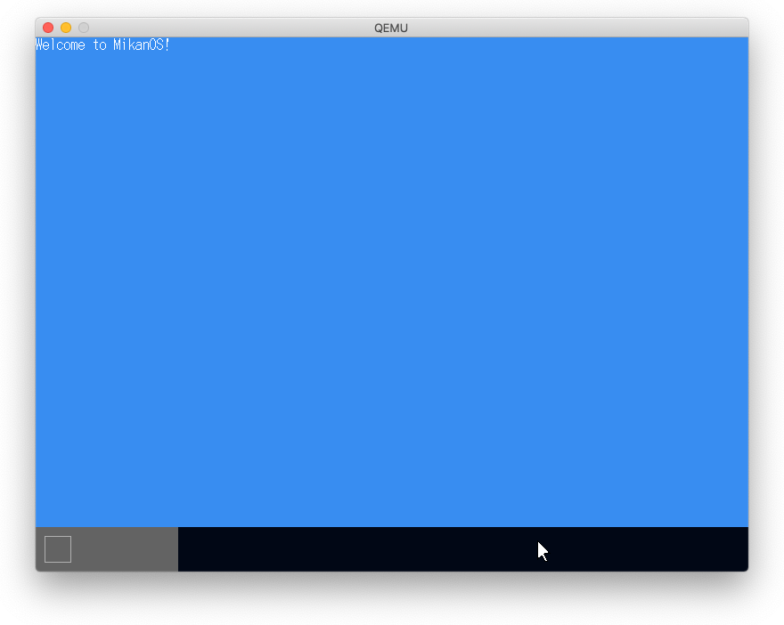
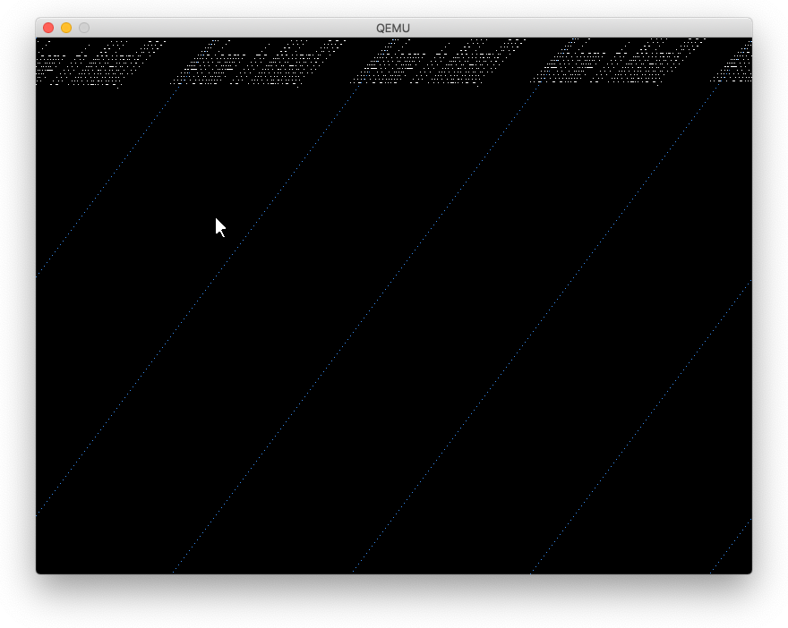
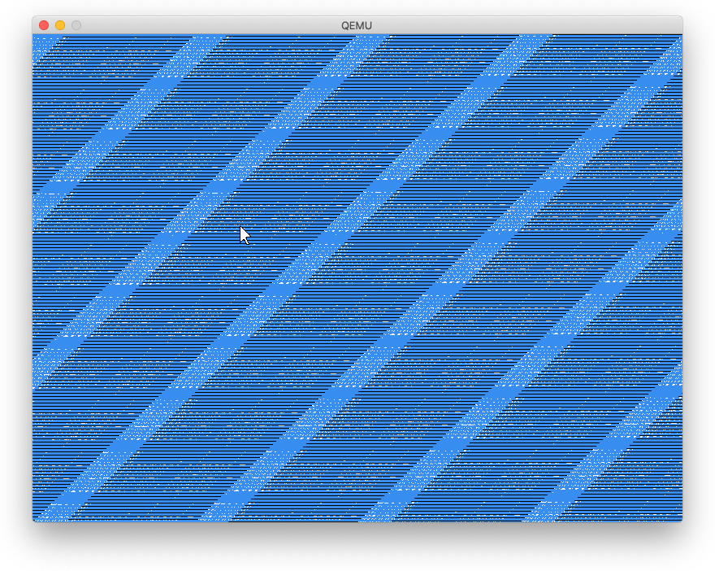
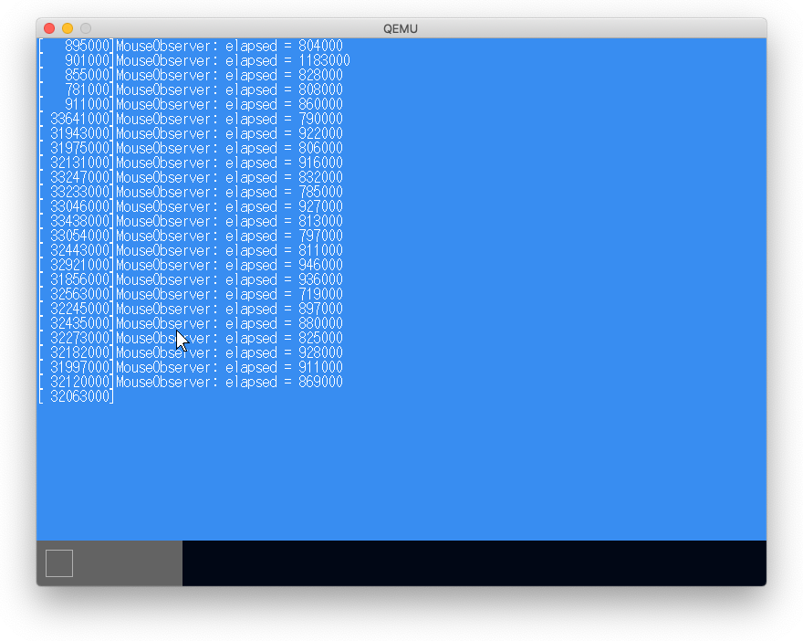

# 9.1 重ね合わせ処理

## 9.2 new演算子

`newlib_support.c#sbrk()`を実装することにより配置newでなくnew演算子が利用できるようになる。

## 9.3 重ね合わせ処理の原理

- レイヤーを導入し、マウスカーソルとコンソールに別のレイヤーとする。
- 任意の大きさの描画領域であるウィンドウを導入しレイヤーに置く。
- マウスカーソルなどの不定形な形には透過色を導入し、透過色を持つピクセルは描画しないことにより四角形のウィンドウで管理できる。
- 複数のレイヤーの上下関係をコントロールして重ね合わせを実現する。
  - コンソールレイヤーを下に、マウスカーソルレイヤーを上に置く。



ただし、この段階ではマウスの動きがぎこちない。

## 9.4 時間計測

LAPICTimer(Local APICタイマ)を利用。


## 9.5 車道バッファによる高速化

エラー発生

### マウスを動かす前



### マウスを動かした場合



### typeが2箇所あった。

1. graphics.cpp#FillRectangle()でtypo
  ```
  誤  writer.Write(pos + Vector2D<int>{dy, dy}, c);
  正  writer.Write(pos + Vector2D<int>{dx, dy}, c);
  ```
2. frame_buffer.cpp#Copy()でtypo
  ```
  誤  src_buf += bytes_per_pixel + src.config_.pixels_per_scan_line;
  正  src_buf += bytes_per_pixel * src.config_.pixels_per_scan_line;
  ```


### シャドウバッファ

- ピクセルを毎回書くのでなく、フレームバッファと同形式のシャドウバッファに書き込み
- シャドウバッファからフレームバッファにmemcpy()することにより描画することで高速化する。

30数倍高速化した。

## 9.6 スクロール処理の時間測定



## 9.7 スクロール処理の高速化

### ピクセル移動

- スクロールごとに全画面更新するのではなく
- 2行目から最終行を1行目から(最終行 -1)にmemcpy()
- 最終行だけピクセルを描く

15倍程度高速化した。


