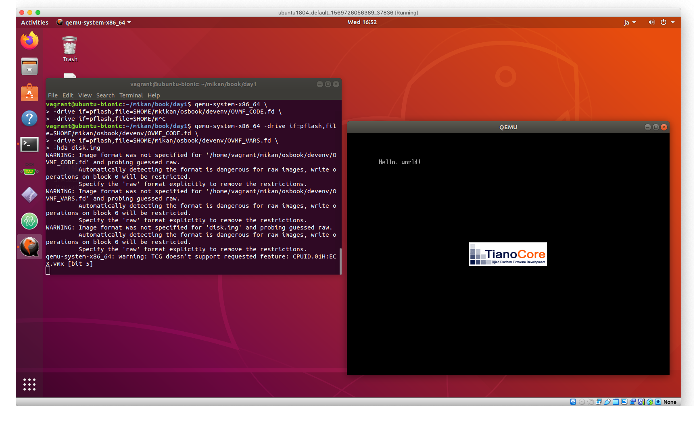

# 第1章

## BOOTX64.EFIを作成

Ubuntu

```
$ mkdir -p $HOME/mikan/book/day1
```

Macで作成

```
$ dd if=/dev/zero of=./BOOTX64.EFI ibs=0x600 count=1
$ 0XED
$ scp BOOTX64.EFI ubuntu18:/home/vagrant/mikan/book/day1/
```

Ubuntu

```
$ cd $HOME/mikan/book/day1
$ ls
BOOTX64.EFI
$ sum BOOTX64.EFI
12430     2
$ qemu-img create -f raw disk.img 200M
Formatting 'disk.img', fmt=raw size=209715200
$ mkfs.fat -n 'MIKAN OS' -s 2 -f 2 -R 32 -F 32 disk.img
mkfs.fat 4.1 (2017-01-24)
$ mkdir -p mnt
$ sudo mount -o loop disk.img mnt
$ sudo mkdir -p mnt/EFI/BOOT
$ sudo cp BOOTX64.EFI mnt/EFI/BOOT/BOOTX64.EFI
$ sudo umount mnt
$ qemu-system-x86_64 \
> -drive if=pflash,file=$HOME/mikan/osbook/devenv/OVMF_CODE.fd \
> -drive if=pflash,file=$HOME/mikan/osbook/devenv/OVMF_VARS.fd \
> -hda disk.img
WARNING: Image format was not specified for '/home/vagrant/mikan/osbook/devenv/OVMF_CODE.fd' and probing guessed raw.
         Automatically detecting the format is dangerous for raw images, write operations on block 0 will be restricted.
         Specify the 'raw' format explicitly to remove the restrictions.
WARNING: Image format was not specified for '/home/vagrant/mikan/osbook/devenv/OVMF_VARS.fd' and probing guessed raw.
         Automatically detecting the format is dangerous for raw images, write operations on block 0 will be restricted.
         Specify the 'raw' format explicitly to remove the restrictions.
WARNING: Image format was not specified for 'disk.img' and probing guessed raw.
         Automatically detecting the format is dangerous for raw images, write operations on block 0 will be restricted.
         Specify the 'raw' format explicitly to remove the restrictions.
qemu-system-x86_64: warning: TCG doesn't support requested feature: CPUID.01H:ECX.vmx [bit 5]
```

warningはでているが問題はなさそう。表示されるまで数秒かかったが`hello world!`が表示された。



## c言語によるhello world

```
$ cd $HOME/mikan/osbook/day01/c
$ clang -target x86_64-pc-win32-coff \
> -mno-red-zone -fno-stack-protector -fshort-wchar -Wall -c hello.c
$ ls
hello.c  hello.o  Makefile
$ lld-link /subsystem:efi_application /entry:EfiMain /out:hello.efi hello.o
$ ls
hello.c  hello.efi  hello.o  Makefile
$ file hello.efi
hello.efi: PE32+ executable (EFI application) x86-64, for MS Windows
$ file hello.o
hello.o: data
$ mkdir -p mnt
$ sudo mount -o loop disk.img mnt
$ ls mnt/EFI/BOOT
BOOTX64.EFI
$ sudo rm mnt/EFI/BOOT/BOOTX64.EFI
$ sudo cp hello.efi mnt/EFI/BOOT/hello.efi
$ sudo umount mnt
$ qemu-system-x86_64 -drive if=pflash,file=$HOME/mikan/osbook/devenv/OVMF_CODE.fd -drive if=pflash,file=$HOME/mikan/osbook/devenv/OVMF_VARS.fd -hda disk.img
```

- ブートロダの名前を`hello.efi`のままで実行したら、`hello world!`は現れず。
- BOOTX64.EFIにrenameしたところ表示された。
- `run_qemu.sh`を使用した場合も問題なく表示された。

```
$ $HOME/mikan/osbook/devenv/run_qemu.sh hello.efi
+ [ 1 -lt 1 ]
+ dirname /home/vagrant/mikan/osbook/devenv/run_qemu.sh
+ DEVENV_DIR=/home/vagrant/mikan/osbook/devenv
+ EFI_FILE=hello.efi
+ ANOTHER_FILE=
+ DISK_IMG=./disk.img
+ MOUNT_POINT=./mnt
+ /home/vagrant/mikan/osbook/devenv/make_image.sh ./disk.img ./mnt hello.efi
+ [ 3 -lt 3 ]
+ dirname /home/vagrant/mikan/osbook/devenv/make_image.sh
+ DEVENV_DIR=/home/vagrant/mikan/osbook/devenv
+ DISK_IMG=./disk.img
+ MOUNT_POINT=./mnt
+ EFI_FILE=hello.efi
+ ANOTHER_FILE=
+ [ ! -f hello.efi ]
+ rm -f ./disk.img
+ qemu-img create -f raw ./disk.img 200M
Formatting './disk.img', fmt=raw size=209715200
+ mkfs.fat -n MIKAN OS -s 2 -f 2 -R 32 -F 32 ./disk.img
mkfs.fat 4.1 (2017-01-24)
+ /home/vagrant/mikan/osbook/devenv/mount_image.sh ./disk.img ./mnt
+ [ 2 -lt 2 ]
+ dirname /home/vagrant/mikan/osbook/devenv/mount_image.sh
+ DEVENV_DIR=/home/vagrant/mikan/osbook/devenv
+ DISK_IMG=./disk.img
+ MOUNT_POINT=./mnt
+ [ ! -f ./disk.img ]
+ mkdir -p ./mnt
+ sudo mount -o loop ./disk.img ./mnt
+ sudo mkdir -p ./mnt/EFI/BOOT
+ sudo cp hello.efi ./mnt/EFI/BOOT/BOOTX64.EFI
+ [  !=  ]
+ sleep 0.5
+ sudo umount ./mnt
+ /home/vagrant/mikan/osbook/devenv/run_image.sh ./disk.img
+ [ 1 -lt 1 ]
+ dirname /home/vagrant/mikan/osbook/devenv/run_image.sh
+ DEVENV_DIR=/home/vagrant/mikan/osbook/devenv
+ DISK_IMG=./disk.img
+ [ ! -f ./disk.img ]
+ qemu-system-x86_64 -m 1G -drive if=pflash,format=raw,readonly,file=/home/vagrant/mikan/osbook/devenv/OVMF_CODE.fd -drive if=pflash,format=raw,file=/home/vagrant/mikan/osbook/devenv/OVMF_VARS.fd -drive if=ide,index=0,media=disk,format=raw,file=./disk.img -device nec-usb-xhci,id=xhci -device usb-mouse -device usb-kbd -monitor stdio
QEMU 2.11.1 monitor - type 'help' for more information
(qemu) qemu-system-x86_64: warning: TCG doesn't support requested feature: CPUID.01H:ECX.vmx [bit 5]
```

### `hello.efi`で実行した場合


### `BOOTX64.EFI`にrenameした場合


### `run_qemu.sh`を実行した場合


## `run_qemu.sh`

```
./make_image.sh ./disk.img ./mnt $1
./run_image.sh ./disk.img
```

## `make_image.sh`

disk.imgを削除して再作成している。ブートローダ名はBOOTX64.EFIにrename。

```
rm -f ./disk.img
qemu-img create -f raw ./disk.img 200M
mkfs.fat -n 'MIKAN OS' -s 2 -f 2 -R 32 -F 32 $DISK_IMG

$DEVENV_DIR/mount_image.sh ./disk.img ./mnt
sudo mkdir -p ./mnt/EFI/BOOT
sudo cp $EFI_FILE ./mnt/EFI/BOOT/BOOTX64.EFI
sleep 0.5
sudo umount ./mnt
```

## `run_image.sh`

- qemu-system-x86_64を実行しているだけ。
- format=rawでwarningを消している

```
qemu-system-x86_64 \
    -m 1G \
    -drive if=pflash,format=raw,readonly,file=$DEVENV_DIR/OVMF_CODE.fd \
    -drive if=pflash,format=raw,file=$DEVENV_DIR/OVMF_VARS.fd \
    -drive if=ide,index=0,media=disk,format=raw,file=./disk.img \
    -device nec-usb-xhci,id=xhci \
    -device usb-mouse -device usb-kbd \
    -monitor stdio \
    $QEMU_OPTS
```
