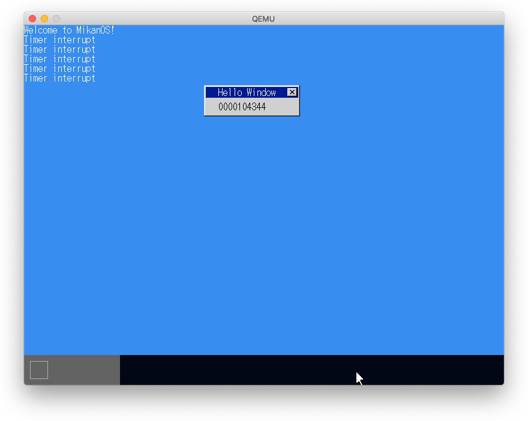
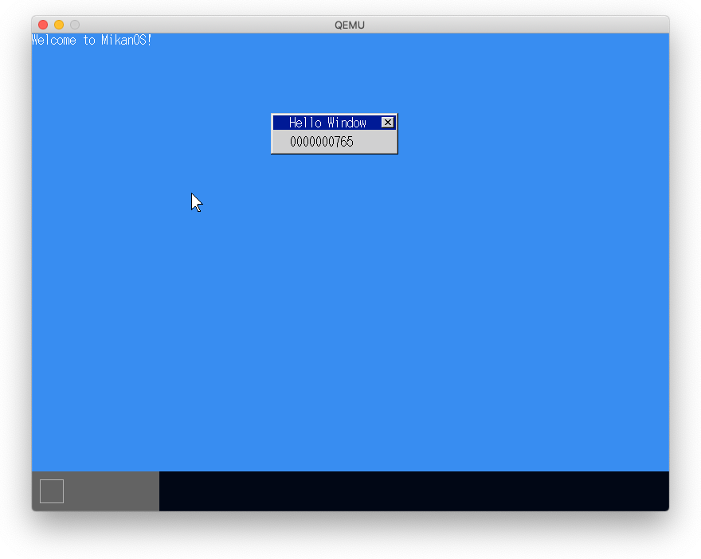
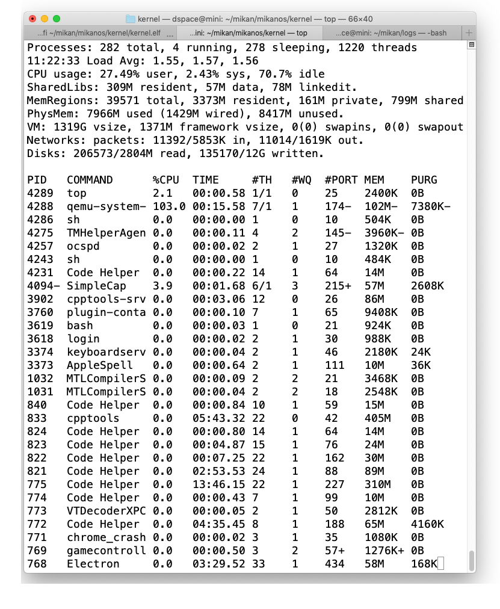
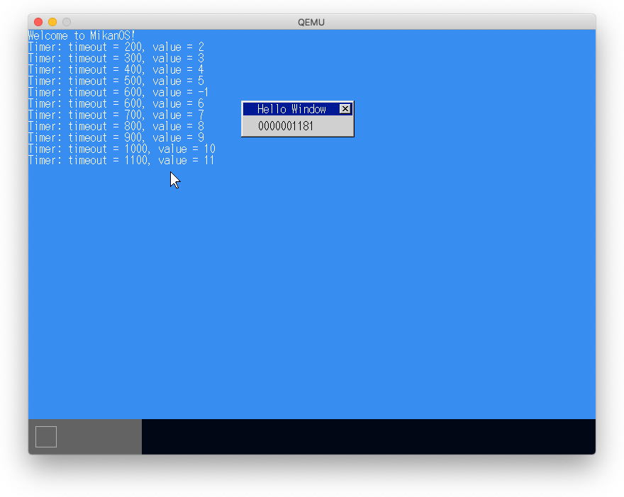

# 11.1 ソースコード整理

- main.cppにある各種初期化コードを`InitializeXXX()`として独立させる。
- testディレクトリが削除された。

# 11.2 タイマ割り込み

- タイマを周期モードにして割り込みを発生させる。

# 11.3 細かく時間を計る

- 割り込み周期を短くし、割り込み時にTickを増分
- 割り込み初期値を変えることで測定時間を変更できる

- イベントがない場合に`hlt`することでcpuタイムを削減

## `hlt`しない場合

## `hlt`した場合

# 11.4 複数のタイマとタイムアウト通知

- 優先度付きキューで複数のタイマを管理
- タイムアウトでタイマの優先度を決定
- Tick()でタイムアウト処理を行う

# 11.5 - 12.2 ACPI PMタイマによる1秒タイマ

- ACPI PMタイマのアドレスはFADTにある
- FADTはUEFIが知っており、RSDP->XSDT->FADTの順に探す
- UefiMain()の第2引数として渡されているsytem_tableから辿れる
- ACPI PMタイマは3.579545MHz
- ACPI PMが100ミリ秒進む間のLAPCIタイマのTick数を数えて10倍して1秒タイマとする。

