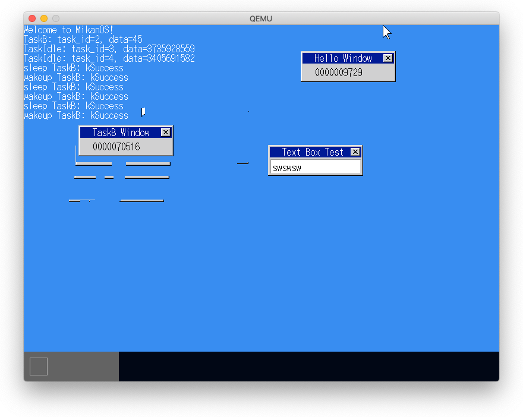
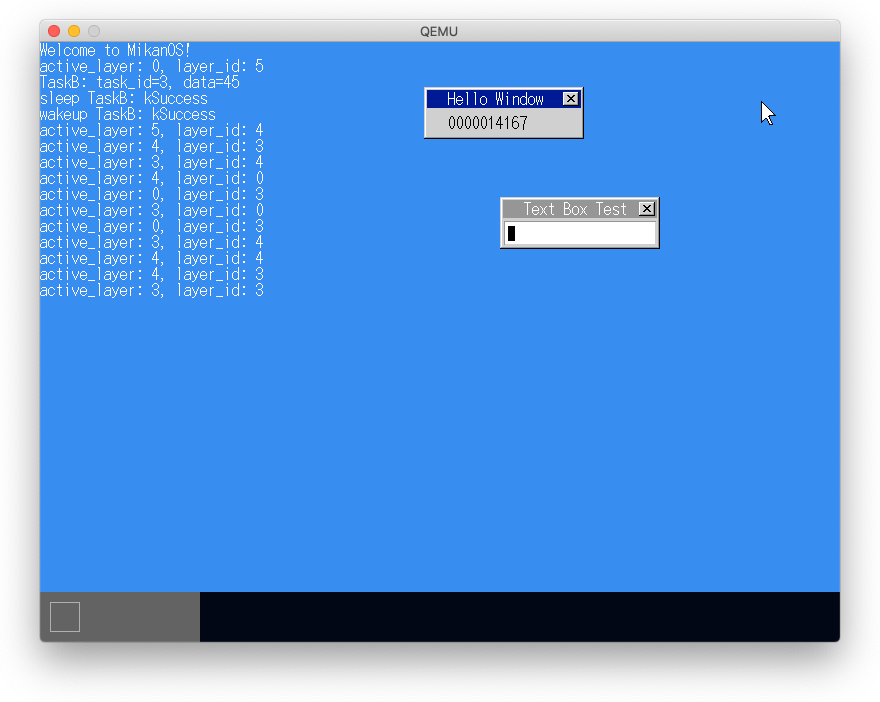
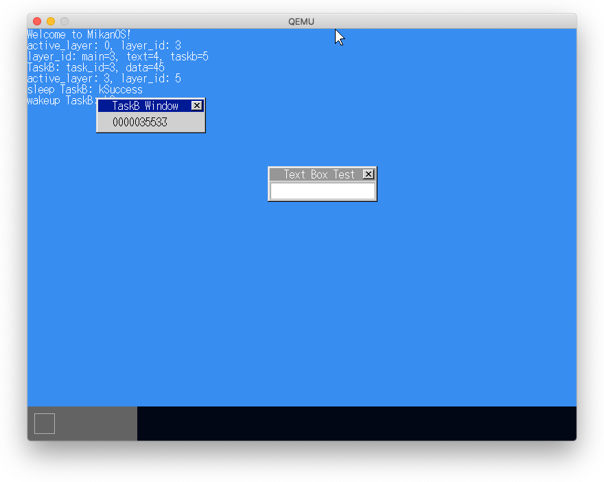
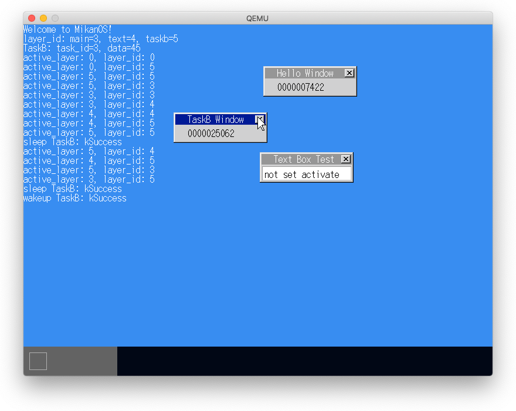
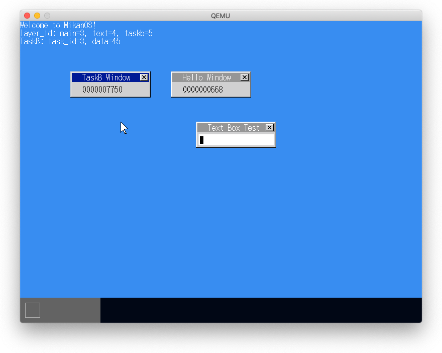
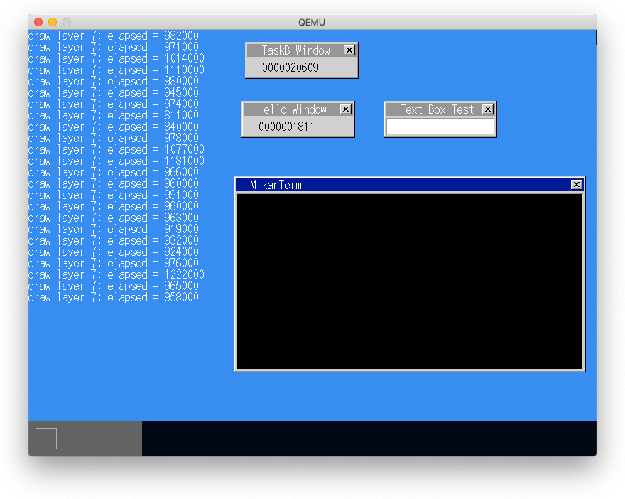
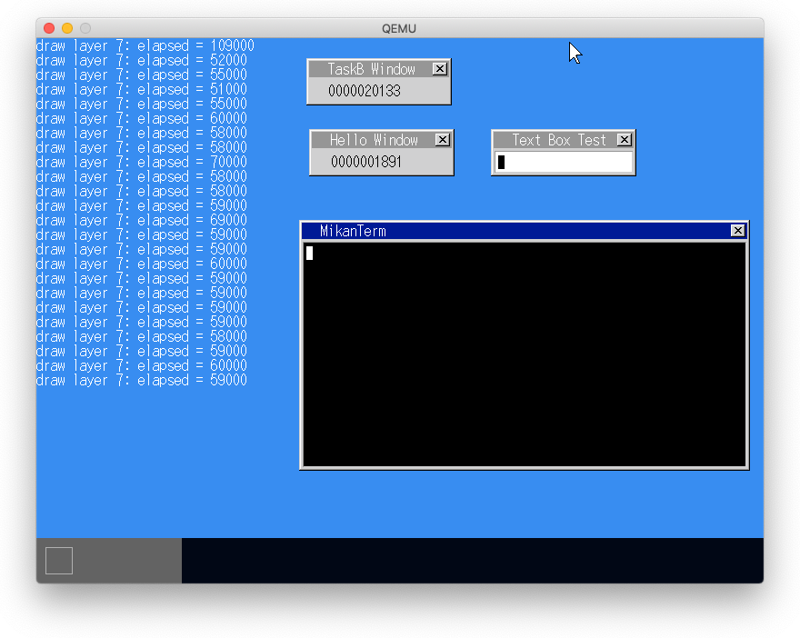

# 15.1 ウィンドウ描画はメインスレッドで

TaskBの`layer_manager->Draw()`と`layer_manager->MoveRelative()`でデータ競合が発生し、描画にゴミが残っていた。

このバグの解消には次の２つの方法があるが、ここでは２の方法を採用する。

1. 両者で割込み禁止で処理するか、
2. ウィンドウ処理専用のタスクに処理を投げて処理させる。

# 15.2 アクティブウィンドウ

- TaskBウィンドウが表示されない。
  - 表示はされないがアクティブウィンドウとなっていてSleep, Wakeupはできる。
  - ただし、一旦別のウィンドウをアクティブにするとTaskBはウィンドウがないのでアクティブにできず、Sleep, Wakeupはできななくなる。
- `main.cpp`でTaskBの代わりにmain_windowをアクティブにするとTaskBウィンドウは表示され、main_windowが表示されなくなる。
- 結局、`main.cpp`でアクティブウィンドウを指定しなければすべてのウィンドウが表示され、クリックによるアクティブ化は問題なく動く。

**追記**: 問題はactivateする場所だった。activateしたレイヤーはマウスレイヤーの１つ下に置かれるが、デフォルトの位置でactivateすると、まだマウスレイヤーが作成されておらず`mouse_layer_=0`なのでactivenにしたWindowのレイヤーが-1になるためだと思われる。マウスレイヤーは`InitializeMouse()`で作成されるので、その後でactivateすればアクティブ状態で表示される。

## `active_layer->Activate(task_b_window_layer_id);`

## `active_layer->Activate(main_window_layer_id);`

## 指定なし

## InitializeMouse()の後にactivate

# 15.3 ターミナルウィンドウ

# 15.4 描画の高速化

- カーソル部分のみ再描画することで高速化
- おおよそ16倍の高速化

