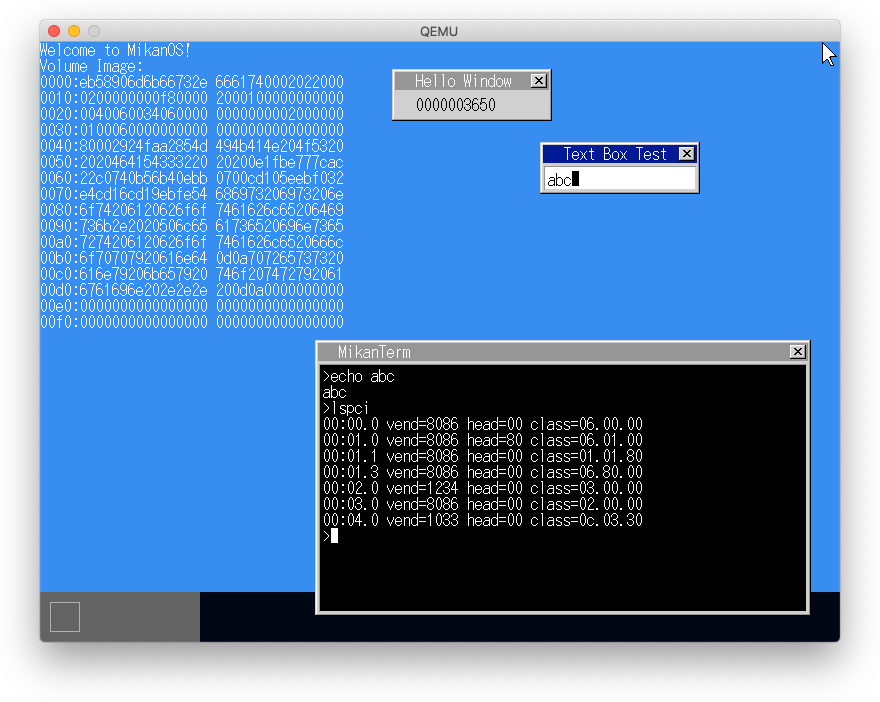
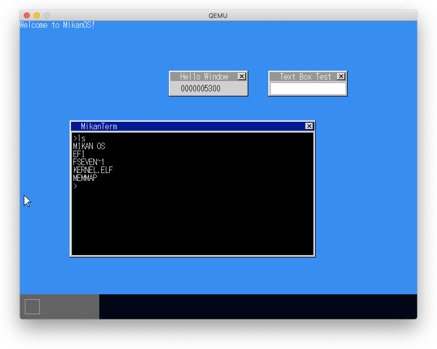

# 17.1 ファイルとファイルシステム

## fat32イメージを作成してマウント、ファイルを一つ作成。

```
$ dd if=/dev/zero of=fat_disk bs=1M count=128
dd: bs: illegal numeric value
$ dd if=/dev/zero of=fat_disk bs=1048576 count=128
128+0 records in
128+0 records out
134217728 bytes transferred in 0.162329 secs (826825535 bytes/sec)
$ mkfs.fat -n 'MIKAN OS' -s 2 -f 2 -R 32 -F 32 fat_disk
mkfs.fat 4.2 (2021-01-31)
$ hdiutil attach -mountpoint ./mnt ./fat_disk
hdiutil: attach failed - イメージを認識できません
$ mv fat_disk fat_disk.img                              # 拡張子.imgを付けてみた
$ hdiutil attach -mountpoint ./mnt ./fat_disk.img       # mount成功
/dev/disk2      /Users/dspace/mikan/logs/mnt
$ echo deadbeef > cafe.txt
$ cp cafe.txt mnt/cafe.txt
$ ls mnt
cafe.txt
$ hdiutil detach ./mnt
"disk2" ejected.

$ xxd fat_disk.img
00004000: f8ff ff0f ffff ff0f f8ff ff0f ffff ff0f  ................
00004010: ffff ff0f ffff ff0f ffff ff0f ffff ff0f  ................
*
00083000: f8ff ff0f ffff ff0f f8ff ff0f ffff ff0f  ................
00083010: ffff ff0f ffff ff0f ffff ff0f ffff ff0f  ................
*
00102000: 4d49 4b41 4e20 4f53 2020 2008 0000 c164  MIKAN OS   ....d
00102010: 9152 9152 0000 f964 9152 0000 0000 0000  .R.R...d.R......
00102020: 412e 0066 0073 0065 0076 000f 00da 6500  A..f.s.e.v....e.
00102030: 6e00 7400 7300 6400 0000 0000 ffff ffff  n.t.s.d.........
00102040: 4653 4556 454e 7e31 2020 2012 0019 e064  FSEVEN~1   ....d
00102050: 9152 9152 0000 e064 9152 0300 0000 0000  .R.R...d.R......
00102060: 4341 4645 2020 2020 5458 5420 1861 f964  CAFE    TXT .a.d
00102070: 9152 9152 0000 f964 9152 0500 0900 0000  .R.R...d.R......
*
00102400: 2e20 2020 2020 2020 2020 2032 0019 e064  .          2...d
00102410: 9152 9152 0000 2265 9152 0300 0000 0000  .R.R.."e.R......
00102420: 2e2e 2020 2020 2020 2020 2010 0019 e064  ..         ....d
00102430: 9152 9152 0000 e064 9152 0000 0000 0000  .R.R...d.R......
00102440: 4264 0000 00ff ffff ffff ff0f 00da ffff  Bd..............
00102450: ffff ffff ffff ffff ffff 0000 ffff ffff  ................
00102460: 0166 0073 0065 0076 0065 000f 00da 6e00  .f.s.e.v.e....n.
00102470: 7400 7300 6400 2d00 7500 0000 7500 6900  t.s.d.-.u...u.i.
00102480: 4653 4556 454e 7e31 2020 2020 0019 e064  FSEVEN~1    ...d
00102490: 9152 9152 0000 2265 9152 0400 2400 0000  .R.R.."e.R..$...
001024a0: 4231 0035 0038 0000 00ff ff0f 001c ffff  B1.5.8..........
001024b0: ffff ffff ffff ffff ffff 0000 ffff ffff  ................
001024c0: 0130 0030 0030 0030 0030 000f 001c 3000  .0.0.0.0.0....0.
001024d0: 3000 3000 3000 3300 3600 0000 6100 3900  0.0.0.3.6...a.9.
001024e0: 3030 3030 3030 7e31 2020 2020 002e 2265  000000~1    .."e
001024f0: 9152 9152 0000 2265 9152 0600 4300 0000  .R.R.."e.R..C...
00102500: 4231 0035 0039 0000 00ff ff0f 003d ffff  B1.5.9.......=..
00102510: ffff ffff ffff ffff ffff 0000 ffff ffff  ................
00102520: 0130 0030 0030 0030 0030 000f 003d 3000  .0.0.0.0.0...=0.
00102530: 3000 3000 3000 3300 3600 0000 6100 3900  0.0.0.3.6...a.9.
00102540: 3030 3030 3030 7e32 2020 2020 002e 2265  000000~2    .."e
00102550: 9152 9152 0000 2265 9152 0700 4800 0000  .R.R.."e.R..H...
*
00102c00: 6465 6164 6265 6566 0a00 0000 0000 0000  deadbeef........
```

## fat32イメージを作成してマウント、長いファイル名のファイルをもう一つ作成。

```
$ hdiutil attach -mountpoint ./mnt ./fat_disk.img
/dev/disk2      /Users/dspace/mikan/logs/mnt
$ echo Cafebabe > HelloWorld.data
$ cp HelloWorld.data mnt/
$ ls mnt
HelloWorld.data  cafe.txt
$ hdiutil detach ./mnt/
"disk2" ejected.

$ xxd fat_disk.img
00004000: f8ff ff0f ffff ff0f f8ff ff0f 0000 0000  ................
00004010: 0000 0000 ffff ff0f ffff ff0f 0000 0000  ................
*
00083000: f8ff ff0f ffff ff0f f8ff ff0f 0000 0000  ................
00083010: 0000 0000 ffff ff0f ffff ff0f 0000 0000  ................
*
00102000: 4d49 4b41 4e20 4f53 2020 2008 0000 c164  MIKAN OS   ....d
00102010: 9152 9152 0000 b175 9152 0000 0000 0000  .R.R...u.R......
00102020: e52e 0066 0073 0065 0076 000f 00da 6500  ...f.s.e.v....e.
00102030: 6e00 7400 7300 6400 0000 0000 ffff ffff  n.t.s.d.........
00102040: e553 4556 454e 7e31 2020 2012 0019 e064  .SEVEN~1   ....d
00102050: 9152 9152 0000 e064 9152 0300 0000 0000  .R.R...d.R......
00102060: 4341 4645 2020 2020 5458 5420 1861 f964  CAFE    TXT .a.d
00102070: 9152 9152 0000 f964 9152 0500 0900 0000  .R.R...d.R......
00102080: 4274 0061 0000 00ff ffff ff0f 008c ffff  Bt.a............
00102090: ffff ffff ffff ffff ffff 0000 ffff ffff  ................
001020a0: 0148 0065 006c 006c 006f 000f 008c 5700  .H.e.l.l.o....W.
001020b0: 6f00 7200 6c00 6400 2e00 0000 6400 6100  o.r.l.d.....d.a.
001020c0: 4845 4c4c 4f57 7e31 4441 5420 0072 a975  HELLOW~1DAT .r.u
001020d0: 9152 9152 0000 a975 9152 0600 0900 0000  .R.R...u.R......
*
00102400: 2e20 2020 2020 2020 2020 2032 0019 e064  .          2...d
00102410: 9152 9152 0000 9c75 9152 0300 0000 0000  .R.R...u.R......
00102420: 2e2e 2020 2020 2020 2020 2010 0019 e064  ..         ....d
00102430: 9152 9152 0000 e064 9152 0000 0000 0000  .R.R...d.R......
00102440: 4264 0000 00ff ffff ffff ff0f 00da ffff  Bd..............
00102450: ffff ffff ffff ffff ffff 0000 ffff ffff  ................
00102460: 0166 0073 0065 0076 0065 000f 00da 6e00  .f.s.e.v.e....n.
00102470: 7400 7300 6400 2d00 7500 0000 7500 6900  t.s.d.-.u...u.i.
00102480: 4653 4556 454e 7e31 2020 2020 001c 8f75  FSEVEN~1    ...u
00102490: 9152 9152 0000 8f75 9152 0400 2400 0000  .R.R...u.R..$...
001024a0: e531 0035 0038 0000 00ff ff0f 001c ffff  .1.5.8..........
001024b0: ffff ffff ffff ffff ffff 0000 ffff ffff  ................
001024c0: e530 0030 0030 0030 0030 000f 001c 3000  .0.0.0.0.0....0.
001024d0: 3000 3000 3000 3300 3600 0000 6100 3900  0.0.0.3.6...a.9.
001024e0: e530 3030 3030 7e31 2020 2020 002e 2265  .00000~1    .."e
001024f0: 9152 9152 0000 2265 9152 0600 4300 0000  .R.R.."e.R..C...
00102500: e531 0035 0039 0000 00ff ff0f 003d ffff  .1.5.9.......=..
00102510: ffff ffff ffff ffff ffff 0000 ffff ffff  ................
00102520: e530 0030 0030 0030 0030 000f 003d 3000  .0.0.0.0.0...=0.
00102530: 3000 3000 3000 3300 3600 0000 6100 3900  0.0.0.3.6...a.9.
00102540: e530 3030 3030 7e32 2020 2020 002e 2265  .00000~2    .."e
00102550: 9152 9152 0000 2265 9152 0700 4800 0000  .R.R.."e.R..H...
*
00102800: 4131 4244 3439 4634 2d33 4242 342d 3442  A1BD49F4-3BB4-4B
00102810: 3039 2d39 4542 342d 4237 4139 3346 3837  09-9EB4-B7A93F87
00102820: 3842 4438 0000 0000 0000 0000 0000 0000  8BD8............
*
00102c00: 6465 6164 6265 6566 0a00 0000 0000 0000  deadbeef........
*
00103000: 4361 6665 6261 6265 0a00 0000 0000 0000  Cafebabe........
```

# 17.2 BPB: BIOSパラメタブロック

```
00000000: eb58 906d 6b66 732e 6661 7400 0202 2000  .X.mkfs.fat... . BytsPerSec(0xb) = 0x200, SecPerClus(0xd) = 0x02
00000010: 0200 0000 00f8 0000 2000 0800 0000 0000  ........ ....... FATSz32(0x24) = 0x000003f8
00000020: 0000 0400 f803 0000 0000 0000 0200 0000  ................ RootClus(0x2c) = 0x00000002
00000030: 0100 0600 0000 0000 0000 0000 0000 0000  ................
00000040: 8000 2922 f8a2 814d 494b 414e 204f 5320  ..)"...MIKAN OS
00000050: 2020 4641 5433 3220 2020                   FAT32
```

#　17.3 ディレクトリエントリ

```
                                                                        DIR_Attr
00102000: 4d49 4b41 4e20 4f53 2020 2008 0000 c164  MIKAN OS   ....d     08
00102010: 9152 9152 0000 b175 9152 0000 0000 0000  .R.R...u.R......

00102020: e52e 0066 0073 0065 0076 000f 00da 6500  ...f.s.e.v....e.     0f
00102030: 6e00 7400 7300 6400 0000 0000 ffff ffff  n.t.s.d.........

00102040: e553 4556 454e 7e31 2020 2012 0019 e064  .SEVEN~1   ....d     12
00102050: 9152 9152 0000 e064 9152 0300 0000 0000  .R.R...d.R......

00102060: 4341 4645 2020 2020 5458 5420 1861 f964  CAFE    TXT .a.d     20
00102070: 9152 9152 0000 f964 9152 0500 0900 0000  .R.R...d.R......

00102080: 4274 0061 0000 00ff ffff ff0f 008c ffff  Bt.a............     0f
00102090: ffff ffff ffff ffff ffff 0000 ffff ffff  ................

001020a0: 0148 0065 006c 006c 006f 000f 008c 5700  .H.e.l.l.o....W.     0f
001020b0: 6f00 7200 6c00 6400 2e00 0000 6400 6100  o.r.l.d.....d.a.

001020c0: 4845 4c4c 4f57 7e31 4441 5420 0072 a975  HELLOW~1DAT .r.u     20
001020d0: 9152 9152 0000 a975 9152 0600 0900 0000  .R.R...u.R......
*
00102c00: 6465 6164 6265 6566 0a00 0000 0000 0000  deadbeef........
*
00103000: 4361 6665 6261 6265 0a00 0000 0000 0000  Cafebabe........
```

## ディレクトリのDirectory Entry

```
$ mkdir -p mnt/test
$ echo TestData > mnt/test/direc.txt
$ xxd fat_disk.img

001020e0: 5445 5354 2020 2020 2020 2010 08b3 9478  TEST       ....x     10
001020f0: 9152 9152 0000 9478 9152 0800 0000 0000  .R.R...x.R......
*
00103800: 2e20 2020 2020 2020 2020 2030 00b3 9478  .          0...x     30     .
00103810: 9152 9152 0000 c378 9152 0800 0000 0000  .R.R...x.R......
*
00103820: 2e2e 2020 2020 2020 2020 2010 00b3 9478  ..         ....x     10     ..
00103830: 9152 9152 0000 9478 9152 0000 0000 0000  .R.R...x.R......
*
00103840: 4449 5245 4320 2020 5458 5420 1839 c378  DIREC   TXT .9.x     20
00103850: 9152 9152 0000 c378 9152 0900 0900 0000  .R.R...x.R......
*
00103c00: 5465 7374 4461 7461 0a00 0000 0000 0000  TestData........
```

# 17.4 ボリュームを読み出す

- UEFIの機能でボリュームデータをメモリに読み込む
- このメモリをカーネルに渡して処理



## 正常に読み込めている。

```
$ xxd mikan/edk2/disk.img
00000000: eb58 906d 6b66 732e 6661 7400 0202 2000  .X.mkfs.fat... .
00000010: 0200 0000 00f8 0000 2000 1000 0000 0000  ........ .......
00000020: 0040 0600 3406 0000 0000 0000 0200 0000  .@..4...........
00000030: 0100 0600 0000 0000 0000 0000 0000 0000  ................
00000040: 8000 2924 faa2 854d 494b 414e 204f 5320  ..)$...MIKAN OS
00000050: 2020 4641 5433 3220 2020 0e1f be77 7cac    FAT32   ...w|.
00000060: 22c0 740b 56b4 0ebb 0700 cd10 5eeb f032  ".t.V.......^..2
00000070: e4cd 16cd 19eb fe54 6869 7320 6973 206e  .......This is n
00000080: 6f74 2061 2062 6f6f 7461 626c 6520 6469  ot a bootable di
00000090: 736b 2e20 2050 6c65 6173 6520 696e 7365  sk.  Please inse
000000a0: 7274 2061 2062 6f6f 7461 626c 6520 666c  rt a bootable fl
000000b0: 6f70 7079 2061 6e64 0d0a 7072 6573 7320  oppy and..press
000000c0: 616e 7920 6b65 7920 746f 2074 7279 2061  any key to try a
000000d0: 6761 696e 202e 2e2e 200d 0a00 0000 0000  gain ... .......
000000e0: 0000 0000 0000 0000 0000 0000 0000 0000  ................
000000f0: 0000 0000 0000 0000 0000 0000 0000 0000  ................
```

# 17.5 lsコマンド

- ディレクトリエントリの先頭アドレス
  - GetSectorAddr(BPB_ROOTClus=0x00000002)
    ```
    sec_num = BPB_RsvdSecCnt(32) + BPB_NumFats(2) * BPB_FATSz32(0x634=1588) +
                (2 - 2) * BPB_SecPerClus(2)
            = 3208
    offset = sec_num(3208) * BPB_BytsPerSec(0x200=512) = 1642496(0x191000)
    ```
- ディレクトリエントリ数
  - BPB_BytsPerSec(=0x200) / ディレクトリエントリ長(32) * BPB_SecPerClus(=0x02) = 32

```
00000000: eb58 906d 6b66 732e 6661 7400 0202 2000  .X.mkfs.fat... .
00000010: 0200 0000 00f8 0000 2000 1000 0000 0000  ........ .......
00000020: 0040 0600 3406 0000 0000 0000 0200 0000  .@..4...........
00000030: 0100 0600 0000 0000 0000 0000 0000 0000  ................
00000040: 8000 29f0 2f68 704d 494b 414e 204f 5320  ..)./hpMIKAN OS
00000050: 2020 4641 5433 3220 2020 0e1f be77 7cac    FAT32   ...w|.


00191000: 4d49 4b41 4e20 4f53 2020 2008 0000 cf88  MIKAN OS   .....     # <= 0x08
00191010: 9152 9152 0000 cf88 9152 0000 0000 0000  .R.R.....R......

00191020: 4546 4920 2020 2020 2020 2010 008e cf88  EFI        .....     # <= 0x10
00191030: 9152 9152 0000 cf88 9152 0300 0000 0000  .R.R.....R......

00191040: 412e 0066 0073 0065 0076 000f 00da 6500  A..f.s.e.v....e.
00191050: 6e00 7400 7300 6400 0000 0000 ffff ffff  n.t.s.d.........

00191060: 4653 4556 454e 7e31 2020 2012 0090 cf88  FSEVEN~1   .....     # <= 0x12
00191070: 9152 9152 0000 cf88 9152 1100 0000 0000  .R.R.....R......

00191080: 4b45 524e 454c 2020 454c 4620 1895 cf88  KERNEL  ELF ....     # <= 0x20
00191090: 9152 9152 0000 cf88 9152 1300 a8d0 2300  .R.R.....R....#.

001910a0: 4d45 4d4d 4150 2020 2020 2020 0800 d240  MEMMAP      ...@     # <= 0x20
001910b0: 9152 9152 0000 d240 9152 0a09 6b08 0000  .R.R...@.R..k...
```


