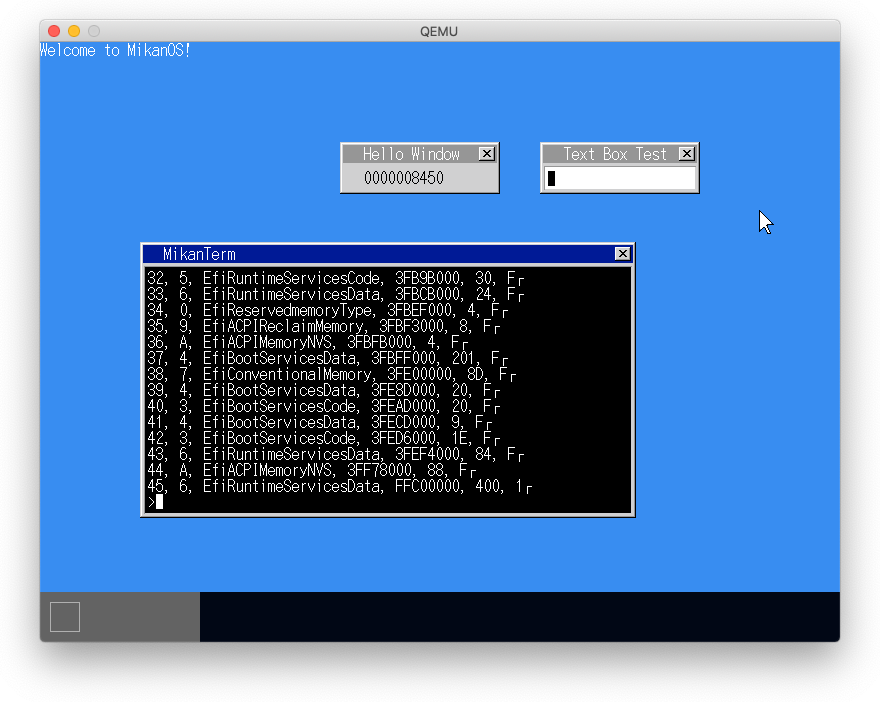
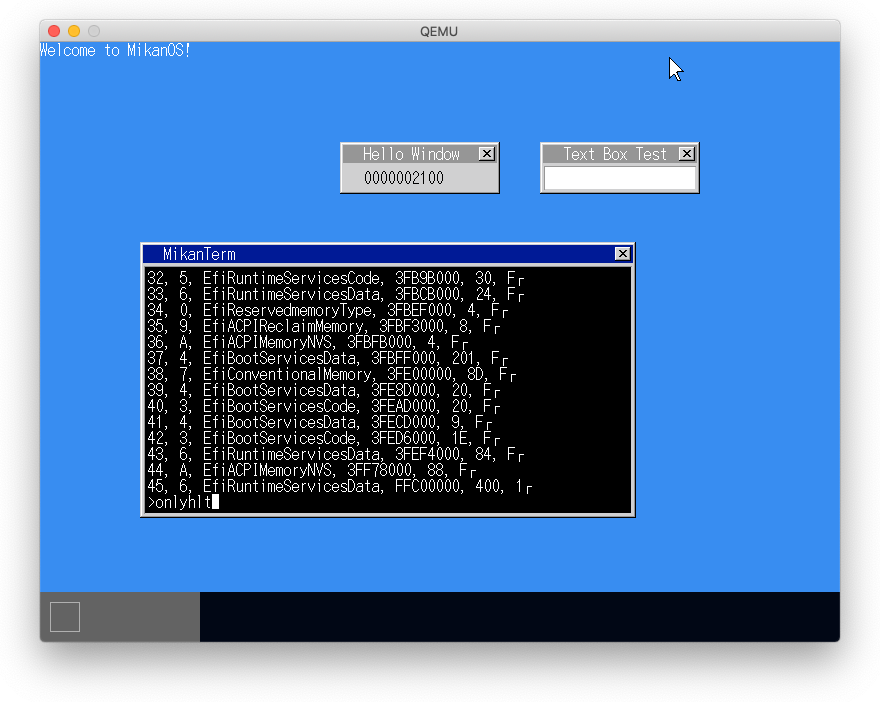
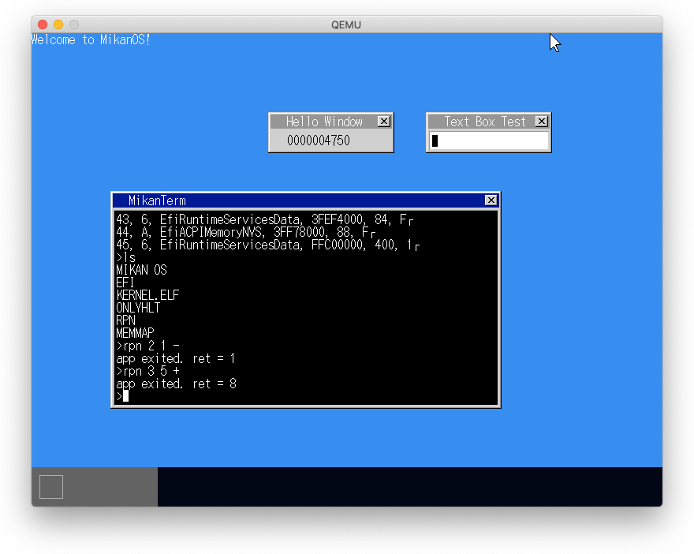
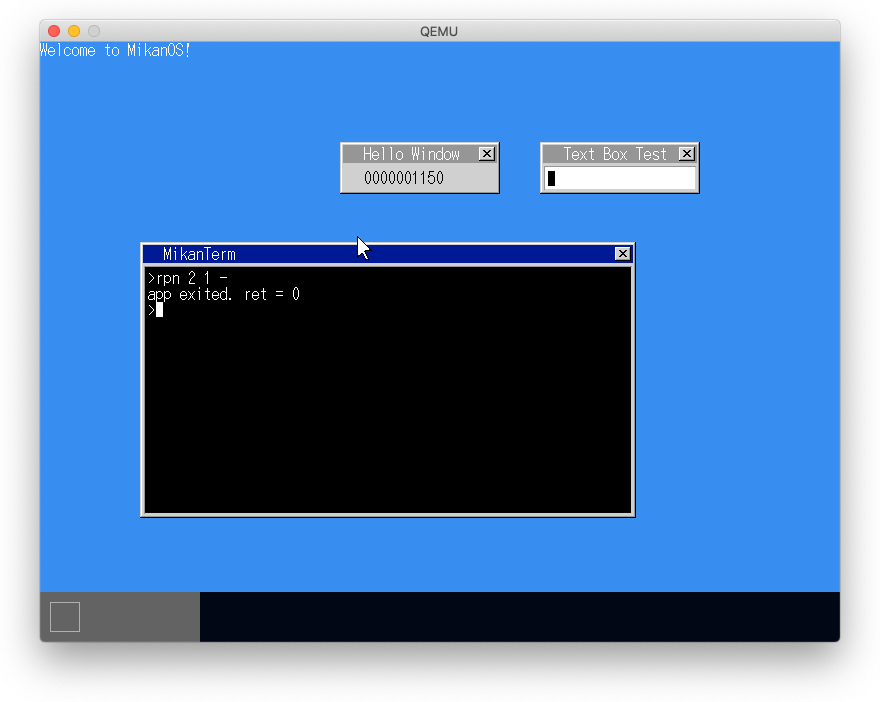

# 18.1 ファイルアロケーションテーブル

- ディレクトリエントリとFATを使ってdisk.imgにあるファイルを読み込む



# 18.2 初アプリ

- アプリをバイナリ形式で作成する
- これをdisk.imgにコピーする
- ファイルを読み込んで関数として実行する

## Mac版のllvm-objdumpではbinary形式のオブジェクトはディスアセンブルできない?

```
$ llvm-objdump -D -m i386:x86-64 -b binary onlyhlt
lvm-objdump: Unknown command line argument '-b'.  Try: 'llvm-objdump --help'
llvm-objdump: Did you mean '-C'?
$ llvm-objdump -D --arch=x86-64 -C onlyhlt
llvm-objdump: error: 'onlyhlt': The file was not recognized as a valid object file
$ llvm-objdump -D --arch=x86-64 onlyhlt
llvm-objdump: error: 'onlyhlt': The file was not recognized as a valid object file
```

## `./build.sh run`でエラー

```
$ cd mikan/mikanos
$ ./build.sh run
+ qemu-system-x86_64 -m 1G -drive if=pflash,format=raw,readonly,file=/Users/dspace/mikan/osbook/devenv/OVMF_CODE.fd -drive if=pflash,format=raw,file=/Users/dspace/mikan/osbook/devenv/OVMF_VARS.fd -drive if=ide,index=0,media=disk,format=raw,file=./disk.img -device nec-usb-xhci,id=xhci -device usb-mouse -device usb-kbd -monitor stdio
QEMU 5.2.0 monitor - type 'help' for more information
(qemu) qemu-system-x86_64: Failed to lock byte 100
```

1. `$(MIKANOS_DIR) = mikan/mikanos`に`mnt`ディレクトリがなかった
   - これまではmikan/ed2でrun_qemu.shを実行しており、mntディレクトリはここにあった。
2. `make_mikanos_image.sh`のMac固有の修正にミスがあった。

以上、2点を修正したところ実行できた。



# 18.3 C++で計算機

- アプリケーションをC言語で作成する
- ライブラリ関数も自作する

## 問題発生

- `rpn`コマンド実行でOSがリセットされる
- Macで3.3を実行した際と同じ現象

## `ld.lld`に`-z separate-code`を指定することで回避



# 18.4 標準ライブラリを使用する


