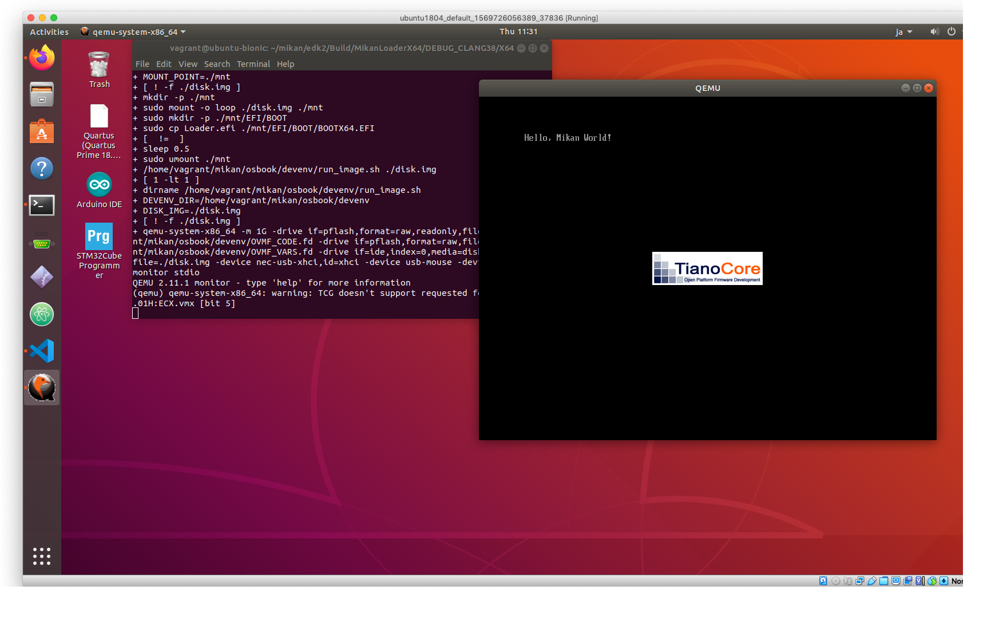
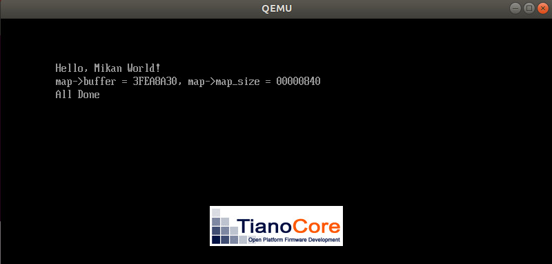

# EDK IIでhello world

```
$ cd $HOME/mikan/mikanos
$ git checkout -b day02 osbook_day02a
$ ls
LICENSE  MikanLoaderPkg  README.md
$ ls MikanLoaderPkg/
Loader.inf  Main.c  MikanLoaderPkg.dec  MikanLoaderPkg.dsc
```

## Loader.inf

```
[Defines]
  MODULE_TYPE                    = UEFI_APPLICATION
  ENTRY_POINT                    = UefiMain
[Sources]
  Main.c
[Packages]
  MdePkg/MdePkg.dec
[LibraryClasses]
  UefiLib
  UefiApplicationEntryPoint
```

## Main.c

```
#include  <Uefi.h>
#include  <Library/UefiLib.h>

EFI_STATUS EFIAPI UefiMain(
    EFI_HANDLE image_handle,
    EFI_SYSTEM_TABLE *system_table) {
  Print(L"Hello, Mikan World!\n");
  while (1);
  return EFI_SUCCESS;
}
```

- include_pathは`edk2/MdePkg/Include`
- Loader.infのENTORY_POINTがMain.cの`UefiMain()`

## コンパイル作業

```
$ cd $HOME/mikan/edk2
$ ln -s /home/vagrant/mikan/mikanos/MikanLoaderPkg ./
$ ls MikanLoaderPkg
Loader.inf  Main.c  MikanLoaderPkg.dec  MikanLoaderPkg.dsc
$ ./edksetup.sh
Loading previous configuration from /home/vagrant/mikan/edk2/Conf/BuildEnv.sh
Using EDK2 in-source Basetools
WORKSPACE: /home/vagrant/mikan/edk2
EDK_TOOLS_PATH: /home/vagrant/mikan/edk2/BaseTools
CONF_PATH: /home/vagrant/mikan/edk2/Conf
./edksetup.sh: line 215: return: can only `return' from a function or sourced script  # <= (1)
$ source edksetup.sh
Loading previous configuration from /home/vagrant/mikan/edk2/Conf/BuildEnv.sh
Using EDK2 in-source Basetools
WORKSPACE: /home/vagrant/mikan/edk2
EDK_TOOLS_PATH: /home/vagrant/mikan/edk2/BaseTools
CONF_PATH: /home/vagrant/mikan/edk2/Conf
$ which build
/home/vagrant/mikan/edk2/BaseTools/BinWrappers/PosixLike/build
$ build
Build environment: Linux-4.15.0-139-generic-x86_64-with-Ubuntu-18.04-bionic
Build start time: 11:27:01, Mar.25 2021

WORKSPACE        = /home/vagrant/mikan/edk2
EDK_TOOLS_PATH   = /home/vagrant/mikan/edk2/BaseTools
CONF_PATH        = /home/vagrant/mikan/edk2/Conf
PYTHON_COMMAND   = /usr/bin/python3.6


Architecture(s)  = X64
Build target     = DEBUG
Toolchain        = CLANG38

Processing meta-data
Active Platform          = /home/vagrant/mikan/edk2/MikanLoaderPkg/MikanLoaderPkg.dsc
. done!
Building ... /home/vagrant/mikan/edk2/MdePkg/Library/UefiApplicationEntryPoint/UefiApplicationEntryPoint.inf [X64]
Building ... /home/vagrant/mikan/edk2/MdePkg/Library/UefiLib/UefiLib.inf [X64]
make: Nothing to be done for 'tbuild'.
Building ... /home/vagrant/mikan/edk2/MdePkg/Library/UefiDevicePathLib/UefiDevicePathLib.inf [X64]
make: Nothing to be done for 'tbuild'.
Building ... /home/vagrant/mikan/edk2/MdePkg/Library/UefiRuntimeServicesTableLib/UefiRuntimeServicesTableLib.inf [X64]
make: Nothing to be done for 'tbuild'.
Building ... /home/vagrant/mikan/edk2/MdePkg/Library/BasePrintLib/BasePrintLib.inf [X64]
make: Nothing to be done for 'tbuild'.
make: Nothing to be done for 'tbuild'.
Building ... /home/vagrant/mikan/edk2/MdePkg/Library/UefiMemoryAllocationLib/UefiMemoryAllocationLib.inf [X64]
Building ... /home/vagrant/mikan/edk2/MdePkg/Library/UefiBootServicesTableLib/UefiBootServicesTableLib.inf [X64]
make: Nothing to be done for 'tbuild'.
Building ... /home/vagrant/mikan/edk2/MdePkg/Library/BaseDebugLibNull/BaseDebugLibNull.inf [X64]
make: Nothing to be done for 'tbuild'.
make: Nothing to be done for 'tbuild'.
Building ... /home/vagrant/mikan/edk2/MdePkg/Library/BaseLib/BaseLib.inf [X64]
Building ... /home/vagrant/mikan/edk2/MdePkg/Library/BasePcdLibNull/BasePcdLibNull.inf [X64]
make: Nothing to be done for 'tbuild'.
Building ... /home/vagrant/mikan/edk2/MdePkg/Library/BaseMemoryLib/BaseMemoryLib.inf [X64]
make: Nothing to be done for 'tbuild'.
make: Nothing to be done for 'tbuild'.
Building ... /home/vagrant/mikan/edk2/MikanLoaderPkg/Loader.inf [X64]
"clang" -MMD -MF /home/vagrant/mikan/edk2/Build/MikanLoaderX64/DEBUG_CLANG38/X64/MikanLoaderPkg/Loader/OUTPUT/AutoGen.obj.deps -g -Os -fshort-wchar -fno-builtin -fno-strict-aliasing -Wall -Werror -Wno-array-bounds -include AutoGen.h -fno-common -ffunction-sections -fdata-sections -DSTRING_ARRAY_NAME=LoaderStrings -Wno-parentheses-equality -Wno-tautological-compare -Wno-tautological-constant-out-of-range-compare -Wno-empty-body -Wno-unused-const-variable -Wno-varargs -Wno-unknown-warning-option -fno-stack-protector -mms-bitfields -Wno-address -Wno-shift-negative-value -Wno-unknown-pragmas -Wno-incompatible-library-redeclaration -fno-asynchronous-unwind-tables -mno-sse -mno-mmx -msoft-float -mno-implicit-float -ftrap-function=undefined_behavior_has_been_optimized_away_by_clang -funsigned-char -fno-ms-extensions -Wno-null-dereference -m64 "-DEFIAPI=__attribute__((ms_abi))" -mno-red-zone -mcmodel=small -fpie -Oz -flto -target x86_64-pc-linux-gnu -g -c -o /home/vagrant/mikan/edk2/Build/MikanLoaderX64/DEBUG_CLANG38/X64/MikanLoaderPkg/Loader/OUTPUT/./AutoGen.obj -I/home/vagrant/mikan/edk2/MikanLoaderPkg -I/home/vagrant/mikan/edk2/Build/MikanLoaderX64/DEBUG_CLANG38/X64/MikanLoaderPkg/Loader/DEBUG -I/home/vagrant/mikan/edk2/MdePkg -I/home/vagrant/mikan/edk2/MdePkg/Include -I/home/vagrant/mikan/edk2/MdePkg/Test/UnitTest/Include -I/home/vagrant/mikan/edk2/MdePkg/Include/X64 /home/vagrant/mikan/edk2/Build/MikanLoaderX64/DEBUG_CLANG38/X64/MikanLoaderPkg/Loader/DEBUG/AutoGen.c
"clang" -MMD -MF /home/vagrant/mikan/edk2/Build/MikanLoaderX64/DEBUG_CLANG38/X64/MikanLoaderPkg/Loader/OUTPUT/Main.obj.deps -g -Os -fshort-wchar -fno-builtin -fno-strict-aliasing -Wall -Werror -Wno-array-bounds -include AutoGen.h -fno-common -ffunction-sections -fdata-sections -DSTRING_ARRAY_NAME=LoaderStrings -Wno-parentheses-equality -Wno-tautological-compare -Wno-tautological-constant-out-of-range-compare -Wno-empty-body -Wno-unused-const-variable -Wno-varargs -Wno-unknown-warning-option -fno-stack-protector -mms-bitfields -Wno-address -Wno-shift-negative-value -Wno-unknown-pragmas -Wno-incompatible-library-redeclaration -fno-asynchronous-unwind-tables -mno-sse -mno-mmx -msoft-float -mno-implicit-float -ftrap-function=undefined_behavior_has_been_optimized_away_by_clang -funsigned-char -fno-ms-extensions -Wno-null-dereference -m64 "-DEFIAPI=__attribute__((ms_abi))" -mno-red-zone -mcmodel=small -fpie -Oz -flto -target x86_64-pc-linux-gnu -g -c -o /home/vagrant/mikan/edk2/Build/MikanLoaderX64/DEBUG_CLANG38/X64/MikanLoaderPkg/Loader/OUTPUT/./Main.obj -I/home/vagrant/mikan/edk2/MikanLoaderPkg -I/home/vagrant/mikan/edk2/Build/MikanLoaderX64/DEBUG_CLANG38/X64/MikanLoaderPkg/Loader/DEBUG -I/home/vagrant/mikan/edk2/MdePkg -I/home/vagrant/mikan/edk2/MdePkg/Include -I/home/vagrant/mikan/edk2/MdePkg/Test/UnitTest/Include -I/home/vagrant/mikan/edk2/MdePkg/Include/X64 /home/vagrant/mikan/edk2/MikanLoaderPkg/Main.c
rm -f /home/vagrant/mikan/edk2/Build/MikanLoaderX64/DEBUG_CLANG38/X64/MikanLoaderPkg/Loader/OUTPUT/Loader.lib
"llvm-ar" cr /home/vagrant/mikan/edk2/Build/MikanLoaderX64/DEBUG_CLANG38/X64/MikanLoaderPkg/Loader/OUTPUT/Loader.lib  @/home/vagrant/mikan/edk2/Build/MikanLoaderX64/DEBUG_CLANG38/X64/MikanLoaderPkg/Loader/OUTPUT/object_files.lst
"clang" -o /home/vagrant/mikan/edk2/Build/MikanLoaderX64/DEBUG_CLANG38/X64/MikanLoaderPkg/Loader/DEBUG/Loader.dll -nostdlib -Wl,-n,-q,--gc-sections -z common-page-size=0x40 -Wl,--entry,_ModuleEntryPoint -u _ModuleEntryPoint -Wl,-Map,/home/vagrant/mikan/edk2/Build/MikanLoaderX64/DEBUG_CLANG38/X64/MikanLoaderPkg/Loader/DEBUG/Loader.map,--whole-archive -flto -Wl,-Oz -Wl,-melf_x86_64 -Wl,--oformat=elf64-x86-64 -Wl,-pie -mcmodel=small -Wl,--start-group,@/home/vagrant/mikan/edk2/Build/MikanLoaderX64/DEBUG_CLANG38/X64/MikanLoaderPkg/Loader/OUTPUT/static_library_files.lst,--end-group -g -Os -fshort-wchar -fno-builtin -fno-strict-aliasing -Wall -Werror -Wno-array-bounds -include AutoGen.h -fno-common -ffunction-sections -fdata-sections -DSTRING_ARRAY_NAME=LoaderStrings -Wno-parentheses-equality -Wno-tautological-compare -Wno-tautological-constant-out-of-range-compare -Wno-empty-body -Wno-unused-const-variable -Wno-varargs -Wno-unknown-warning-option -fno-stack-protector -mms-bitfields -Wno-address -Wno-shift-negative-value -Wno-unknown-pragmas -Wno-incompatible-library-redeclaration -fno-asynchronous-unwind-tables -mno-sse -mno-mmx -msoft-float -mno-implicit-float -ftrap-function=undefined_behavior_has_been_optimized_away_by_clang -funsigned-char -fno-ms-extensions -Wno-null-dereference -m64 "-DEFIAPI=__attribute__((ms_abi))" -mno-red-zone -mcmodel=small -fpie -Oz -flto -target x86_64-pc-linux-gnu -g -Wl,--defsym=PECOFF_HEADER_SIZE=0x228 -Wl,--script=/home/vagrant/mikan/edk2/BaseTools/Scripts/GccBase.lds -Wno-error -O3
"objcopy"  /home/vagrant/mikan/edk2/Build/MikanLoaderX64/DEBUG_CLANG38/X64/MikanLoaderPkg/Loader/DEBUG/Loader.dll
cp -f /home/vagrant/mikan/edk2/Build/MikanLoaderX64/DEBUG_CLANG38/X64/MikanLoaderPkg/Loader/DEBUG/Loader.dll /home/vagrant/mikan/edk2/Build/MikanLoaderX64/DEBUG_CLANG38/X64/MikanLoaderPkg/Loader/DEBUG/Loader.debug
objcopy --strip-unneeded -R .eh_frame /home/vagrant/mikan/edk2/Build/MikanLoaderX64/DEBUG_CLANG38/X64/MikanLoaderPkg/Loader/DEBUG/Loader.dll
objcopy --add-gnu-debuglink=/home/vagrant/mikan/edk2/Build/MikanLoaderX64/DEBUG_CLANG38/X64/MikanLoaderPkg/Loader/DEBUG/Loader.debug /home/vagrant/mikan/edk2/Build/MikanLoaderX64/DEBUG_CLANG38/X64/MikanLoaderPkg/Loader/DEBUG/Loader.dll
cp -f /home/vagrant/mikan/edk2/Build/MikanLoaderX64/DEBUG_CLANG38/X64/MikanLoaderPkg/Loader/DEBUG/Loader.debug /home/vagrant/mikan/edk2/Build/MikanLoaderX64/DEBUG_CLANG38/X64/Loader.debug
"GenFw" -e UEFI_APPLICATION -o /home/vagrant/mikan/edk2/Build/MikanLoaderX64/DEBUG_CLANG38/X64/MikanLoaderPkg/Loader/OUTPUT/Loader.efi /home/vagrant/mikan/edk2/Build/MikanLoaderX64/DEBUG_CLANG38/X64/MikanLoaderPkg/Loader/DEBUG/Loader.dll
cp -f /home/vagrant/mikan/edk2/Build/MikanLoaderX64/DEBUG_CLANG38/X64/MikanLoaderPkg/Loader/OUTPUT/Loader.efi /home/vagrant/mikan/edk2/Build/MikanLoaderX64/DEBUG_CLANG38/X64/MikanLoaderPkg/Loader/DEBUG
cp -f /home/vagrant/mikan/edk2/Build/MikanLoaderX64/DEBUG_CLANG38/X64/MikanLoaderPkg/Loader/OUTPUT/Loader.efi /home/vagrant/mikan/edk2/Build/MikanLoaderX64/DEBUG_CLANG38/X64/Loader.efi
cp -f /home/vagrant/mikan/edk2/Build/MikanLoaderX64/DEBUG_CLANG38/X64/MikanLoaderPkg/Loader/DEBUG/*.map /home/vagrant/mikan/edk2/Build/MikanLoaderX64/DEBUG_CLANG38/X64/MikanLoaderPkg/Loader/OUTPUT

- Done -
Build end time: 11:27:03, Mar.25 2021
Build total time: 00:00:02

$ ls Build/MikanLoaderX64/DEBUG_CLANG38/X64/
Loader.debug  Loader.efi  MdePkg  MikanLoaderPkg  TOOLS_DEF.X64
$ cd Build/MikanLoaderX64/DEBUG_CLANG38/X64/
$ ~/mikan/osbook/devenv/run_qemu.sh Loader.efi
# Could not initialize SDL(No available video device) - exiting  # <= (2) ssh terminalから実行するとエラー
```

1. `source edksetup.sh`ではなく`./edksetup.sh`とするとエラー
2. `run_qemu.sh`をsshから実行するとエラー。ubuntu画面から実行すること。



# メモリマップの取得

```
$ cd $HOME/mikan/mikanos
$ git diff osbook_day02a osbook_day02b
$ vi MikanLoaderPkg/Loader.inf
$ vi MikanLoaderPkg/Main.c
$ cd $HOME/mikan/edk2
$ source edksetup.sh
$ build
$ $HOME/mikan/osbook/devenv/run_qemu.sh Build/MikanLoaderX64/DEBUG_CLANG38/X64/Loader.efi
$ ls -l disk.img
-rw-r--r-- 1 vagrant vagrant 209715200 Mar 25 17:43 disk.img
$ mkdir -p mnt
$ sudo mount -o loop disk.img mnt
$ ls /mnt
$ ls mnt
EFI  memmap
$ cat mnt/memmap
Index, Type, Type(name), PhysicalStart, NumberOfPages, Attribute
0, 3, EfiBootServicesCode, 00000000, 1, F
1, 7, EfiConventionalMemory, 00001000, 9F, F
2, 7, EfiConventionalMemory, 00100000, 700, F
3, A, EfiACPIMemoryNVS, 00800000, 8, F
4, 7, EfiConventionalMemory, 00808000, 8, F
5, A, EfiACPIMemoryNVS, 00810000, F0, F
6, 4, EfiBootServicesData, 00900000, B00, F
7, 7, EfiConventionalMemory, 01400000, 3AB36, F
8, 4, EfiBootServicesData, 3BF36000, 20, F
9, 7, EfiConventionalMemory, 3BF56000, 270F, F
10, 1, EfiLoaderCode, 3E665000, 2, F
11, 4, EfiBootServicesData, 3E667000, 217, F
12, 3, EfiBootServicesCode, 3E87E000, B6, F
13, A, EfiACPIMemoryNVS, 3E934000, 12, F
14, 0, EfiReservedmemoryType, 3E946000, 1C, F
15, 3, EfiBootServicesCode, 3E962000, 10A, F
16, 6, EfiRuntimeServicesData, 3EA6C000, 5, F
17, 5, EfiRuntimeServicesCode, 3EA71000, 5, F
18, 6, EfiRuntimeServicesData, 3EA76000, 5, F
19, 5, EfiRuntimeServicesCode, 3EA7B000, 5, F
20, 6, EfiRuntimeServicesData, 3EA80000, 5, F
21, 5, EfiRuntimeServicesCode, 3EA85000, 7, F
22, 6, EfiRuntimeServicesData, 3EA8C000, 8F, F
23, 4, EfiBootServicesData, 3EB1B000, 4DA, F
24, 7, EfiConventionalMemory, 3EFF5000, 4, F
25, 4, EfiBootServicesData, 3EFF9000, 6, F
26, 7, EfiConventionalMemory, 3EFFF000, 1, F
27, 4, EfiBootServicesData, 3F000000, A1B, F
28, 7, EfiConventionalMemory, 3FA1B000, 1, F
29, 3, EfiBootServicesCode, 3FA1C000, 17F, F
30, 5, EfiRuntimeServicesCode, 3FB9B000, 30, F
31, 6, EfiRuntimeServicesData, 3FBCB000, 24, F
32, 0, EfiReservedmemoryType, 3FBEF000, 4, F
33, 9, EfiACPIReclaimMemory, 3FBF3000, 8, F
34, A, EfiACPIMemoryNVS, 3FBFB000, 4, F
35, 4, EfiBootServicesData, 3FBFF000, 201, F
36, 7, EfiConventionalMemory, 3FE00000, 8D, F
37, 4, EfiBootServicesData, 3FE8D000, 20, F
38, 3, EfiBootServicesCode, 3FEAD000, 20, F
39, 4, EfiBootServicesData, 3FECD000, 9, F
40, 3, EfiBootServicesCode, 3FED6000, 1E, F
41, 6, EfiRuntimeServicesData, 3FEF4000, 84, F
42, A, EfiACPIMemoryNVS, 3FF78000, 88, F
43, 6, EfiRuntimeServicesData, FFC00000, 400, 1
```


