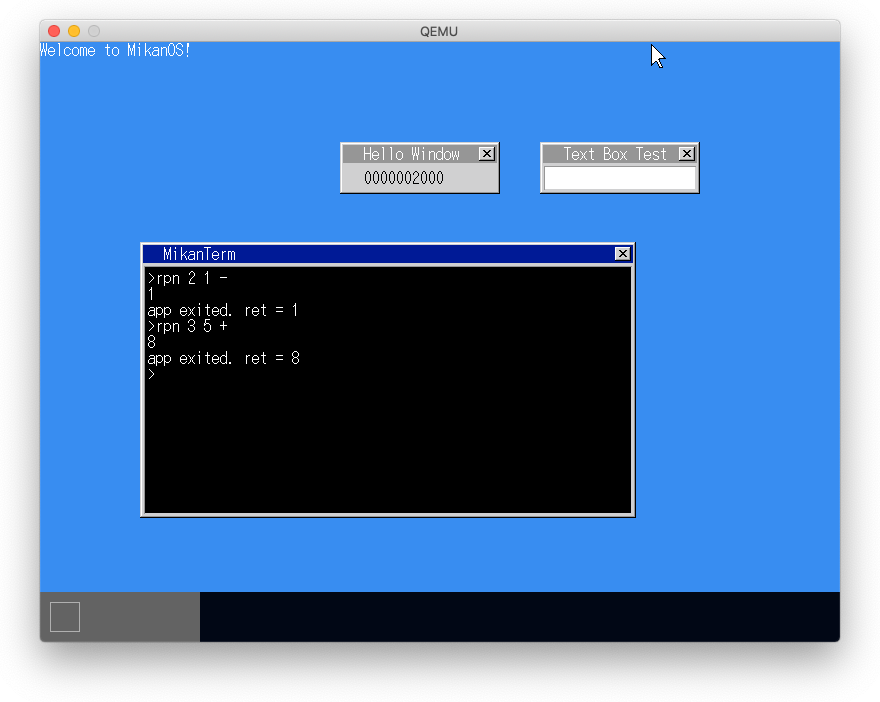
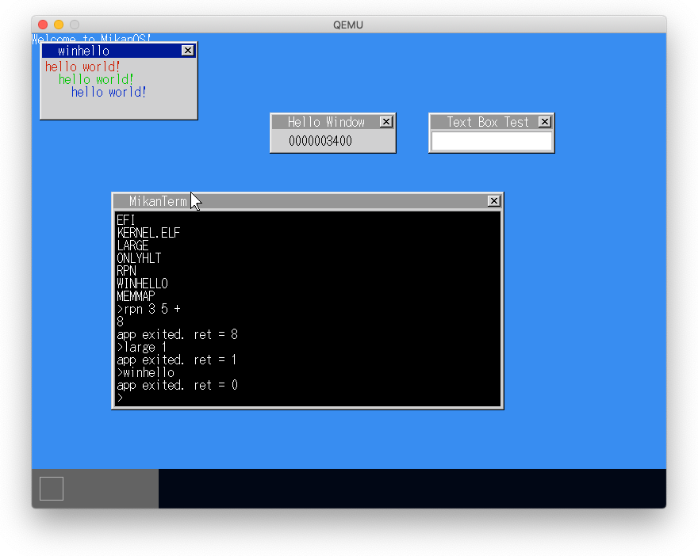

# 21.1 IST (Interrupt Stack Table)の設定

- システムコール実行時に割り込みがあるとアプリ用のスタックが使用されるというバグあり
- 割り込み処理がカーネルスタックで処理されるようにする必要がある
- CPUには割り込み時に自動的に設定したスタックに入れ替える機能がある
- それにはスタック領域を割り当て、TSSのIST1-7のいずれかに設定し、そのIST番号をInterruptDescriptorAttributeのistフィールドに設定する。

# 21.2 文字列表示システムコール

- newlibのprintf()を使う
- そのためにwrite(int, void *, size_t)関数を定義する
- write()から呼び出すPutStringシステムコールを作成する

# 21.5 終了システムコール

1. CallApp: OS用スタックにレジスタを保存
   - OS用のスタックポインタは、保存場所を引数で受けとり、そこに保存する
   - OS用のスタックポインタを保存する変数はtaskが持つ
   - ExitシステムコールがOS用スタックポインタを返り値として返す
2. CallApp: アプリ用スタックに切り替え
3. CallApp: アプリを起動
4. SyscallEntry: OS用スタックに切り替え
5. SyscallEntry: OS用スタックからレジスタを復帰
6. SyscallEntry: CallApp()呼び出しの次の行に戻る

# 21.-9 アプリからウィンドウを開いて文字を描く

- OpenWindowとWinWriteStringシステムコールを実装する

