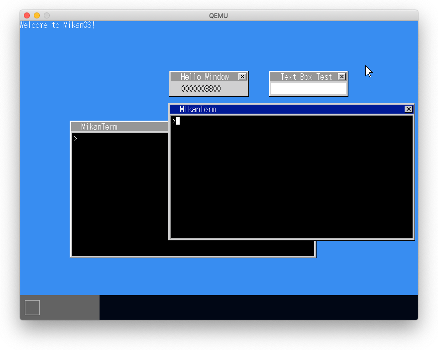
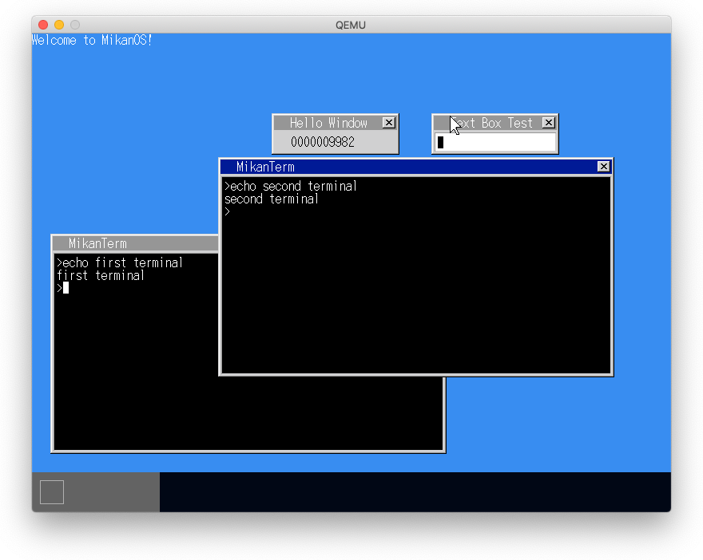
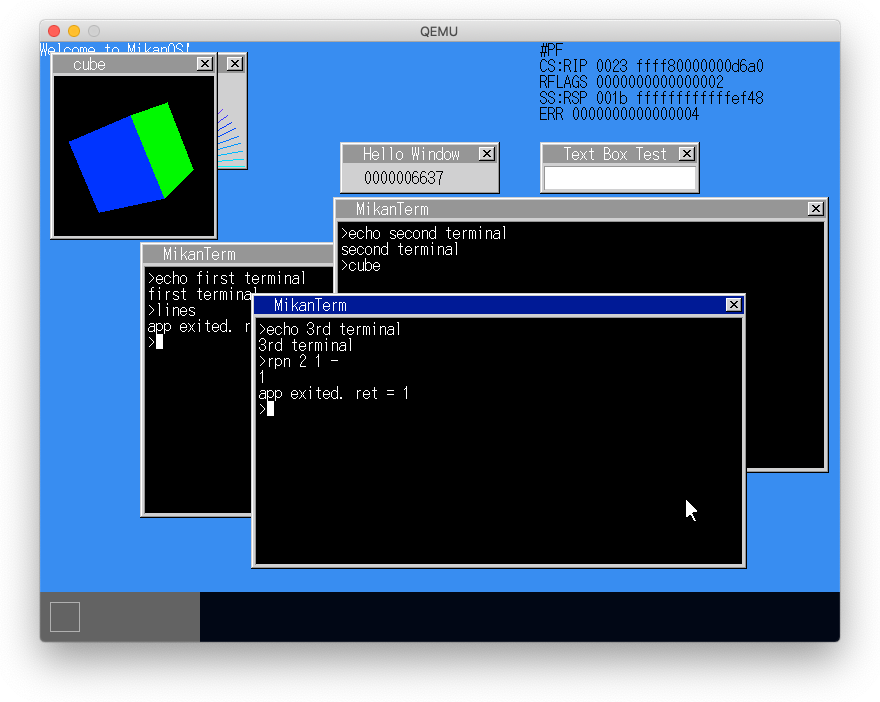
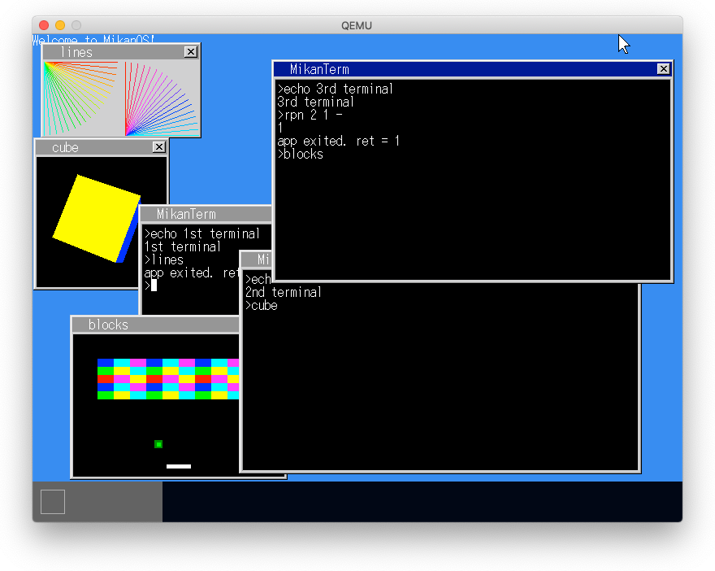
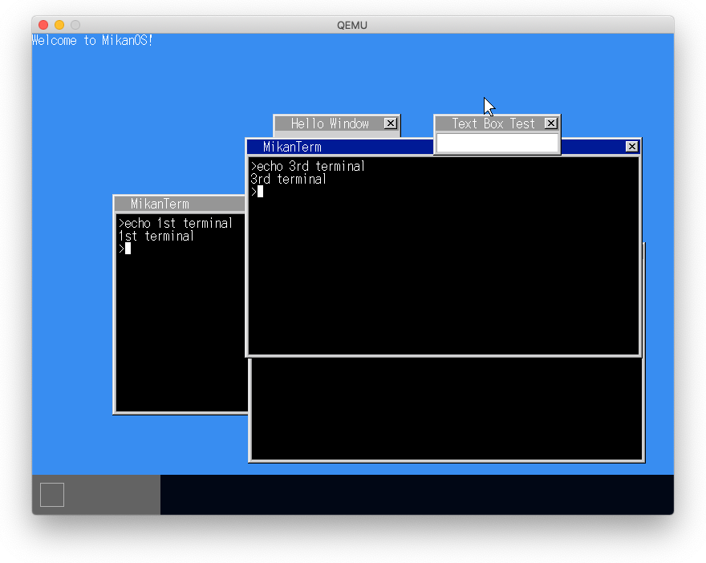
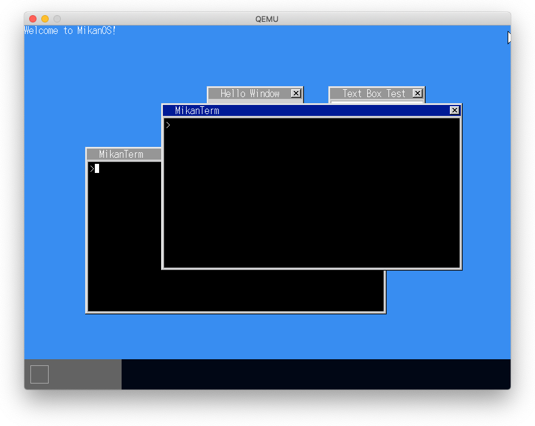
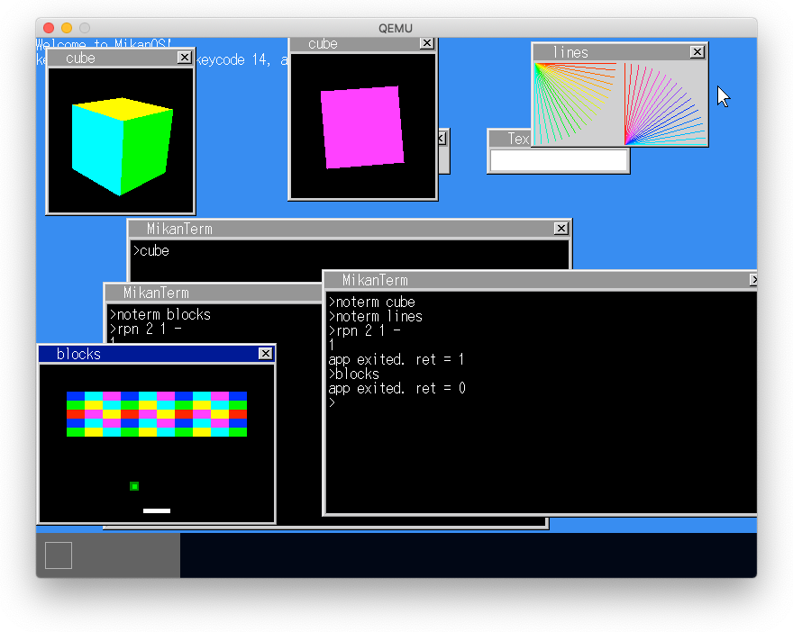
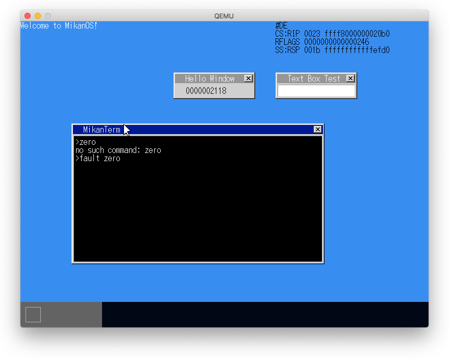
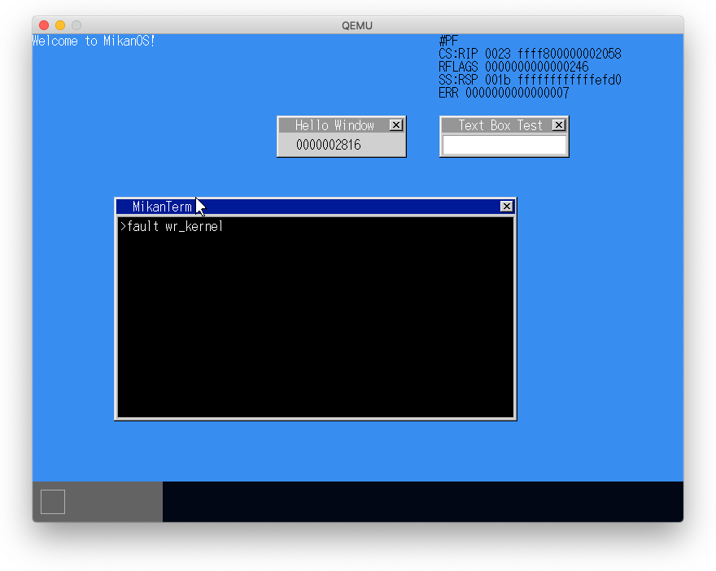
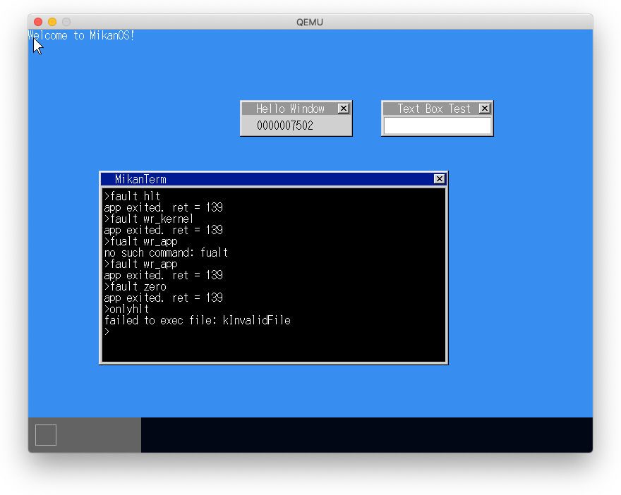

# 24.1 ターミナルを増やす

- F2が押されたら新しいターミナルを作成
-

# 24.2 カーソル点滅を自分で

- ターミナルタスクがタイマを制御する
- アクティブウィンドウが切り替わったことをタスクに通知する
- ターミナルが非アクティブになったらカーソル点滅を停止、アクティブになったら再開する

# 24.3 複数アプリの同時起動

## 現在は複数のアプリが階層ページングを共有しているため競合が発生する

## アプリごとに専用の階層ページング機構を持つようにする

- アプリごとに実行可能ファイルをロードする前にPML4を作成・設定する
- 新規PML4を作成する際に、前半部分は現在のcr3からコピーする
  - 前半部分はカーネル用で共通のため
- アプリ終了時にPML4を削除する

# 24.4 ウィンドウの重なりのバグ修正

- 新規作成レイヤのレイヤの設定にバグ

## バグ修正前

## バグ修正後

# 24.5 ターミナルなしのアプリ起動

- ターミナルクラスに画面表示フラグを新設する
- 表示フラグが立っている場合のみ画面表示する
- 画面表示しないコマンド(`noterm`)を作成する

# 24.6 OSをフリーズさせるアプリ

- アプリが例外を発生させるとOSがフリーズする

# 24.8 OSを守ろう

- アプリが例外を発生させた場合はアプリを終了させる
  - 実行中のコードがアプリかカーネル化はCSのCPLをチェックする
  - CPL==3はアプリ、CPL==0はカーネル
- ELF以外の実行ファイルをエラーとする

