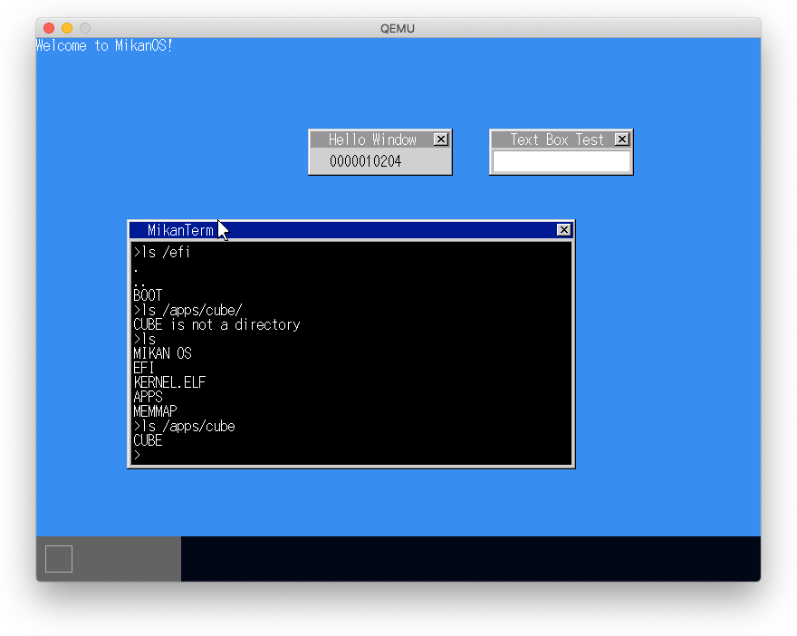
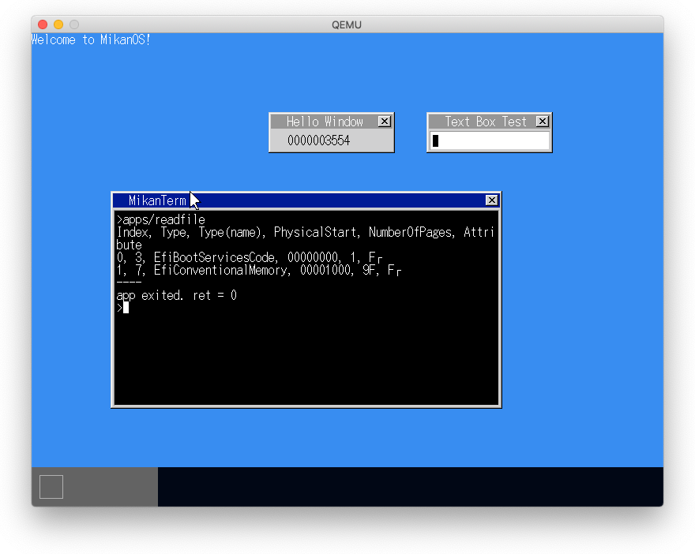
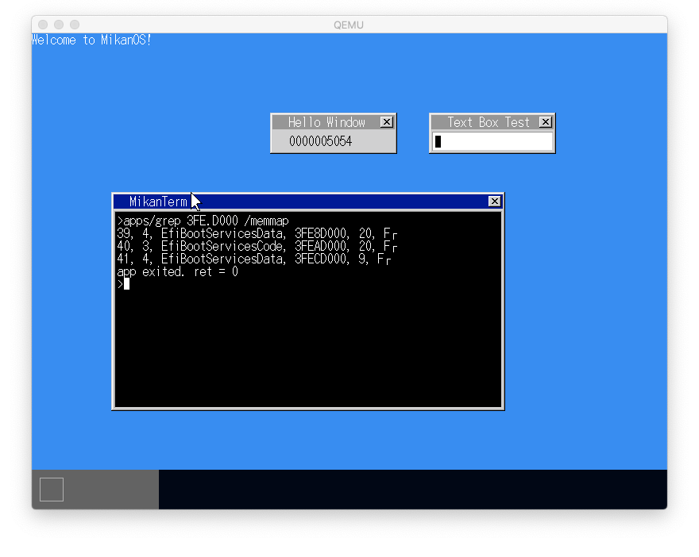

# 25.1 ディレクトリ対応

- fat::FindFile()をディレクトリ対応
- path中の'/'を見つけて要素ごとにディレクトリエントリと突き合わせる
- 要素が最後の要素でなく、ディレクトリであれば再帰的に探索する
- ファイルなのに最後に'/'がある場合はエラーとする



# 25.2 ファイル読み込み

- fopenの実装（openシステムコールの実装）
- fread, fgetsの実装（readシステムコールの実装）
- sbrkの簡易実装（ヒープでなく配列で割当）

- fat::Descriptorを作成し、ファイルとオフセット情報を持たせる
- タスクにDescritorの配列をもたせ、そのインデックスをfdとする。



## `sbrk()`を実装しないとエラー


# 25.3 正規表現検索

- std::regex()を使う



## std::regex()には`posix_memalign()`が必要

```
ld.lld -L/Users/dspace/mikan/osbook/devenv/x86_64-elf/lib --entry main -z norelro -z separate-code --image-base 0xffff800000000000 --static -o grep grep.o ../syscall.o ../newlib_support.o -lc -lc++ -lc++abi -lm
ld.lld: error: undefined symbol: posix_memalign
>>> referenced by new.cpp
>>>               new.cpp.o:(operator new(unsigned long, std::align_val_t)) in archive /Users/dspace/mikan/osbook/devenv/x86_64-elf/lib/libc++.a
>>> referenced by new.cpp
>>>               new.cpp.o:(operator new(unsigned long, std::align_val_t)) in archive /Users/dspace/mikan/osbook/devenv/x86_64-elf/lib/libc++.a
make: *** [grep] Error 1
```
