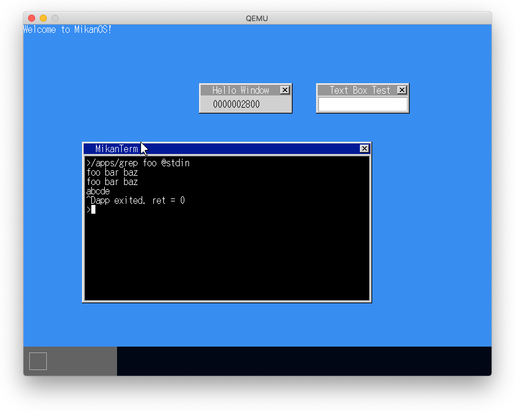
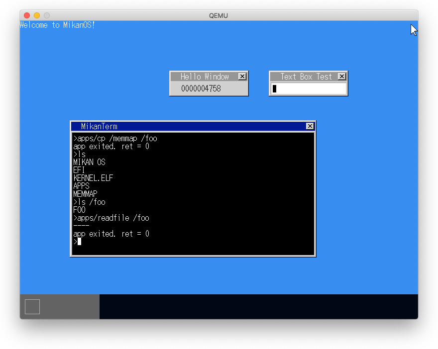
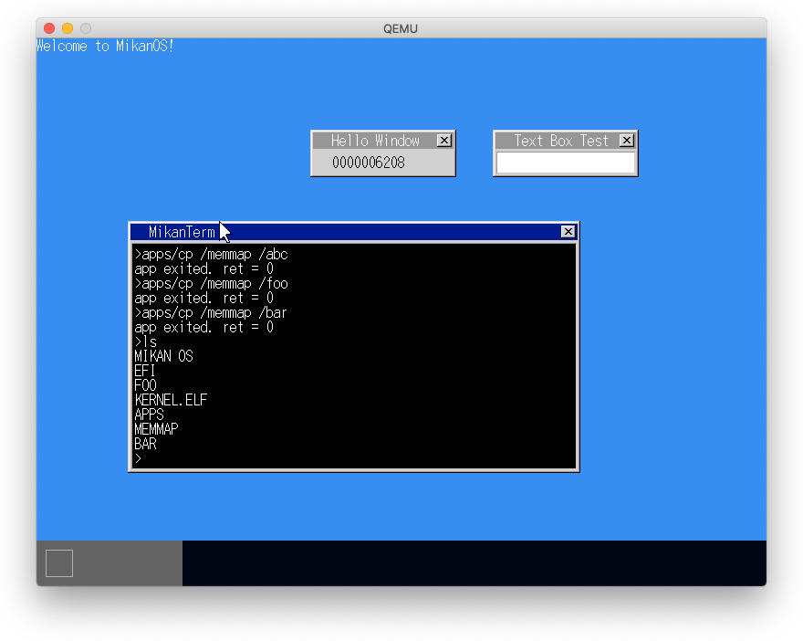
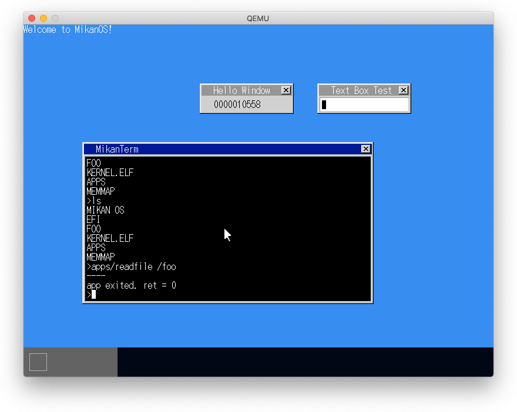
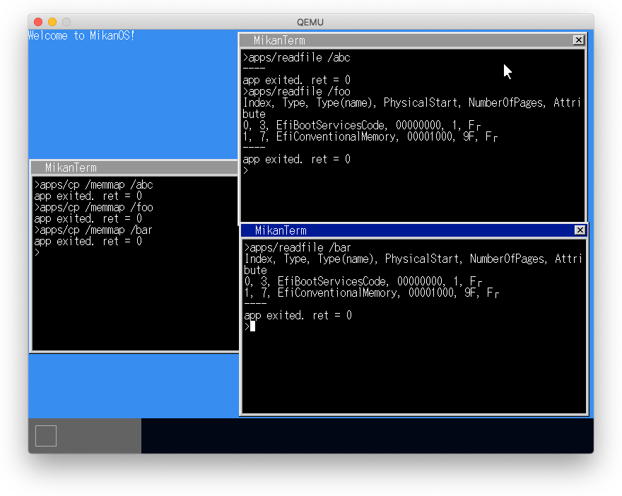

# 26.1 標準入力
# 26.2 ファイルディスクリプタの抽象化
# 26.3 キーボード入力を受け付ける

- FileDescriptorを親クラスとして、fat::FileDescriptorとTerminalFileDescriptorを作成
- 共通メソッドでファイルと標準入出力を扱える
- タスクに::FileDescriptorの配列を持ち、fd=0を持つ
- 標準入力に名前を付け(@stdin)、fd=0に紐付ける


# 26.4 EOFとEOT

- Cntl-DでEOTを入力する



# 26.5 ファイル書き込み (1)
# 26.6 ファイル書き込み (2)

## 新規ファイルの作成

1. pathを解析して、ファイルを作成するディレクトリを決定する
2. ディレクトリエントリを作成する
  - ディレクトリエントリ用のクラスタを順次見ていき、空きエントリを探す
  - すべてのクラスタのエントリが使用済みの場合はクラスタを拡張する
3. データをFATファイルシステムに書き込む
   - write offset, write cluster, write cluster offsetを管理する
   - ファイルサイズをディレクトリエントリに書き込む

# 問題発生: cpコマンドは正常終了するが、lsに出ず、readfileしても出力されない。



## 原因 1: lsコマンドで表示されない

### (1) もともとname[0]が0xe5のディレクトリエントリが２つ（dir[2], dir[3]）あり、新規再生する最初の2つのファイルにはこのエントリが再利用された。

```
lldb) p dir[0]
(fat::DirectoryEntry) $1 = {
  name = {
    [0] = 'M'
    [1] = 'I'
    [2] = 'K'
    [3] = 'A'
    [4] = 'N'
    [5] = ' '
    [6] = 'O'
    [7] = 'S'
    [8] = ' '
    [9] = ' '
    [10] = ' '
  }
  attr = kVolumeID
  ntres = '\0'
  create_time_tenth = '\0'
  create_time = 19040
  create_date = 21153
  last_access_date = 21153
  first_cluster_high = 0
  write_time = 19041
  write_date = 21153
  first_cluster_low = 0
  file_size = 0
}
(lldb) p dir[1]
(fat::DirectoryEntry) $2 = {
  name = {
    [0] = 'E'
    [1] = 'F'
    [2] = 'I'
    [3] = ' '
    [4] = ' '
    [5] = ' '
    [6] = ' '
    [7] = ' '
    [8] = ' '
    [9] = ' '
    [10] = ' '
  }
  attr = kDirectory
  ntres = '\0'
  create_time_tenth = 'y'
  create_time = 19040
  create_date = 21153
  last_access_date = 21153
  first_cluster_high = 0
  write_time = 19040
  write_date = 21153
  first_cluster_low = 3
  file_size = 0
}
(lldb) p dir[2]                           # name[0] = 0xe5 なので再利用される
(fat::DirectoryEntry) $3 = {
  name = {
    [0] = '\xe5'
    [1] = '.'
    [2] = '\0'
    [3] = 'f'
    [4] = '\0'
    [5] = 's'
    [6] = '\0'
    [7] = 'e'
    [8] = '\0'
    [9] = 'v'
    [10] = '\0'
  }
  attr = kLongName
  ntres = '\0'
  create_time_tenth = '\xda'
  create_time = 101
  create_date = 110
  last_access_date = 116
  first_cluster_high = 115
  write_time = 100
  write_date = 0
  first_cluster_low = 0
  file_size = 4294967295                   # 4095MB
}
(lldb) p dir[3]                           # name[0] = 0xe5 なので再利用される
(fat::DirectoryEntry) $4 = {
  name = {
    [0] = '\xe5'
    [1] = 'S'
    [2] = 'E'
    [3] = 'V'
    [4] = 'E'
    [5] = 'N'
    [6] = '~'
    [7] = '1'
    [8] = ' '
    [9] = ' '
    [10] = ' '
  }
  attr = kHidden | kDirectory
  ntres = '\0'
  create_time_tenth = '|'
  create_time = 19040
  create_date = 21153
  last_access_date = 21153
  first_cluster_high = 0
  write_time = 19040
  write_date = 21153
  first_cluster_low = 17
  file_size = 0
}
(lldb) p dir[4]
(fat::DirectoryEntry) $5 = {
  name = {
    [0] = 'K'
    [1] = 'E'
    [2] = 'R'
    [3] = 'N'
    [4] = 'E'
    [5] = 'L'
    [6] = ' '
    [7] = ' '
    [8] = 'E'
    [9] = 'L'
    [10] = 'F'
  }
  attr = kArchive
  ntres = '\x18'
  create_time_tenth = '\x7f'
  create_time = 19040
  create_date = 21153
  last_access_date = 21153
  first_cluster_high = 0
  write_time = 19040
  write_date = 21153
  first_cluster_low = 19
  file_size = 3213880
}
(lldb) p dir[5]
(fat::DirectoryEntry) $6 = {
  name = {
    [0] = 'A'
    [1] = 'P'
    [2] = 'P'
    [3] = 'S'
    [4] = ' '
    [5] = ' '
    [6] = ' '
    [7] = ' '
    [8] = ' '
    [9] = ' '
    [10] = ' '
  }
  attr = kDirectory
  ntres = '\b'
  create_time_tenth = '\x0f'
  create_time = 19041
  create_date = 21153
  last_access_date = 21153
  first_cluster_high = 0
  write_time = 19041
  write_date = 21153
  first_cluster_low = 3160
  file_size = 0
}
(lldb) p dir[6]
(fat::DirectoryEntry) $7 = {
  name = {
    [0] = 'M'
    [1] = 'E'
    [2] = 'M'
    [3] = 'M'
    [4] = 'A'
    [5] = 'P'
    [6] = ' '
    [7] = ' '
    [8] = ' '
    [9] = ' '
    [10] = ' '
  }
  attr = kArchive
  ntres = '\b'
  create_time_tenth = '\0'
  create_time = 634
  create_date = 21153
  last_access_date = 21153
  first_cluster_high = 0
  write_time = 634
  write_date = 21153
  first_cluster_low = 3161
  file_size = 2065
}
(lldb) p dir[7]                           # name[0] = 0x00 なので空きエントリ
(fat::DirectoryEntry) $8 = {
  name = {
    [0] = '\0'
    [1] = '\0'
    [2] = '\0'
    [3] = '\0'
    [4] = '\0'
    [5] = '\0'
    [6] = '\0'
    [7] = '\0'
    [8] = '\0'
    [9] = '\0'
    [10] = '\0'
  }
  attr =
  ntres = '\0'
  create_time_tenth = '\0'
  create_time = 0
  create_date = 0
  last_access_date = 0
  first_cluster_high = 0
  write_time = 0
  write_date = 0
  first_cluster_low = 0
  file_size = 0
}
```

### (2) fat::CreateFile()のバグ

- fat::CreateFile()で新規ファイルのエントリにはfile_sizeしか設定していなかったため、その他のフィールドは元のエントリ値のままである。
- 最初に作成するファイルにはattr=kLongNameのエントリが、2つ目に作成するファイルにはattr=kHidden | kDirectory、3つ目に作成するファイルはattr=nullのエントリが使われるため、以下の"ls"コマンドのロジックによりattr=kLongNameの1つ目のファイルがlsコマンドで表示されない。

```
# terminal.cpp#ListAllEntries()#L277-290
    for (int i = 0; i < kEntriesPerCluster; ++i) {
        if (dir[i].name[0] == 0x00) {   // 空で以降はなし
            return ;
        } else if (static_cast<uint8_t>(dir[i].name[0]) == 0xe5) { // 空エントリ
            continue;
        } else if (dir[i].attr == fat::Attribute::kLongName) {
            continue;
        }

        char name[13];
        fat::FormatName(dir[i], name);
        term->Print(name);
        term->Print("\n");
    }
```

```
> apps/cp /memmap /abc
> apps/cp /memmap /foo
> apps/cp /foo /bar

(lldb) p dir[2]                         # /abcはdir[2]が使われた
(fat::DirectoryEntry) $8 = {
  name = {
    [0] = 'A'
    [1] = 'B'
    [2] = 'C'
    [3] = ' '
    [4] = ' '
    [5] = ' '
    [6] = ' '
    [7] = ' '
    [8] = ' '
    [9] = ' '
    [10] = ' '
  }
  attr = kLongName                    # attr = kLongNameのため"ls"で表示されない
  ntres = '\0'
  create_time_tenth = '\xda'
  create_time = 101
  create_date = 110
  last_access_date = 116
  first_cluster_high = 115
  write_time = 100
  write_date = 0
  first_cluster_low = 0
  file_size = 2155
}
(lldb) p dir[3]                         # /fooはdir[3]が使われた
(fat::DirectoryEntry) $9 = {
  name = {
    [0] = 'F'
    [1] = 'O'
    [2] = 'O'
    [3] = ' '
    [4] = ' '
    [5] = ' '
    [6] = ' '
    [7] = ' '
    [8] = ' '
    [9] = ' '
    [10] = ' '
  }
  attr = kHidden | kDirectory           # "ls"で表示される
  ntres = '\0'
  create_time_tenth = 'h'
  create_time = 20086
  create_date = 21153
  last_access_date = 21153
  first_cluster_high = 0
  write_time = 20086
  write_date = 21153
  first_cluster_low = 17
  file_size = 2155
}
(lldb) p dir[7]                         # /barはdir[2]が使われた
(fat::DirectoryEntry) $10 = {
  name = {
    [0] = 'B'
    [1] = 'A'
    [2] = 'R'
    [3] = ' '
    [4] = ' '
    [5] = ' '
    [6] = ' '
    [7] = ' '
    [8] = ' '
    [9] = ' '
    [10] = ' '
  }
  attr =                                # "ls"で表示される
  ntres = '\0'
  create_time_tenth = '\0'
  create_time = 0
  create_date = 0
  last_access_date = 0
  first_cluster_high = 0
  write_time = 0
  write_date = 0
  first_cluster_low = 6004
  file_size = 2155
}
(lldb)
```



#### 属性を変えると表示されることがわかった

```
(lldb) expr dir[2].attr = fat::Attribute::kArchive  <= 属性を変える
(fat::Attribute) $16 = kArchive
```



#### fat.cppを修正

```
vi fat.cpp#CreateFile()#L262-265

    fat::SetFileName(*dir, filename);
    dir->file_size = 0;
    dir->attr = fat::Attribute::kArchive;             # <= この行を追加
    return { dir, MAKE_ERROR(Error::kSuccess) };
```


```
# apps/cp /memmap /abc
# apps/readfile /abc
----
app exited. ret = 0

(lldb) p dir[2]
(fat::DirectoryEntry) $11 = {
  name = {
    [0] = 'A'
    [1] = 'B'
    [2] = 'C'
    [3] = ' '
    [4] = ' '
    [5] = ' '
    [6] = ' '
    [7] = ' '
    [8] = ' '
    [9] = ' '
    [10] = ' '
  }
  attr = kArchive
  ntres = '\0'
  create_time_tenth = '\xda'
  create_time = 101
  create_date = 110
  last_access_date = 116
  first_cluster_high = 115
  write_time = 100
  write_date = 0
  first_cluster_low = 0
  file_size = 2065
}

# apps/cp /memmap /foo
# apps/readfile /foo
Index, Type, Type(name), PhysicalStart, NumberOfPages, Attri
bute
0, 3, EfiBootServicesCode, 00000000, 1, Fr
1, 7, EfiConventionalMemory, 00001000, 9F, Fr
----
app exited. ret = 0

(lldb) p dir[3]
(fat::DirectoryEntry) $16 = {
  name = {
    [0] = 'F'
    [1] = 'O'
    [2] = 'O'
    [3] = ' '
    [4] = ' '
    [5] = ' '
    [6] = ' '
    [7] = ' '
    [8] = ' '
    [9] = ' '
    [10] = ' '
  }
  attr = kArchive
  ntres = '\0'
  create_time_tenth = '|'
  create_time = 19040
  create_date = 21153
  last_access_date = 21153
  first_cluster_high = 0
  write_time = 19040
  write_date = 21153
  first_cluster_low = 17
  file_size = 2065
}

# apps/cp /foo /bar
# apps/readfile /bar
Index, Type, Type(name), PhysicalStart, NumberOfPages, Attri
bute
0, 3, EfiBootServicesCode, 00000000, 1, Fr
1, 7, EfiConventionalMemory, 00001000, 9F, Fr
----

(lldb) p dir[7]
(fat::DirectoryEntry) $28 = {
  name = {
    [0] = 'B'
    [1] = 'A'
    [2] = 'R'
    [3] = ' '
    [4] = ' '
    [5] = ' '
    [6] = ' '
    [7] = ' '
    [8] = ' '
    [9] = ' '
    [10] = ' '
  }
  attr = kArchive
  ntres = '\0'
  create_time_tenth = '\0'
  create_time = 0
  create_date = 0
  last_access_date = 0
  first_cluster_high = 0
  write_time = 0
  write_date = 0
  first_cluster_low = 3159
  file_size = 2065
}
```

## 原因 2: readfileコマンドで出力されない

### 正確には最初に作成したファイルだけ出力されず、2つ目からは表示された。



これは最初に再利用したエントリのデータクラスタが0x730000番目（3680MB）と大きく、ファイルシステムとしてコピーした200MB内に収まらないため、書き込めなかったためと思われる。

2つ目は0x11, 3つ目は0xc57で200MB以内なので書き込めたのであろう。

これは手元の環境のためと思われるのでこれ以上追求しない（dir[2]の元ファイルがなんであったかは要調査だが）。

```
(lldb) p dir[2]
(fat::DirectoryEntry) $11 = {
  name = {
    [0] = 'A'
    [1] = 'B'
    [2] = 'C'
    [3] = ' '
    [4] = ' '
    [5] = ' '
    [6] = ' '
    [7] = ' '
    [8] = ' '
    [9] = ' '
    [10] = ' '
  }
  attr = kArchive
  ntres = '\0'
  create_time_tenth = '\xda'
  create_time = 101
  create_date = 110
  last_access_date = 116
  first_cluster_high = 115      # first_cluster = 0x730000 -> 200MBに入らない
  write_time = 100
  write_date = 0
  first_cluster_low = 0
  file_size = 2065
}
```
