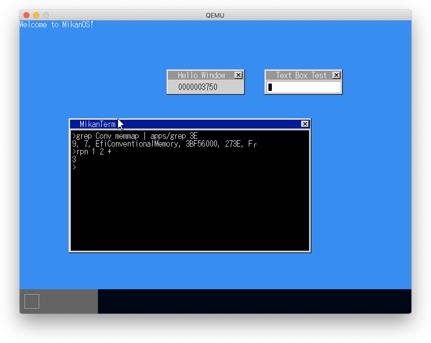
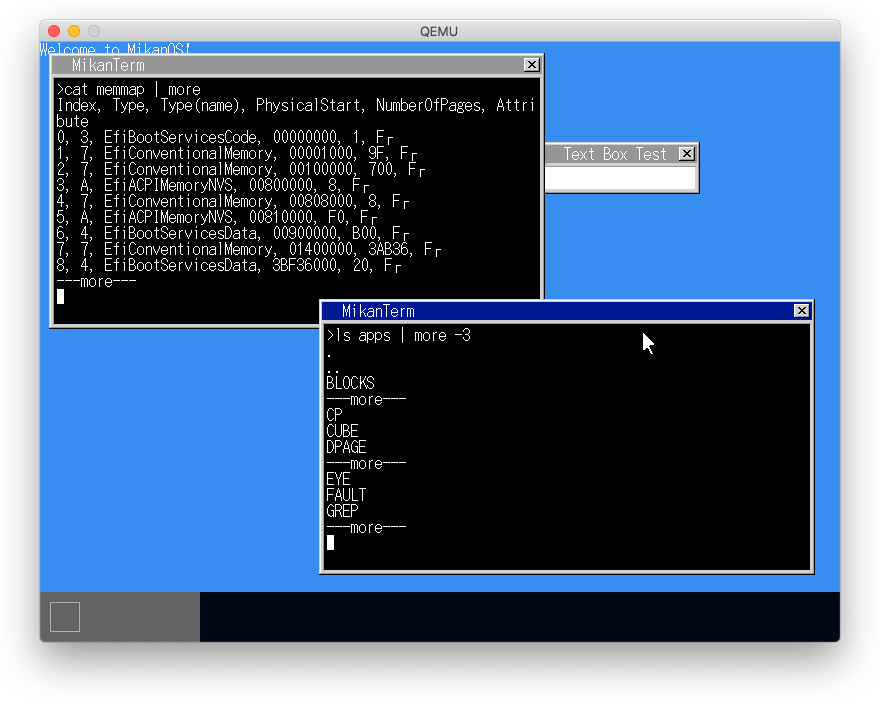
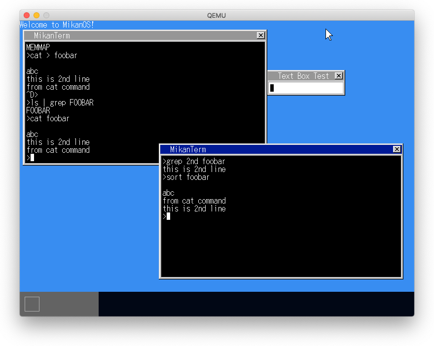
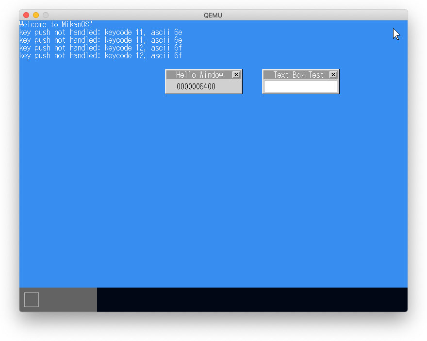
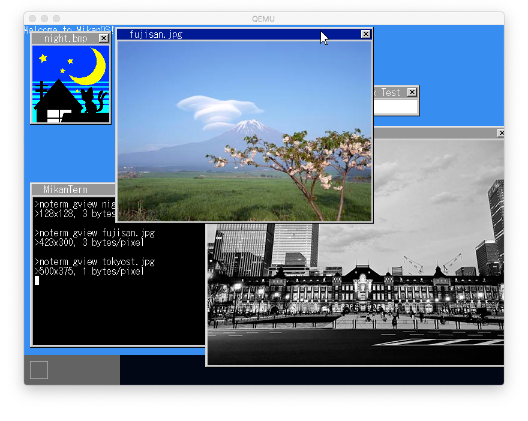

# 30.1 アプリにパスを通す

- 指定されたfilepathで探して見つからない場合は`apps`ディレクトリ配下を探す

# 30.2 moreコマンド

- パイプを使用している場合、イベント送信先を変える

# 30.3 catを入力に対応させる

- ファイル名を省略したらstdinとする

# 30.4 閉じるボタン

- 閉じるボタン領域でマウスクリックがあったらウィンドウにクローズメッセージを送信する

# 30.5 テキストビューア

# 30.6 画像ビューア

