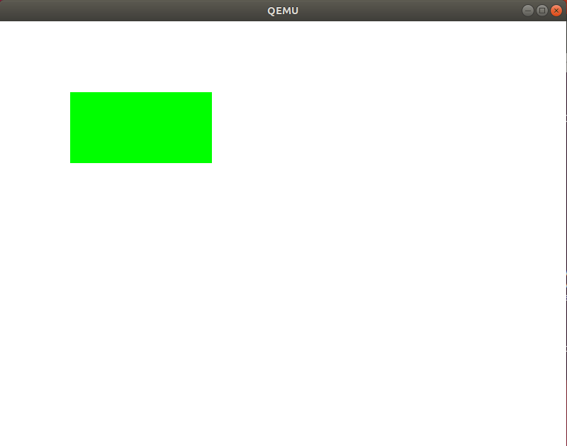
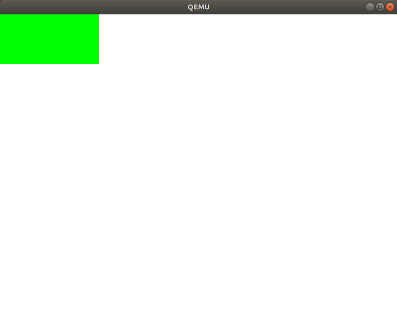
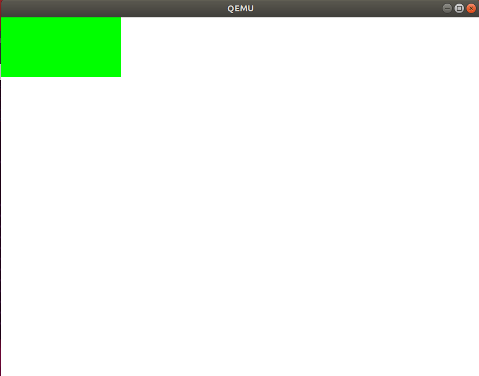

# 4.1 make入門

`mikan/mikanos/kernel/Makefile`を作成

# 4.2 ピクセルを自在に描く



## ABI (System V AMD64 ABI)

###  呼び出し規約

- 引数はレジスタ渡しで`rdi, rsi, rdx, rcx, r8, r9, zmm0-7`の順
- 返り値は`rax, rdx`の順
- calleeは`rsp, rbp, rbx, r12-r15`を保存

## ABI関係参考資料

- [System V Application Binary InterfaceAMD64 Architecture Processor Supplement(With LP64 and ILP32 Programming Models)Version 1.0](https://raw.githubusercontent.com/wiki/hjl-tools/x86-psABI/x86-64-psABI-1.0.pdf)
- [Calling conventions for different C++ compilers and operating systems](https://www.agner.org/optimize/calling_conventions.pdf)

# 4.3 C++の機能を使って書き直す



## 配置new

メモリ確保はせず、引数で指定したメモリ領域（この場合はchar配列）に
インスタンスを作成する機能。

通常のnewはヒープ領域にメモリを確保するが、OS作成の現地点ではメモリ管理ができないため
この機能を使用する。

```c++
char pixel_writer_buffer[sizeof(RGBResv8BitPerColorPixelWriter)];
PixelWriter *pixel_writer;

pixel_writer = new(pixel_writer_buffer)
                RGBResv8BitPerColorPixelWriter{frame_buffer_config};
```

# 4.5 ローダを改良する

プログラムヘッダを見て、必要な部分だけロードする。そのために一旦カーネルファイルを
一時ファイルにコピーして、ELFヘッダを解析する。

```
Program Headers:
  Type           Offset             VirtAddr           PhysAddr
                 FileSiz            MemSiz              Flags  Align
  PHDR           0x0000000000000040 0x0000000000100040 0x0000000000100040
                 0x0000000000000118 0x0000000000000118  R      0x8
  LOAD           0x0000000000000000 0x0000000000100000 0x0000000000100000
                 0x00000000000001a8 0x00000000000001a8  R      0x1000
  LOAD           0x0000000000001000 0x0000000000101000 0x0000000000101000
                 0x00000000000001b9 0x00000000000001b9  R E    0x1000
  LOAD           0x0000000000002000 0x0000000000102000 0x0000000000102000
                 0x0000000000000000 0x0000000000000018  RW     0x1000
  GNU_STACK      0x0000000000000000 0x0000000000000000 0x0000000000000000
                 0x0000000000000000 0x0000000000000000  RW     0x0
```

1. `Type=Load`のセグメントだけロードする。
2. 各セグメントの開始アドレス=`VirtAddr`と終了アドレス=`VirtAdd + MemSiz`を計算する。
3. 全セグメントの最小の開始アドレスから最大の終了アドレスをロード対象とする。
4. `(MemSiz - FileSiz) > 0`のセグメントはその分だけ0詰めする（.bssセグメント）。


