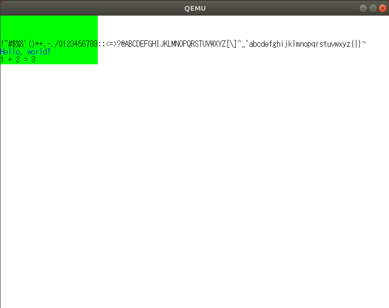
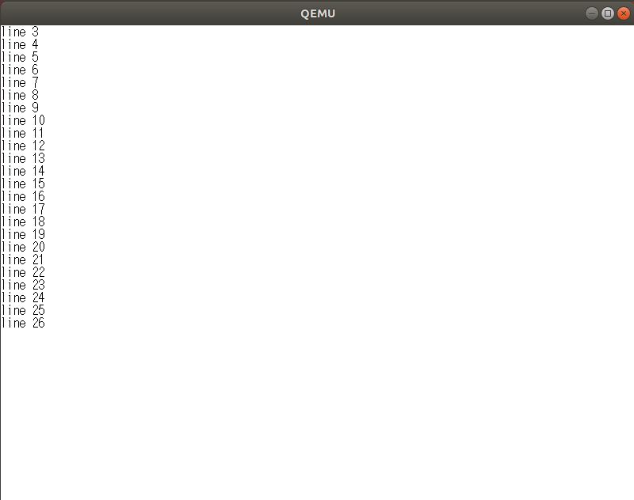
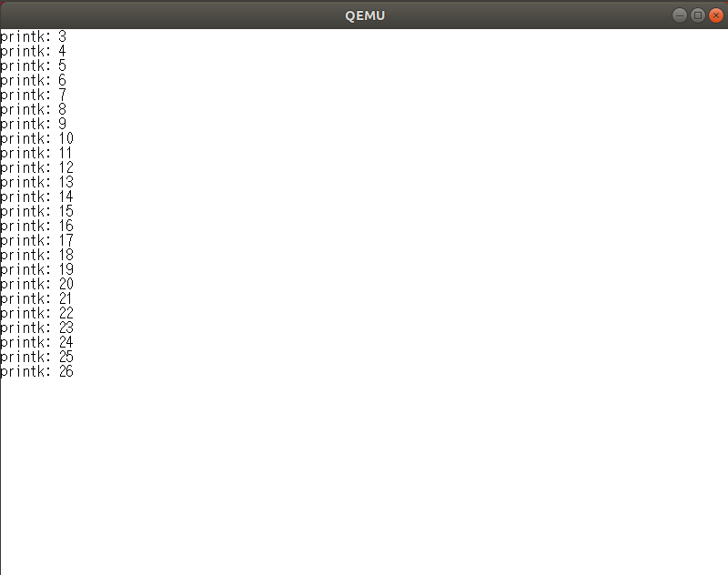

# 5.1 文字を描いてみる

- ピクセルの具体な描画方法と切り離すためにWriteAscii()の実装はPixelWriterの
  実装とは独立させるとあるが、WriteAscii()はフォントの描写だからピクセルの
  描写とは次元が違うということか。
- 参照はヌル参照を常に異常値と認識させるためのものだったのか（それだけ?）。


# 5.2 分割コンパイル

問題なし

# 5.3 フォントを増やそう

```
$ cd $HOME/mikan/mikanos
$ git checkout osbook_day05c
$ chmod +x tools/makefont.py
$ cd kernle
$ ../tools/makefont.py -o hankaku.bin hankaku.txt
$ objcopy -I binary -O elf64-x86-64 -B i386:x86-64 hankaku.bin hankaku.o
```

- フォントファイルはobjcopyにより作成される3つのシンボル: _binary_objfile_start,
  _binary_objfile_end, _binary_objfile_sizeを介してプログラムからアクセスできるようになる。
- objcopyの`-O`と`-B`と`で指定するbfdnameとbfdarchは`objdump --info`でリストされる。
  `-B i386`と`-B i386:x86-64`は同じ結果となるが`-B x86-64`はエラーとなる。`x86-64`という
  マシンアーキテクチャはないようだ。
  ```
  $ objcopy -I binary -O elf64-x86-64 -B x86-64 hankaku.bin hankaku.o
  objcopy: architecture x86-64 unknown
  ```


```
$ xxd hankaku.bin
00000000: 0000 0000 0000 0000 0000 0000 0000 0000  ................   # 0x00
00000010: 1010 3838 7c7c fefe 7c7c 3838 1010 0000  ..88||..||88....   # 0x01
00000020: 55aa 55aa 55aa 55aa 55aa 55aa 55aa 0000  U.U.U.U.U.U.U...   # 0x02
00000030: 0088 8888 f888 8888 003e 0808 0808 0808  .........>......   # 0x03

$ xxd hankaku.o
00000000: 7f45 4c46 0201 0100 0000 0000 0000 0000  .ELF............   # elf header
00000010: 0100 3e00 0100 0000 0000 0000 0000 0000  ..>.............
00000020: 0000 0000 0000 0000 2811 0000 0000 0000  ........(.......
00000030: 0000 0000 4000 0000 0000 4000 0500 0400  ....@.....@.....

00000040: 0000 0000 0000 0000 0000 0000 0000 0000  ................   # .data
00000050: 1010 3838 7c7c fefe 7c7c 3838 1010 0000  ..88||..||88....
00000060: 55aa 55aa 55aa 55aa 55aa 55aa 55aa 0000  U.U.U.U.U.U.U...
00000070: 0088 8888 f888 8888 003e 0808 0808 0808  .........>......

$ readelf -a hankaku.o
ELF Header:
  Magic:   7f 45 4c 46 02 01 01 00 00 00 00 00 00 00 00 00
  Class:                             ELF64
  Data:                              2's complement, little endian
  Version:                           1 (current)
  OS/ABI:                            UNIX - System V
  ABI Version:                       0
  Type:                              REL (Relocatable file)
  Machine:                           Advanced Micro Devices X86-64
  Version:                           0x1
  Entry point address:               0x0
  Start of program headers:          0 (bytes into file)
  Start of section headers:          4392 (bytes into file)
  Flags:                             0x0
  Size of this header:               64 (bytes)
  Size of program headers:           0 (bytes)
  Number of program headers:         0
  Size of section headers:           64 (bytes)
  Number of section headers:         5
  Section header string table index: 4

Section Headers:
  [Nr] Name              Type             Address           Offset
       Size              EntSize          Flags  Link  Info  Align
  [ 0]                   NULL             0000000000000000  00000000
       0000000000000000  0000000000000000           0     0     0
  [ 1] .data             PROGBITS         0000000000000000  00000040
       0000000000001000  0000000000000000  WA       0     0     1
  [ 2] .symtab           SYMTAB           0000000000000000  00001040
       0000000000000078  0000000000000018           3     2     8
  [ 3] .strtab           STRTAB           0000000000000000  000010b8
       000000000000004c  0000000000000000           0     0     1
  [ 4] .shstrtab         STRTAB           0000000000000000  00001104
       0000000000000021  0000000000000000           0     0     1

Symbol table '.symtab' contains 5 entries:
   Num:    Value          Size Type    Bind   Vis      Ndx Name
     0: 0000000000000000     0 NOTYPE  LOCAL  DEFAULT  UND
     1: 0000000000000000     0 SECTION LOCAL  DEFAULT    1
     2: 0000000000000000     0 NOTYPE  GLOBAL DEFAULT    1 _binary_hankaku_bin_start
     3: 0000000000001000     0 NOTYPE  GLOBAL DEFAULT    1 _binary_hankaku_bin_end
     4: 0000000000001000     0 NOTYPE  GLOBAL DEFAULT  ABS _binary_hankaku_bin_size

No version information found in this file.
```

# 5.4 文字列描画とsprintf()



- `newlib_supportc`に実装すべき関数群をまとめて実装したとあるが、この段階では
`sbrk`しか定義されていない。

## newlibで実装すべき関数一覧

`_exit`, `close`, `environ`, `execve`, `fork`, `fstat`, `getpid`, `isstty`,
`kill`, `link`, `lseek`, `open`, `read`, `sbrk`, `stat`, `times`, `unlink`,
`wait`, `write`

**参考**: [The Red Hat newlib C Library: 12.1 Definitions for OS interface](https://sourceware.org/newlib/)に参照実装あり。

# 5.5 コンソールクラス

出力専門のコンソール。機能は2つ。

1. 改行文字で改行する機能。
2. 最下行で1行スクロールする機能。

# 5.5 コンソールクラス



# 5.6 printk()


