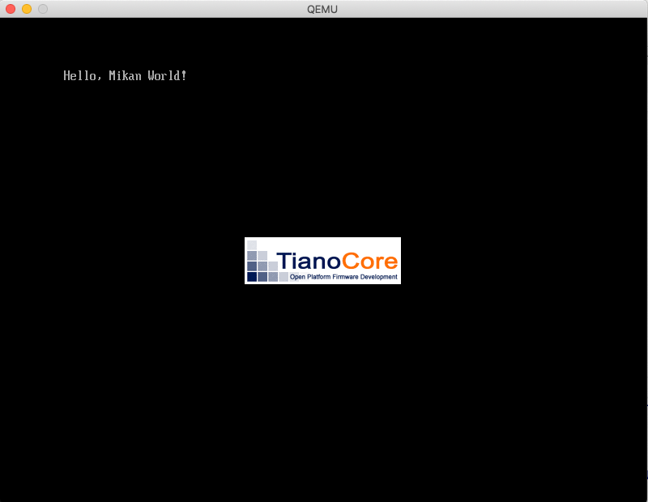
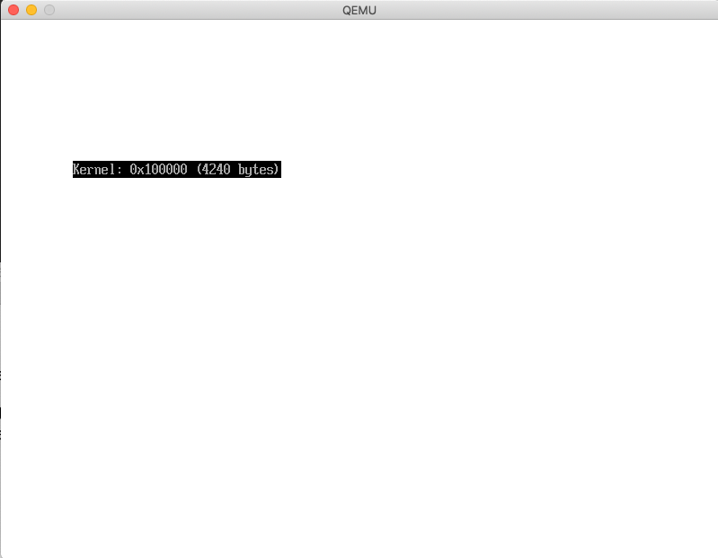
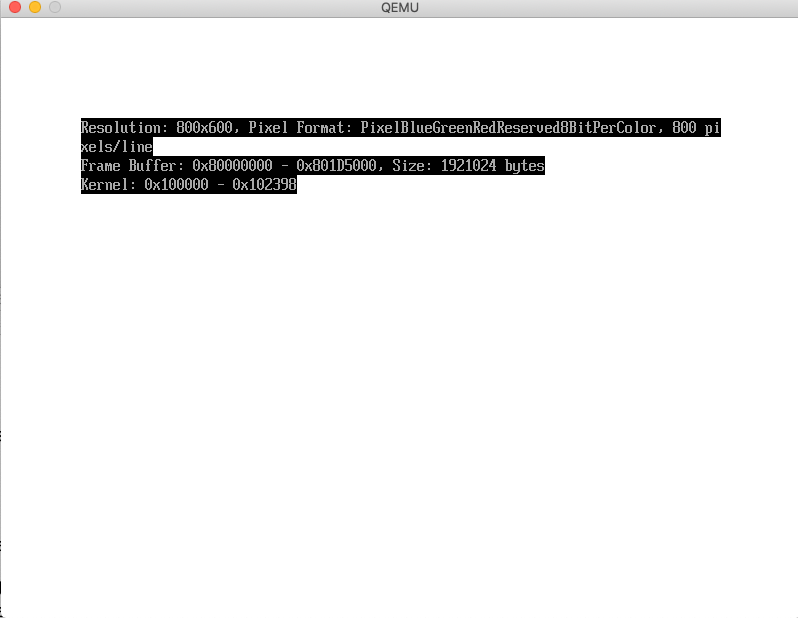

# Macでの環境構築

[Mac で始める「ゼロからのOS自作入門」](https://qiita.com/yamoridon/items/4905765cc6e4f320c9b5)による

## QEMUとBuild Tools

```
$ brew install qemu dosfstools llvm nasm
$ vi .bashrc
export PATH=/usr/local/opt/llvm/bin:$PATH
$ . .bashrc
$ clang --version
clang version 11.0.1
Target: x86_64-apple-darwin18.7.0
Thread model: posix
InstalledDir: /usr/local/opt/llvm/bin
$ clang++ --version
clang version 11.0.1
Target: x86_64-apple-darwin18.7.0
Thread model: posix
InstalledDir: /usr/local/opt/llvm/bin
```

## EDK II

```
$ cd && mkdir mikan && cd mikan
$ cd $HOME
$ git clone https://github.com/tianocore/edk2.git
$ cd edk2
$ git submodule init
$ git submodule update
$ cd BaseTools/Source/C
$ make
Finished building BaseTools C Tools with HOST_ARCH=X64
```

## mikanos-build

```
$ cd $HOME/mikan
$ git clone https://github.com/uchan-nos/mikanos-build.git osbook
$ cd osbook/devenv
$ curl -L https://github.com/uchan-nos/mikanos-build/releases/download/v2.0/x86_64-elf.tar.gz | tar xz
$ patch -p1 < mac.patch
```

## mikanos

```
$ cd $HOME/mikan
$ git clone https://github.com/uchan-nos/mikanos.git
$ cd mikanos
$ git checkout osbook_day02a
$ cd $HOME/edk2
$ ln -s $HOME/workspace/mikanos/MikanLoaderPkg .
$ source edksetup.sh
$ vi Conf/target.txt
ACTIVE_PLATFORM = MikanLoaderPkg/MikanLoaderPkg.dsc
TARGET          = DEBUG
TARGET_ARCH     = X64
TOOL_CHAIN_TAG  = CLANGPDB          #   CLANGPDB -Linux, Windows, Mac-  Requires:
                                    #       Clang 9 or above
```



**注** 必要であれば

```
For compilers to find llvm you may need to set:
  export LDFLAGS="-L/usr/local/opt/llvm/lib"
  export CPPFLAGS="-I/usr/local/opt/llvm/include"
```

# ブートローダのコンパイルと実行

## Macで実行: うまく動かない

エントリポイントが`0x101120`となっており、シンボルテーブルの
KernelMainも`0x101120`となっているが。kernel.elfのファイルサイズは
`1568=0x620`であり`0x10000`から読み込んでも`0x101120`にKernelMainはない。
KernelMainは`0x100120`にあるはず。

```
$ llvm-readelf -h kernel.elf
ELF Header:
  Magic:   7f 45 4c 46 02 01 01 00 00 00 00 00 00 00 00 00
  Class:                             ELF64
  Data:                              2's complement, little endian
  Version:                           1 (current)
  OS/ABI:                            UNIX - System V
  ABI Version:                       0
  Type:                              EXEC (Executable file)
  Machine:                           Advanced Micro Devices X86-64
  Version:                           0x1
  Entry point address:               0x101120
  Start of program headers:          64 (bytes into file)
  Start of section headers:          864 (bytes into file)
  Flags:                             0x0
  Size of this header:               64 (bytes)
  Size of program headers:           56 (bytes)
  Number of program headers:         4
  Size of section headers:           64 (bytes)
  Number of section headers:         11
  Section header string table index: 9

$ llvm-objdump -D kernel.elf

0000000000101120 <KernelMain>:
  101120: 55                           	pushq	%rbp
  101121: 48 89 e5                     	movq	%rsp, %rbp
  101124: 66 2e 0f 1f 84 00 00 00 00 00	nopw	%cs:(%rax,%rax)
  10112e: 66 90                        	nop
  101130: f4                           	hlt
  101131: eb fd                        	jmp	0x101130 <KernelMain+0x10>

$ xxd kernel.elf
00000000: 7f45 4c46 0201 0100 0000 0000 0000 0000  .ELF............
00000010: 0200 3e00 0100 0000 2011 1000 0000 0000  ..>..... .......
00000020: 4000 0000 0000 0000 6003 0000 0000 0000  @.......`.......
00000030: 0000 0000 4000 3800 0400 4000 0b00 0900  ....@.8...@.....
00000040: 0600 0000 0400 0000 4000 0000 0000 0000  ........@.......
00000050: 4000 1000 0000 0000 4000 1000 0000 0000  @.......@.......
00000060: e000 0000 0000 0000 e000 0000 0000 0000  ................
00000070: 0800 0000 0000 0000 0100 0000 0400 0000  ................
00000080: 0000 0000 0000 0000 0000 1000 0000 0000  ................
00000090: 0000 1000 0000 0000 2001 0000 0000 0000  ........ .......
000000a0: 2001 0000 0000 0000 0010 0000 0000 0000   ...............
000000b0: 0100 0000 0500 0000 2001 0000 0000 0000  ........ .......
000000c0: 2011 1000 0000 0000 2011 1000 0000 0000   ....... .......
000000d0: 1300 0000 0000 0000 1300 0000 0000 0000  ................
000000e0: 0010 0000 0000 0000 51e5 7464 0600 0000  ........Q.td....
000000f0: 0000 0000 0000 0000 0000 0000 0000 0000  ................
00000100: 0000 0000 0000 0000 0000 0000 0000 0000  ................
00000110: 0000 0000 0000 0000 0000 0000 0000 0000  ................
00000120: 5548 89e5 662e 0f1f 8400 0000 0000 6690  UH..f.........f.    # <= KernelMainは0x120から始まっている
00000130: f4eb fd01 1101 250e 1305 030e 1017 1b0e  ......%.........

$ llvm-nm kernel.elf
0000000000101120 T KernelMain
```

## entry_pointを直書きするとうまく動く

```C
  //UINT64 entry_addr = *(UINT64 *)(kernel_base_addr + 24);
  UINT64 entry_addr = 0x100120;
  typedef void EntryPointType(void);
  EntryPointType *entry_point = (EntryPointType *)entry_addr;
  entry_point();
```

- 意図通りに動く

```
(qemu) info registers
RIP=0000000000100131 RFL=00000002 [-------] CPL=0 II=0 A20=1 SMM=0 HLT=1
(qemu) x /2i 0x100130
0x00100130:  f4                       hlt
0x00100131:  eb fd                    jmp      0x100130
(qemu) x /6i 0x100120
0x00100120:  55                       pushq    %rbp
0x00100121:  48 89 e5                 movq     %rsp, %rbp
0x00100124:  66 2e 0f 1f 84 00 00 00  nopw     %cs:(%rax, %rax)
0x0010012c:  00 00
0x0010012e:  66 90                    nop
0x00100130:  f4                       hlt
0x00100131:  eb fd                    jmp      0x100130
```

## ld.lldの`-nmagic`オプションを付けるとうまく動く

```
$ ld.lld --help
--nmagic                Do not page align sections, link against static libraries.
--no-nmagic             Page align sections (default)
--no-omagic             Do not set the text data sections to be writable, page align sections (default)
--omagic                Set the text and data sections to be readable and writable, do not page align sections, link against static libraries


$ ld.lld --entry KernelMain -z norelro --image-base 0x100000 --static --nmagic -o kernel.elf main.o
$ ls -l
total 12
-rwxr-xr-x 1 dspace staff 1456  3 27 12:59 kernel.elf      # <= (1) ファイルサイズが1568から減少
-rw-r--r-- 1 dspace staff   63  3 26 17:26 main.cpp
-rw-r--r-- 1 dspace staff 1992  3 27 09:32 main.o

$ llvm-readelf kernel.elf
ELF Header:
  Magic:   7f 45 4c 46 02 01 01 00 00 00 00 00 00 00 00 00
  Class:                             ELF64
  Data:                              2's complement, little endian
  Version:                           1 (current)
  OS/ABI:                            UNIX - System V
  ABI Version:                       0
  Type:                              EXEC (Executable file)
  Machine:                           Advanced Micro Devices X86-64
  Version:                           0x1
  Entry point address:               0x1000B0               # <= (2) エントリポイントがKernelMainのアドレスに
  Start of program headers:          64 (bytes into file)
  Start of section headers:          752 (bytes into file)
  Flags:                             0x0
  Size of this header:               64 (bytes)
  Size of program headers:           56 (bytes)
  Number of program headers:         2                      # <= (3) プログラムヘッダーが4から2へ
  Size of section headers:           64 (bytes)
  Number of section headers:         11
  Section header string table index: 9

Elf file type is EXEC (Executable file)
Entry point 0x1000b0
There are 2 program headers, starting at offset 64

Program Headers:
  Type           Offset   VirtAddr           PhysAddr           FileSiz  MemSiz   Flg Align
  LOAD           0x0000b0 0x00000000001000b0 0x00000000001000b0 0x000013 0x000013 R E 0x10    <= (4) KernelMainのコード
  GNU_STACK      0x000000 0x0000000000000000 0x0000000000000000 0x000000 0x000000 RW  0x0


# xxd kernel.elf
00000000: 7f45 4c46 0201 0100 0000 0000 0000 0000  .ELF............   # ELF Header
00000010: 0200 3e00 0100 0000 b000 1000 0000 0000  ..>.............
00000020: 4000 0000 0000 0000 f002 0000 0000 0000  @...............
00000030: 0000 0000 4000 3800 0200 4000 0b00 0900  ....@.8...@.....

00000040: 0100 0000 0500 0000 b000 0000 0000 0000  ................   # Program Header 1
00000050: b000 1000 0000 0000 b000 1000 0000 0000  ................
00000060: 1300 0000 0000 0000 1300 0000 0000 0000  ................
00000070: 1000 0000 0000 0000
                              51e5 7464 0600 0000  ........Q.td....   # Program Header 2
00000080: 0000 0000 0000 0000 0000 0000 0000 0000  ................
00000090: 0000 0000 0000 0000 0000 0000 0000 0000  ................
000000a0: 0000 0000 0000 0000 0000 0000 0000 0000  ................

000000b0: 5548 89e5 662e 0f1f 8400 0000 0000 6690  UH..f.........f.   # (5) <= エントリポイント: KernelMain
000000c0: f4eb fd01 1101 250e 1305 030e 1017 1b0e  ......%.........

$ llvm-nm kernel.elf
00000000001000b0 T KernelMain
```

- 意図通りに動く

```
(qemu) info registers
RIP=00000000001000c1 RFL=00000002 [-------] CPL=0 II=0 A20=1 SMM=0 HLT=1    # <= (6) RIPがKernelMainの最後の命令を指している
(qemu) x /6i 0x1000b0
0x001000b0:  55                       pushq    %rbp
0x001000b1:  48 89 e5                 movq     %rsp, %rbp
0x001000b4:  66 2e 0f 1f 84 00 00 00  nopw     %cs:(%rax, %rax)
0x001000bc:  00 00
0x001000be:  66 90                    nop
0x001000c0:  f4                       hlt
0x001000c1:  eb fd                    jmp      0x1000c0
```

**参考**: [[LLD][ELF] Full support for -n (--nmagic) and -N (--omagic)](https://reviews.llvm.org/D61201)

# 3.4 ブートローダからピクセルを描く

問題なく動いているように見える。


# 3.5 カーネルからピクセルを描く

カーネルに制御は渡っているが、処理途中で止まる。

```
(qemu) info registers
RIP=0000000000100220 RFL=00000082 [--S----] CPL=0 II=0 A20=1 SMM=0 HLT=0

XMM00=3f3e3d3c3b3a39383736353433323130 XMM01=80808080808080808080808080808080
XMM02=0f0e0d0c0b0a09080706050403020100 XMM03=30303030303030303030303030303030
XMM04=40404040404040404040404040404040 XMM05=50505050505050505050505050505050
XMM06=60606060606060606060606060606060 XMM07=70707070707070707070707070707070
XMM08=10101010101010101010101010101010 XMM09=20202020202020202020202020202020

(qemu) x /81i 0x100180
0x00100180:  55                       pushq    %rbp
0x00100181:  48 89 e5                 movq     %rsp, %rbp
0x00100184:  48 85 f6                 testq    %rsi, %rsi
0x00100187:  0f 84 53 01 00 00        je       0x1002e0
0x0010018d:  48 83 fe 10              cmpq     $0x10, %rsi
0x00100191:  73 07                    jae      0x10019a
0x00100193:  31 c0                    xorl     %eax, %eax
0x00100195:  e9 36 01 00 00           jmp      0x1002d0
0x0010019a:  48 89 f0                 movq     %rsi, %rax
0x0010019d:  48 83 e0 f0              andq     $0xfffffffffffffff0, %rax
0x001001a1:  48 8d 50 f0              leaq     -0x10(%rax), %rdx
0x001001a5:  48 89 d1                 movq     %rdx, %rcx
0x001001a8:  48 c1 e9 04              shrq     $4, %rcx
0x001001ac:  48 83 c1 01              addq     $1, %rcx
0x001001b0:  41 89 c8                 movl     %ecx, %r8d
0x001001b3:  41 83 e0 07              andl     $7, %r8d
0x001001b7:  48 83 fa 70              cmpq     $0x70, %rdx
0x001001bb:  73 0f                    jae      0x1001cc
0x001001bd:  66 0f 6f 15 8b ff ff ff  movdqa   -0x75(%rip), %xmm2
0x001001c5:  31 d2                    xorl     %edx, %edx
0x001001c7:  e9 cb 00 00 00           jmp      0x100297
0x001001cc:  48 83 e1 f8              andq     $0xfffffffffffffff8, %rcx
0x001001d0:  48 f7 d9                 negq     %rcx
0x001001d3:  66 0f 6f 15 75 ff ff ff  movdqa   -0x8b(%rip), %xmm2
0x001001db:  31 d2                    xorl     %edx, %edx
0x001001dd:  66 44 0f 6f 05 7a ff ff  movdqa   -0x86(%rip), %xmm8
0x001001e5:  ff
0x001001e6:  66 44 0f 6f 0d 31 ff ff  movdqa   -0xcf(%rip), %xmm9
0x001001ee:  ff
0x001001ef:  66 0f 6f 1d f9 fe ff ff  movdqa   -0x107(%rip), %xmm3
0x001001f7:  66 0f 6f 25 01 ff ff ff  movdqa   -0xff(%rip), %xmm4
0x001001ff:  66 0f 6f 2d 69 ff ff ff  movdqa   -0x97(%rip), %xmm5
0x00100207:  66 0f 6f 35 01 ff ff ff  movdqa   -0xff(%rip), %xmm6
0x0010020f:  66 0f 6f 3d 29 ff ff ff  movdqa   -0xd7(%rip), %xmm7
0x00100217:  66 0f 6f 0d 11 ff ff ff  movdqa   -0xef(%rip), %xmm1
0x0010021f:  90                       nop
0x00100220:  f3 0f 7f 14 17           movdqu   %xmm2, (%rdi, %rdx)
0x00100225:  66 0f 6f c2              movdqa   %xmm2, %xmm0
0x00100229:  66 41 0f fc c0           paddb    %xmm8, %xmm0
0x0010022e:  f3 0f 7f 44 17 10        movdqu   %xmm0, 0x10(%rdi, %rdx)
0x00100234:  66 0f 6f c2              movdqa   %xmm2, %xmm0
0x00100238:  66 41 0f fc c1           paddb    %xmm9, %xmm0
0x0010023d:  f3 0f 7f 44 17 20        movdqu   %xmm0, 0x20(%rdi, %rdx)
0x00100243:  66 0f 6f c2              movdqa   %xmm2, %xmm0
0x00100247:  66 0f fc c3              paddb    %xmm3, %xmm0
0x0010024b:  f3 0f 7f 44 17 30        movdqu   %xmm0, 0x30(%rdi, %rdx)
0x00100251:  66 0f 6f c2              movdqa   %xmm2, %xmm0
0x00100255:  66 0f fc c4              paddb    %xmm4, %xmm0
0x00100259:  f3 0f 7f 44 17 40        movdqu   %xmm0, 0x40(%rdi, %rdx)
0x0010025f:  66 0f 6f c2              movdqa   %xmm2, %xmm0
0x00100263:  66 0f fc c5              paddb    %xmm5, %xmm0
0x00100267:  f3 0f 7f 44 17 50        movdqu   %xmm0, 0x50(%rdi, %rdx)
0x0010026d:  66 0f 6f c2              movdqa   %xmm2, %xmm0
0x00100271:  66 0f fc c6              paddb    %xmm6, %xmm0
0x00100275:  f3 0f 7f 44 17 60        movdqu   %xmm0, 0x60(%rdi, %rdx)
0x0010027b:  66 0f 6f c2              movdqa   %xmm2, %xmm0
0x0010027f:  66 0f fc c7              paddb    %xmm7, %xmm0
0x00100283:  f3 0f 7f 44 17 70        movdqu   %xmm0, 0x70(%rdi, %rdx)
0x00100289:  48 83 ea 80              subq     $-0x80, %rdx
0x0010028d:  66 0f ef d1              pxor     %xmm1, %xmm2
0x00100291:  48 83 c1 08              addq     $8, %rcx
0x00100295:  75 89                    jne      0x100220
0x00100297:  4d 85 c0                 testq    %r8, %r8
0x0010029a:  74 25                    je       0x1002c1
0x0010029c:  48 01 fa                 addq     %rdi, %rdx
0x0010029f:  49 f7 d8                 negq     %r8
0x001002a2:  66 0f 6f 0d b6 fe ff ff  movdqa   -0x14a(%rip), %xmm1
0x001002aa:  66 0f 1f 44 00 00        nopw     (%rax, %rax)
0x001002b0:  f3 0f 7f 12              movdqu   %xmm2, (%rdx)
0x001002b4:  66 0f fc d1              paddb    %xmm1, %xmm2
0x001002b8:  48 83 c2 10              addq     $0x10, %rdx
0x001002bc:  49 ff c0                 incq     %r8
0x001002bf:  75 ef                    jne      0x1002b0
0x001002c1:  48 39 f0                 cmpq     %rsi, %rax
0x001002c4:  74 1a                    je       0x1002e0
0x001002c6:  66 2e 0f 1f 84 00 00 00  nopw     %cs:(%rax, %rax)
0x001002ce:  00 00
0x001002d0:  88 04 07                 movb     %al, (%rdi, %rax)
0x001002d3:  48 83 c0 01              addq     $1, %rax
0x001002d7:  48 39 c6                 cmpq     %rax, %rsi
0x001002da:  75 f4                    jne      0x1002d0
0x001002dc:  0f 1f 40 00              nopl     (%rax)
0x001002e0:  f4                       hlt
0x001002e1:  eb fd                    jmp      0x1002e0
```



# メモ

## LinuxとMacにおける違い

### Linux

```
$ readelf -a kernel.elf
ELF Header:
  Magic:   7f 45 4c 46 02 01 01 00 00 00 00 00 00 00 00 00
  Class:                             ELF64
  Data:                              2's complement, little endian
  Version:                           1 (current)
  OS/ABI:                            UNIX - System V
  ABI Version:                       0
  Type:                              EXEC (Executable file)
  Machine:                           Advanced Micro Devices X86-64
  Version:                           0x1
  Entry point address:               0x101000
  Start of program headers:          64 (bytes into file)
  Start of section headers:          8928 (bytes into file)
  Flags:                             0x0
  Size of this header:               64 (bytes)
  Size of program headers:           56 (bytes)
  Number of program headers:         4
  Size of section headers:           64 (bytes)
  Number of section headers:         14
  Section header string table index: 12

Program Headers:
  Type           Offset             VirtAddr           PhysAddr           FileSiz            MemSiz              Flags  Align
  PHDR           0x0000000000000040 0x0000000000100040 0x0000000000100040 0x00000000000000e0 0x00000000000000e0  R      0x8
  LOAD           0x0000000000000000 0x0000000000100000 0x0000000000100000 0x0000000000000120 0x0000000000000120  R      0x1000
  LOAD           0x0000000000001000 0x0000000000101000 0x0000000000101000 0x0000000000001000 0x0000000000001000  R E    0x1000
  GNU_STACK      0x0000000000000000 0x0000000000000000 0x0000000000000000 0x0000000000000000 0x0000000000000000  RW     0x0

$ xxd kernle.elf
00000000: 7f45 4c46 0201 0100 0000 0000 0000 0000  .ELF............   # ELF Header
00000010: 0200 3e00 0100 0000 0010 1000 0000 0000  ..>.............
00000020: 4000 0000 0000 0000 e022 0000 0000 0000  @........"......
00000030: 0000 0000 4000 3800 0400 4000 0e00 0c00  ....@.8...@.....

00000040: 0600 0000 0400 0000 4000 0000 0000 0000  ........@.......   # Program Header 1
00000050: 4000 1000 0000 0000 4000 1000 0000 0000  @.......@.......
00000060: e000 0000 0000 0000 e000 0000 0000 0000  ................
00000070: 0800 0000 0000 0000
                              0100 0000 0400 0000  ................   # Program Header 2
00000080: 0000 0000 0000 0000 0000 1000 0000 0000  ................
00000090: 0000 1000 0000 0000 2001 0000 0000 0000  ........ .......
000000a0: 2001 0000 0000 0000 0010 0000 0000 0000   ...............

000000b0: 0100 0000 0500 0000 0010 0000 0000 0000  ................   # Program Header 3
000000c0: 0010 1000 0000 0000 0010 1000 0000 0000  ................
000000d0: 0010 0000 0000 0000 0010 0000 0000 0000  ................
000000e0: 0010 0000 0000 0000
                              51e5 7464 0600 0000  ........Q.td....   # Program Header 4
000000f0: 0000 0000 0000 0000 0000 0000 0000 0000  ................
00000100: 0000 0000 0000 0000 0000 0000 0000 0000  ................
00000110: 0000 0000 0000 0000 0000 0000 0000 0000  ................

00000120: 0000 0000 0000 0000 0000 0000 0000 0000  ................
...
00000ff0: 0000 0000 0000 0000 0000 0000 0000 0000  ................
00001000: 5548 89e5 662e 0f1f 8400 0000 0000 6690  UH..f.........f.   # KernelMain
00001010: f4eb fdcc cccc cccc cccc cccc cccc cccc  ................

```

### Mac

```
$ llvm-readelf -a kernel.elf
ELF Header:
  Magic:   7f 45 4c 46 02 01 01 00 00 00 00 00 00 00 00 00
  Class:                             ELF64
  Data:                              2's complement, little endian
  Version:                           1 (current)
  OS/ABI:                            UNIX - System V
  ABI Version:                       0
  Type:                              EXEC (Executable file)
  Machine:                           Advanced Micro Devices X86-64
  Version:                           0x1
  Entry point address:               0x101120
  Start of program headers:          64 (bytes into file)
  Start of section headers:          864 (bytes into file)
  Flags:                             0x0
  Size of this header:               64 (bytes)
  Size of program headers:           56 (bytes)
  Number of program headers:         4
  Size of section headers:           64 (bytes)
  Number of section headers:         11
  Section header string table index: 9
There are 11 section headers, starting at offset 0x360:

Section Headers:
  [ 1] .text             PROGBITS        0000000000101120 000120 000013 00  AX  0   0 16

Program Headers:
  Type           Offset   VirtAddr           PhysAddr           FileSiz  MemSiz   Flg Align
  PHDR           0x000040 0x0000000000100040 0x0000000000100040 0x0000e0 0x0000e0 R   0x8
  LOAD           0x000000 0x0000000000100000 0x0000000000100000 0x000120 0x000120 R   0x1000
  LOAD           0x000120 0x0000000000101120 0x0000000000101120 0x000013 0x000013 R E 0x1000
  GNU_STACK      0x000000 0x0000000000000000 0x0000000000000000 0x000000 0x000000 RW  0x0

# xxd kernel.elf
00000000: 7f45 4c46 0201 0100 0000 0000 0000 0000  .ELF............   # ELf Header
00000010: 0200 3e00 0100 0000 2011 1000 0000 0000  ..>..... .......
00000020: 4000 0000 0000 0000 6003 0000 0000 0000  @.......`.......
00000030: 0000 0000 4000 3800 0400 4000 0b00 0900  ....@.8...@.....

00000040: 0600 0000 0400 0000 4000 0000 0000 0000  ........@.......   # Program Header 1
00000050: 4000 1000 0000 0000 4000 1000 0000 0000  @.......@.......
00000060: e000 0000 0000 0000 e000 0000 0000 0000  ................
00000070: 0800 0000 0000 0000
                              0100 0000 0400 0000  ................   # Program Header 2
00000080: 0000 0000 0000 0000 0000 1000 0000 0000  ................
00000090: 0000 1000 0000 0000 2001 0000 0000 0000  ........ .......
000000a0: 2001 0000 0000 0000 0010 0000 0000 0000   ...............

000000b0: 0100 0000 0500 0000 2001 0000 0000 0000  ........ .......   # Program Header 3
000000c0: 2011 1000 0000 0000 2011 1000 0000 0000   ....... .......
000000d0: 1300 0000 0000 0000 1300 0000 0000 0000  ................
000000e0: 0010 0000 0000 0000
                              51e5 7464 0600 0000  ........Q.td....   # Program Header 4
000000f0: 0000 0000 0000 0000 0000 0000 0000 0000  ................
00000100: 0000 0000 0000 0000 0000 0000 0000 0000  ................
00000110: 0000 0000 0000 0000 0000 0000 0000 0000  ................

00000120: 5548 89e5 662e 0f1f 8400 0000 0000 6690  UH..f.........f.   # Kernel Main
00000130: f4eb fd01 1101 250e 1305 030e 1017 1b0e  ......%.........
00000140: 1101 1206 0000 022e 0011 0112 0640 1897  .............@..
00000150: 4219 030e 3a0b 3b0b 3f19 0000 003c 0000  B...:.;.?....<..
00000160: 0004 0000 0000 0008 0114 0000 0021 0000  .............!..

```

### Program Header

```
typedef struct {
    uint32_t   p_type;
    uint32_t   p_flags;
    Elf64_Off  p_offset;
    Elf64_Addr p_vaddr;
    Elf64_Addr p_paddr;
    uint64_t   p_filesz;
    uint64_t   p_memsz;
    uint64_t   p_align;
} Elf64_Phdr;
```

## nmagic, omagic

omagicについてはHelpにある説明とは異なり、効果はないようである。

### (1) -no-nmagic, -no-omagic（デフォルト）

```
-rwxr-xr-x 1 dspace staff 1568  3 27 17:08 kernel.elf

  Entry point address:               0x101120

Section Headers:
  [Nr] Name              Type            Address          Off    Size   ES Flg Lk Inf Al
  [ 1] .text             PROGBITS        0000000000101120 000120 000013 00  AX  0   0 16

Program Headers:
  Type           Offset   VirtAddr           PhysAddr           FileSiz  MemSiz   Flg Align
  PHDR           0x000040 0x0000000000100040 0x0000000000100040 0x0000e0 0x0000e0 R   0x8
  LOAD           0x000000 0x0000000000100000 0x0000000000100000 0x000120 0x000120 R   0x1000
  LOAD           0x000120 0x0000000000101120 0x0000000000101120 0x000013 0x000013 R E 0x1000
  GNU_STACK      0x000000 0x0000000000000000 0x0000000000000000 0x000000 0x000000 RW  0x0
```

### (2) -nmagic, -no-omagic

```
-rwxr-xr-x 1 dspace staff 1456  3 27 17:12 kernel.elf

  Entry point address:               0x1000B0

Section Headers:
  [Nr] Name              Type            Address          Off    Size   ES Flg Lk Inf Al
  [ 1] .text             PROGBITS        00000000001000b0 0000b0 000013 00  AX  0   0 16

Program Headers:
  Type           Offset   VirtAddr           PhysAddr           FileSiz  MemSiz   Flg Align
  LOAD           0x0000b0 0x00000000001000b0 0x00000000001000b0 0x000013 0x000013 R E 0x10
  GNU_STACK      0x000000 0x0000000000000000 0x0000000000000000 0x000000 0x000000 RW  0x0
```

### (3) -no-nmagic, -omagic

```
-rwxr-xr-x 1 dspace staff 1568  3 27 17:15 kernel.elf

  Entry point address:               0x101120

Section Headers:
  [Nr] Name              Type            Address          Off    Size   ES Flg Lk Inf Al
  [ 1] .text             PROGBITS        0000000000101120 000120 000013 00  AX  0   0 16

Program Headers:
  Type           Offset   VirtAddr           PhysAddr           FileSiz  MemSiz   Flg Align
  PHDR           0x000040 0x0000000000100040 0x0000000000100040 0x0000e0 0x0000e0 R   0x8
  LOAD           0x000000 0x0000000000100000 0x0000000000100000 0x000120 0x000120 R   0x1000
  LOAD           0x000120 0x0000000000101120 0x0000000000101120 0x000013 0x000013 R E 0x1000
  GNU_STACK      0x000000 0x0000000000000000 0x0000000000000000 0x000000 0x000000 RW  0x0
```

### (3) -nmagic, -omagic

```
-rwxr-xr-x 1 dspace staff 1456  3 27 17:16 kernel.elf

  Entry point address:               0x1000B0

Section Headers:
  [Nr] Name              Type            Address          Off    Size   ES Flg Lk Inf Al
  [ 1] .text             PROGBITS        00000000001000b0 0000b0 000013 00  AX  0   0 16

Program Headers:
  Type           Offset   VirtAddr           PhysAddr           FileSiz  MemSiz   Flg Align
  LOAD           0x0000b0 0x00000000001000b0 0x00000000001000b0 0x000013 0x000013 R E 0x10
  GNU_STACK      0x000000 0x0000000000000000 0x0000000000000000 0x000000 0x000000 RW  0x0
```

# 4.5 ローダを改良する

エントリポイントの問題は解決し、処理も途中で止まらなくなったが、ブートローダから引数が渡らないか、
フレームバッファにアクセスできないのか、カーネルからの画面描写ができない、

```
(qemu) info registers
RAX=0000000000102300 RBX=0000000000000064 RCX=000000003fea47f8 RDX=000000000000031c
RSI=00000000000000c7 RDI=0000000000000000 RBP=000000003fea4820 RSP=000000003fea47f0
R8 =000000003fea47b4 R9 =000000003fb7b48f R10=000000003fbcd018 R11=fffffffffffffffc
R12=0000000000102398 R13=000000003f226a20 R14=000000003fea47f8 R15=00000000000000c8
RIP=00000000001012e1 RFL=00000046 [---Z-P-] CPL=0 II=0 A20=1 SMM=0 HLT=1
ES =0030 0000000000000000 ffffffff 00cf9300 DPL=0 DS   [-WA]
CS =0038 0000000000000000 ffffffff 00af9a00 DPL=0 CS64 [-R-]
SS =0030 0000000000000000 ffffffff 00cf9300 DPL=0 DS   [-WA]
DS =0030 0000000000000000 ffffffff 00cf9300 DPL=0 DS   [-WA]
FS =0030 0000000000000000 ffffffff 00cf9300 DPL=0 DS   [-WA]
GS =0030 0000000000000000 ffffffff 00cf9300 DPL=0 DS   [-WA]
LDT=0000 0000000000000000 0000ffff 00008200 DPL=0 LDT
TR =0000 0000000000000000 0000ffff 00008b00 DPL=0 TSS64-busy
GDT=     000000003fbee698 00000047
IDT=     000000003f306018 00000fff
CR0=80010033 CR2=0000000000000000 CR3=000000003fc01000 CR4=00000668
DR0=0000000000000000 DR1=0000000000000000 DR2=0000000000000000 DR3=0000000000000000
DR6=00000000ffff0ff0 DR7=0000000000000400
EFER=0000000000000500
FCW=037f FSW=0000 [ST=0] FTW=00 MXCSR=00001f80
FPR0=0000000000000000 0000 FPR1=0000000000000000 0000
FPR2=0000000000000000 0000 FPR3=0000000000000000 0000
FPR4=0000000000000000 0000 FPR5=0000000000000000 0000
FPR6=0000000000000000 0000 FPR7=0000000000000000 0000
XMM00=00000000000000000000000000000000 XMM01=00000000000000000000000000000000
XMM02=00000000000000000000000000000000 XMM03=00000000000000000000000000000000
XMM04=00000000000000000000000000000000 XMM05=00000000000000000000000000000000
XMM06=00000000000000000000000000000000 XMM07=00000000000000000000000000000000
XMM08=00000000000000000000000000000000 XMM09=00000000000000000000000000000000
XMM10=00000000000000000000000000000000 XMM11=00000000000000000000000000000000
XMM12=00000000000000000000000000000000 XMM13=00000000000000000000000000000000
XMM14=00000000000000000000000000000000 XMM15=00000000000000000000000000000000
(qemu) x /74i 0x1011d0
0x001011d0:  55                       pushq    %rbp
0x001011d1:  48 89 e5                 movq     %rsp, %rbp
0x001011d4:  41 57                    pushq    %r15
0x001011d6:  41 56                    pushq    %r14
0x001011d8:  41 54                    pushq    %r12
0x001011da:  53                       pushq    %rbx
0x001011db:  48 83 ec 10              subq     $0x10, %rsp
0x001011df:  49 89 fe                 movq     %rdi, %r14
0x001011e2:  8b 47 14                 movl     0x14(%rdi), %eax
0x001011e5:  85 c0                    testl    %eax, %eax
0x001011e7:  74 0c                    je       0x1011f5
0x001011e9:  83 f8 01                 cmpl     $1, %eax
0x001011ec:  75 25                    jne      0x101213
0x001011ee:  b8 90 01 10 00           movl     $0x100190, %eax
0x001011f3:  eb 05                    jmp      0x1011fa
0x001011f5:  b8 68 01 10 00           movl     $0x100168, %eax
0x001011fa:  4c 89 35 87 11 00 00     movq     %r14, 0x1187(%rip)
0x00101201:  48 89 05 78 11 00 00     movq     %rax, 0x1178(%rip)
0x00101208:  48 c7 05 7d 11 00 00 80  movq     $0x102380, 0x117d(%rip)
0x00101210:  23 10 00
0x00101213:  41 8b 46 0c              movl     0xc(%r14), %eax    #
0x00101217:  85 c0                    testl    %eax, %eax
0x00101219:  74 65                    je       0x101280
0x0010121b:  41 8b 4e 10              movl     0x10(%r14), %ecx
0x0010121f:  45 31 e4                 xorl     %r12d, %r12d
0x00101222:  4c 8d 7d d0              leaq     -0x30(%rbp), %r15
0x00101226:  eb 11                    jmp      0x101239
0x00101228:  0f 1f 84 00 00 00 00 00  nopl     (%rax, %rax)
0x00101230:  41 83 c4 01              addl     $1, %r12d
0x00101234:  41 39 c4                 cmpl     %eax, %r12d
0x00101237:  73 47                    jae      0x101280
0x00101239:  85 c9                    testl    %ecx, %ecx
0x0010123b:  b9 00 00 00 00           movl     $0, %ecx
0x00101240:  74 ee                    je       0x101230
0x00101242:  31 db                    xorl     %ebx, %ebx
0x00101244:  66 2e 0f 1f 84 00 00 00  nopw     %cs:(%rax, %rax)
0x0010124c:  00 00
0x0010124e:  66 90                    nop
0x00101250:  48 8b 3d 39 11 00 00     movq     0x1139(%rip), %rdi
0x00101257:  66 c7 45 d0 ff ff        movw     $0xffff, -0x30(%rbp)
0x0010125d:  c6 45 d2 ff              movb     $0xff, -0x2e(%rbp)
0x00101261:  48 8b 07                 movq     (%rdi), %rax
0x00101264:  44 89 e6                 movl     %r12d, %esi
0x00101267:  89 da                    movl     %ebx, %edx
0x00101269:  4c 89 f9                 movq     %r15, %rcx
0x0010126c:  ff 50 10                 callq    *0x10(%rax)
0x0010126f:  83 c3 01                 addl     $1, %ebx
0x00101272:  41 8b 4e 10              movl     0x10(%r14), %ecx
0x00101276:  39 cb                    cmpl     %ecx, %ebx
0x00101278:  72 d6                    jb       0x101250
0x0010127a:  41 8b 46 0c              movl     0xc(%r14), %eax
0x0010127e:  eb b0                    jmp      0x101230
0x00101280:  45 31 ff                 xorl     %r15d, %r15d
0x00101283:  4c 8d 75 d8              leaq     -0x28(%rbp), %r14
0x00101287:  66 0f 1f 84 00 00 00 00  nopw     (%rax, %rax)
0x0010128f:  00
0x00101290:  31 db                    xorl     %ebx, %ebx
0x00101292:  66 2e 0f 1f 84 00 00 00  nopw     %cs:(%rax, %rax)
0x0010129a:  00 00
0x0010129c:  0f 1f 40 00              nopl     (%rax)
0x001012a0:  48 8b 3d e9 10 00 00     movq     0x10e9(%rip), %rdi
0x001012a7:  66 c7 45 d8 00 ff        movw     $0xff00, -0x28(%rbp)
0x001012ad:  c6 45 da 00              movb     $0, -0x26(%rbp)
0x001012b1:  48 8b 07                 movq     (%rdi), %rax
0x001012b4:  44 89 fe                 movl     %r15d, %esi
0x001012b7:  89 da                    movl     %ebx, %edx
0x001012b9:  4c 89 f1                 movq     %r14, %rcx
0x001012bc:  ff 50 10                 callq    *0x10(%rax)
0x001012bf:  83 c3 01                 addl     $1, %ebx
0x001012c2:  83 fb 64                 cmpl     $0x64, %ebx
0x001012c5:  75 d9                    jne      0x1012a0
0x001012c7:  41 83 c7 01              addl     $1, %r15d
0x001012cb:  41 81 ff c8 00 00 00     cmpl     $0xc8, %r15d
0x001012d2:  75 bc                    jne      0x101290
0x001012d4:  66 2e 0f 1f 84 00 00 00  nopw     %cs:(%rax, %rax)
0x001012dc:  00 00
0x001012de:  66 90                    nop
0x001012e0:  f4                       hlt
0x001012e1:  eb fd                    jmp      0x1012e0
```



- 命令は最後まで実行されているがOSによる描画はできていない


```
qemu-system-x86_64 -m 1G -drive if=pflash,format=raw,readonly,file=/Users/dspace/mikan/osbook/devenv/OVMF_CODE.fd -drive if=pflash,format=raw,file=/Users/dspace/mikan/osbook/devenv/OVMF_VARS.fd -drive if=ide,index=0,media=disk,format=raw,file=./disk.img -device nec-usb-xhci,id=xhci -device usb-mouse -device usb-kbd -monitor stdio
```
