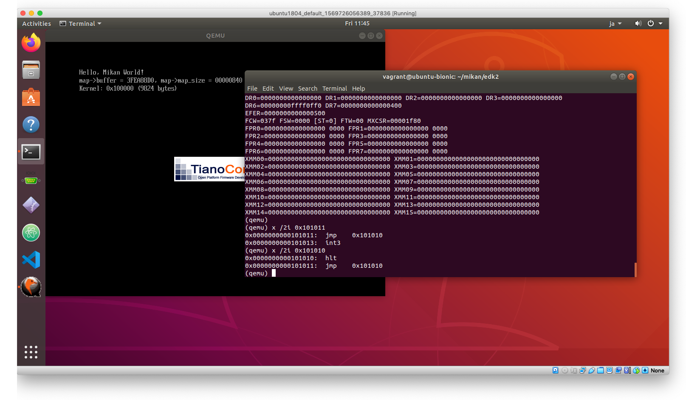
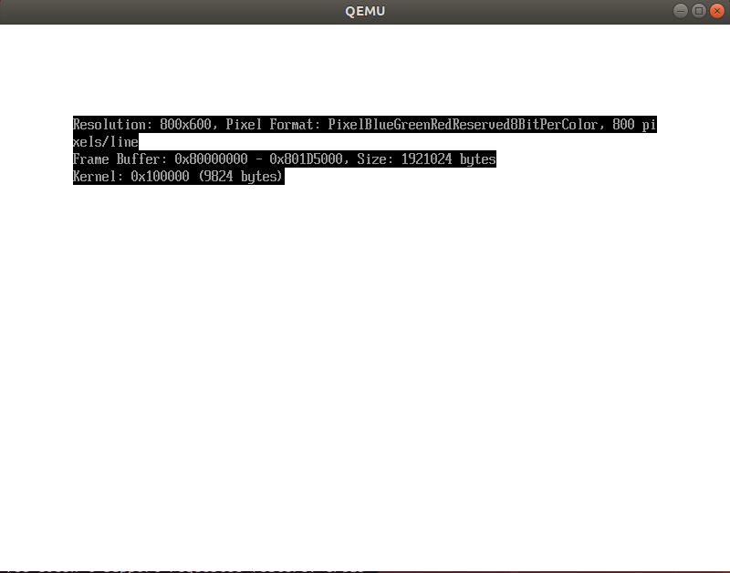
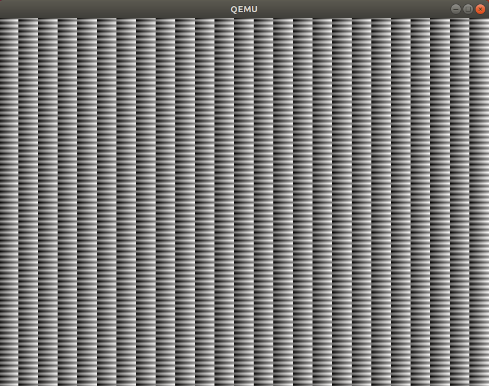

# QEMUモニタ

```
(qemu) info registers
RAX=0000000000000000 RBX=0000000000000001 RCX=000000003fb7b1c0 RDX=000000000000002f
RSI=0000000000000400 RDI=000000003fea9270 RBP=000000000000002c RSP=000000003fea88a0
R8 =0000000000000000 R9 =000000003fecc30f R10=0000000000000050 R11=0000000000000000
R12=000000003e666568 R13=000000003fea8930 R14=000000003e7747a0 R15=000000003fea88e8
RIP=000000003e665416 RFL=00000202 [-------] CPL=0 II=0 A20=1 SMM=0 HLT=0
ES =0030 0000000000000000 ffffffff 00cf9300 DPL=0 DS   [-WA]
CS =0038 0000000000000000 ffffffff 00af9a00 DPL=0 CS64 [-R-]
SS =0030 0000000000000000 ffffffff 00cf9300 DPL=0 DS   [-WA]
DS =0030 0000000000000000 ffffffff 00cf9300 DPL=0 DS   [-WA]
FS =0030 0000000000000000 ffffffff 00cf9300 DPL=0 DS   [-WA]
GS =0030 0000000000000000 ffffffff 00cf9300 DPL=0 DS   [-WA]
LDT=0000 0000000000000000 0000ffff 00008200 DPL=0 LDT
TR =0000 0000000000000000 0000ffff 00008b00 DPL=0 TSS64-busy
GDT=     000000003fbee698 00000047
IDT=     000000003f306018 00000fff
CR0=80010033 CR2=0000000000000000 CR3=000000003fc01000 CR4=00000668
DR0=0000000000000000 DR1=0000000000000000 DR2=0000000000000000 DR3=0000000000000000
DR6=00000000ffff0ff0 DR7=0000000000000400
EFER=0000000000000500
FCW=037f FSW=0000 [ST=0] FTW=00 MXCSR=00001f80
FPR0=0000000000000000 0000 FPR1=0000000000000000 0000
FPR2=0000000000000000 0000 FPR3=0000000000000000 0000
FPR4=0000000000000000 0000 FPR5=0000000000000000 0000
FPR6=0000000000000000 0000 FPR7=0000000000000000 0000
XMM00=00000000000000000000000000000000 XMM01=00000000000000000000000000000000
XMM02=00000000000000000000000000000000 XMM03=00000000000000000000000000000000
XMM04=00000000000000000000000000000000 XMM05=00000000000000000000000000000000
XMM06=00000000000000000000000000000000 XMM07=00000000000000000000000000000000
XMM08=00000000000000000000000000000000 XMM09=00000000000000000000000000000000
XMM10=00000000000000000000000000000000 XMM11=00000000000000000000000000000000
XMM12=00000000000000000000000000000000 XMM13=00000000000000000000000000000000
XMM14=00000000000000000000000000000000 XMM15=00000000000000000000000000000000
(qemu) x /4xb 0x3e665416
000000003e665416: 0xeb 0xfe 0x55 0x41
(qemu) x /2i 0x3e665416
0x000000003e665416:  jmp    0x3e665416
0x000000003e665418:  push   %rbp
(qemu)
```

# 初めてのカーネル

```
$ cd $HOME/mikan/mikanos
$ git status
On branch day02
nothing to commit, working tree clean
$ git checkout -b day03                   # day02を元に写経
$ mkdir kernel && vi kernel/main.cpp      # コンパイラフラグとリンカフラグについては説明あり
$ clang++ -O2 -Wall -g --target=x86_64-elf -ffreestanding -mno-red-zone \
-fno-exceptions -fno-rtti -std=c++17 -c main.cpp
$ file main.o
main.o: ELF 64-bit LSB relocatable, x86-64, version 1 (SYSV), with debug_info, not stripped
$ ld.lld --entry KernelMain -z norelro --image-base 0x100000 --static -o kernel.elf main.o
$ ls -l
total 20
-rwxrwxr-x 1 vagrant vagrant 9824 Mar 26 11:11 kernel.elf
-rw-rw-r-- 1 vagrant vagrant   63 Mar 26 11:10 main.cpp
-rw-rw-r-- 1 vagrant vagrant 2576 Mar 26 11:11 main.o
$ file kernel.elf
kernel.elf: ELF 64-bit LSB executable, x86-64, version 1 (SYSV), statically linked, with debug_info, not stripped
$ readelf -h kernel.elf
ELF Header:
  Magic:   7f 45 4c 46 02 01 01 00 00 00 00 00 00 00 00 00
  Class:                             ELF64
  Data:                              2's complement, little endian
  Version:                           1 (current)
  OS/ABI:                            UNIX - System V
  ABI Version:                       0
  Type:                              EXEC (Executable file)
  Machine:                           Advanced Micro Devices X86-64
  Version:                           0x1
  Entry point address:               0x101000
  Start of program headers:          64 (bytes into file)
  Start of section headers:          8928 (bytes into file)
  Flags:                             0x0
  Size of this header:               64 (bytes)
  Size of program headers:           56 (bytes)
  Number of program headers:         4
  Size of section headers:           64 (bytes)
  Number of section headers:         14
  Section header string table index: 12
```

## ELF header

```
$ man elf

#define EI_NIDENT 16

typedef struct {
    unsigned char e_ident[EI_NIDENT];
    uint16_t      e_type;
    uint16_t      e_machine;
    uint32_t      e_version;
    ElfN_Addr     e_entry;              # <= offset: 24
    ElfN_Off      e_phoff;
    ElfN_Off      e_shoff;
    uint32_t      e_flags;
    uint16_t      e_ehsize;
    uint16_t      e_phentsize;
    uint16_t      e_phnum;
    uint16_t      e_shentsize;
    uint16_t      e_shnum;
    uint16_t      e_shstrndx;
} ElfN_Ehdr;
```

## ブートローダのコンパイルと実行

```
$ vi MikanLoaderPkg/Loader.inf
$ vi MikanLoaderPkg/Main.c
$ $HOME/mikan/osbook/devenv/run_qemu.sh Build/MikanLoaderX64/DEBUG_CLANG38/X64/Loader.efi \
/home/vagrant/mikan/mikanos/kernel/kernel.elf

(qemu) info registers
RAX=0000000000100000 RBX=000000003effef18 RCX=0000000000000000 RDX=0000000000000000
RSI=000000003feaca08 RDI=000000003feac9e0 RBP=000000003fea8850 RSP=000000003fea8850
R8 =000000003fea87c4 R9 =000000003fb7b48f R10=000000003fbcd018 R11=fffffffffffffffc
R12=000000003effe920 R13=000000003feac8d0 R14=000000003fea9110 R15=000000003e66573c
RIP=0000000000101011 RFL=00000046 [---Z-P-] CPL=0 II=0 A20=1 SMM=0 HLT=1
(qemu) x /2i 0x101011
0x0000000000101011:  jmp    0x101010
0x0000000000101013:  int3
(qemu) x /2i 0x101010
0x0000000000101010:  hlt
0x0000000000101011:  jmp    0x101010
```



### ここまでのdiff

第3章で不要なコードの`@@range_begin(), @@range_end()`が削除され、追加コードのうち第3章に
コードが示されている部分に新たに付加されていた。昨日の推理は正しいようだ。

```
$ git diff
$ cat diff.txt
diff --git a/MikanLoaderPkg/Loader.inf b/MikanLoaderPkg/Loader.inf
index 47d14bf..62c23df 100644
--- a/MikanLoaderPkg/Loader.inf
+++ b/MikanLoaderPkg/Loader.inf
@@ -19,6 +19,7 @@
   UefiApplicationEntryPoint

 [Guids]
+  gEfiFileInfoGuid

 [Protocols]
   gEfiLoadedImageProtocolGuid
diff --git a/MikanLoaderPkg/Main.c b/MikanLoaderPkg/Main.c
index 5cd3083..6287139 100644
--- a/MikanLoaderPkg/Main.c
+++ b/MikanLoaderPkg/Main.c
@@ -6,8 +6,8 @@
 #include  <Protocol/SimpleFileSystem.h>
 #include  <Protocol/DiskIo2.h>
 #include  <Protocol/BlockIo.h>
+#include  <Guid/FileInfo.h>

-// #@@range_begin(struct_memory_map)
 struct MemoryMap {
     UINTN buffer_size;
     VOID* buffer;
@@ -16,9 +16,7 @@ struct MemoryMap {
     UINTN descriptor_size;
     UINT32 descriptor_version;
 };
-// #@@range_end(struct_memory_map)

-// #@@range_begin(get_memory_map)
 EFI_STATUS GetMemoryMap(struct MemoryMap *map) {
     if (map->buffer == NULL) {
         return EFI_BUFFER_TOO_SMALL;
@@ -32,9 +30,7 @@ EFI_STATUS GetMemoryMap(struct MemoryMap *map) {
         &map->descriptor_size,
         &map->descriptor_version);
 }
-// #@@range_end(get_memory_map)

-// #@@range_begin(get_memory_type)
 const CHAR16 *GetMemoryTypeUnicode(EFI_MEMORY_TYPE type) {
     switch (type) {
         case EfiReservedMemoryType: return L"EfiReservedmemoryType";
@@ -56,9 +52,7 @@ const CHAR16 *GetMemoryTypeUnicode(EFI_MEMORY_TYPE type) {
         default: return L"InvallidMemoryType";
     }
 }
-// #@@range_end(get_memory_type)

-// #@@range_begin(save_memory_map)
 EFI_STATUS SaveMemoryMap(struct MemoryMap *map, EFI_FILE_PROTOCOL *file) {
     CHAR8 buf[256];
     UINTN len;
@@ -88,7 +82,6 @@ EFI_STATUS SaveMemoryMap(struct MemoryMap *map, EFI_FILE_PROTOCOL *file) {

     return EFI_SUCCESS;
 }
-// #@@range_end(save_memory_map)

 EFI_STATUS OpenRootDir(EFI_HANDLE image_handle, EFI_FILE_PROTOCOL **root) {
     EFI_LOADED_IMAGE_PROTOCOL *loaded_image;
@@ -120,7 +113,6 @@ EFI_STATUS EFIAPI UefiMain(
     EFI_SYSTEM_TABLE *system_table) {
   Print(L"Hello, Mikan World!\n");

-  // #@@range_begin(main)
   CHAR8 memmap_buf[4096 * 4];
   struct MemoryMap memmap = {sizeof(memmap_buf), memmap_buf, 0, 0, 0, 0};
   GetMemoryMap(&memmap);
@@ -135,7 +127,48 @@ EFI_STATUS EFIAPI UefiMain(

   SaveMemoryMap(&memmap, memmap_file);
   memmap_file->Close(memmap_file);
-  // #@@range_end(main)
+
+  EFI_FILE_PROTOCOL *kernel_file;
+  root_dir->Open(
+      root_dir, &kernel_file, L"\\kernel.elf",
+      EFI_FILE_MODE_READ, 0);
+
+  UINTN file_info_size = sizeof(EFI_FILE_INFO) + sizeof(CHAR16) * 12;
+  UINT8 file_info_buffer[file_info_size];
+  kernel_file->GetInfo(
+      kernel_file, &gEfiFileInfoGuid,
+      &file_info_size, file_info_buffer);
+
+  EFI_FILE_INFO *file_info = (EFI_FILE_INFO *)file_info_buffer;
+  UINTN kernel_file_size = file_info->FileSize;
+
+  EFI_PHYSICAL_ADDRESS kernel_base_addr = 0x100000;
+  gBS->AllocatePages(
+      AllocateAddress, EfiLoaderData,
+      (kernel_file_size + 0xfff) / 0x1000, &kernel_base_addr);
+  kernel_file->Read(kernel_file, &kernel_file_size, (VOID *)kernel_base_addr);
+  Print(L"Kernel: 0x%0lx (%lu bytes)\n", kernel_base_addr, kernel_file_size);
+
+  EFI_STATUS status;
+  status = gBS->ExitBootServices(image_handle, memmap.map_key);
+  if (EFI_ERROR(status)) {
+      status = GetMemoryMap(&memmap);
+      if (EFI_ERROR(status)) {
+          Print(L"failed to get memory map: %r\n", status);
+          while (1);
+      }
+      status = gBS->ExitBootServices(image_handle, memmap.map_key);
+      if (EFI_ERROR(status)) {
+          Print(L"Could not exit boot service: %r\n", status);
+          while (1);
+      }
+  }
+
+  UINT64 entry_addr = *(UINT64 *)(kernel_base_addr + 24);
+
+  typedef void EntryPointType(void);
+  EntryPointType *entry_point = (EntryPointType *)entry_addr;
+  entry_point();

   Print(L"All Done\n");
```


# 3.4 ブートローダからピクセルを描く

```
$ cd $HOME/mikan/mikanos
$ vi MikanLoaderPkg/Main.c
$ build
$ /Users/dspace/mikan/osbook/devenv/run_qemu.sh /Users/dspace/mikan/edk2/Build/MikanLoaderX64/DEBUG_CLANGPDB/X64/Loader.efi /Users/dspace/mikan/mikanos/kernel/kernel.elf
```



# 3.5 カーネルからピクセルを描く



```
(qemu) info registers
RAX=00000000001d5000 RBX=000000003feaca18 RCX=0000000000000000 RDX=00000000001d5000
RSI=00000000001d5000 RDI=0000000080000000 RBP=000000003fea4850 RSP=000000003fea4850
R8 =0000000000000000 R9 =000000003fb7b48f R10=000000003fbcd018 R11=fffffffffffffffc
R12=000000003e665878 R13=000000003effe920 R14=000000003effef18 R15=000000003fea5110
RIP=0000000000101181 RFL=00000046 [---Z-P-] CPL=0 II=0 A20=1 SMM=0 HLT=1
ES =0030 0000000000000000 ffffffff 00cf9300 DPL=0 DS   [-WA]
CS =0038 0000000000000000 ffffffff 00af9a00 DPL=0 CS64 [-R-]
SS =0030 0000000000000000 ffffffff 00cf9300 DPL=0 DS   [-WA]
DS =0030 0000000000000000 ffffffff 00cf9300 DPL=0 DS   [-WA]
FS =0030 0000000000000000 ffffffff 00cf9300 DPL=0 DS   [-WA]
GS =0030 0000000000000000 ffffffff 00cf9300 DPL=0 DS   [-WA]
LDT=0000 0000000000000000 0000ffff 00008200 DPL=0 LDT
TR =0000 0000000000000000 0000ffff 00008b00 DPL=0 TSS64-busy
GDT=     000000003fbee698 00000047
IDT=     000000003f306018 00000fff
CR0=80010033 CR2=0000000000000000 CR3=000000003fc01000 CR4=00000668
DR0=0000000000000000 DR1=0000000000000000 DR2=0000000000000000 DR3=0000000000000000
DR6=00000000ffff0ff0 DR7=0000000000000400
EFER=0000000000000500
FCW=037f FSW=0000 [ST=0] FTW=00 MXCSR=00001f80
FPR0=0000000000000000 0000 FPR1=0000000000000000 0000
FPR2=0000000000000000 0000 FPR3=0000000000000000 0000
FPR4=0000000000000000 0000 FPR5=0000000000000000 0000
FPR6=0000000000000000 0000 FPR7=0000000000000000 0000
XMM00=fffefdfcfbfaf9f8f7f6f5f4f3f2f1f0 XMM01=80808080808080808080808080808080
XMM02=0f0e0d0c0b0a09080706050403020100 XMM03=30303030303030303030303030303030
XMM04=40404040404040404040404040404040 XMM05=50505050505050505050505050505050
XMM06=60606060606060606060606060606060 XMM07=70707070707070707070707070707070
XMM08=10101010101010101010101010101010 XMM09=20202020202020202020202020202020
XMM10=00000000000000000000000000000000 XMM11=00000000000000000000000000000000
XMM12=00000000000000000000000000000000 XMM13=00000000000000000000000000000000
XMM14=00000000000000000000000000000000 XMM15=00000000000000000000000000000000

(qemu) quit

$ readelf -a kernel.elf
ELF Header:
  Magic:   7f 45 4c 46 02 01 01 00 00 00 00 00 00 00 00 00
  Class:                             ELF64
  Data:                              2's complement, little endian
  Version:                           1 (current)
  OS/ABI:                            UNIX - System V
  ABI Version:                       0
  Type:                              EXEC (Executable file)
  Machine:                           Advanced Micro Devices X86-64
  Version:                           0x1
  Entry point address:               0x101000
  Start of program headers:          64 (bytes into file)
  Start of section headers:          12048 (bytes into file)
  Flags:                             0x0
  Size of this header:               64 (bytes)
  Size of program headers:           56 (bytes)
  Number of program headers:         4
  Size of section headers:           64 (bytes)
  Number of section headers:         16
  Section header string table index: 14

Section Headers:
  [Nr] Name              Type             Address           Offset
       Size              EntSize          Flags  Link  Info  Align
  [ 0]                   NULL             0000000000000000  00000000
       0000000000000000  0000000000000000           0     0     0
  [ 1] .rodata           PROGBITS         0000000000100120  00000120
       0000000000000090  0000000000000010  AM       0     0     16
  [ 2] .text             PROGBITS         0000000000101000  00001000
       0000000000000183  0000000000000000  AX       0     0     16

Program Headers:
  Type           Offset             VirtAddr           PhysAddr
                 FileSiz            MemSiz              Flags  Align
  PHDR           0x0000000000000040 0x0000000000100040 0x0000000000100040
                 0x00000000000000e0 0x00000000000000e0  R      0x8
  LOAD           0x0000000000000000 0x0000000000100000 0x0000000000100000
                 0x00000000000001b0 0x00000000000001b0  R      0x1000
  LOAD           0x0000000000001000 0x0000000000101000 0x0000000000101000
                 0x0000000000001000 0x0000000000001000  R E    0x1000
  GNU_STACK      0x0000000000000000 0x0000000000000000 0x0000000000000000
                 0x0000000000000000 0x0000000000000000  RW     0x0

 Section to Segment mapping:
  Segment Sections...
   00
   01     .rodata
   02     .text
   03

There is no dynamic section in this file.

There are no relocations in this file.

The decoding of unwind sections for machine type Advanced Micro Devices X86-64 is not currently supported.

Symbol table '.symtab' contains 3 entries:
   Num:    Value          Size Type    Bind   Vis      Ndx Name
     0: 0000000000000000     0 NOTYPE  LOCAL  DEFAULT  UND
     1: 0000000000000000     0 FILE    LOCAL  DEFAULT  ABS main.cpp
     2: 0000000000101000   387 FUNC    GLOBAL DEFAULT    2 KernelMain

No version information found in this file.

$ objdump -D kernel.elf

kernel.elf:     file format elf64-x86-64

Disassembly of section .text:

0000000000101000 <KernelMain>:
  101000:	55                   	push   %rbp
  101001:	48 89 e5             	mov    %rsp,%rbp
  101004:	48 85 f6             	test   %rsi,%rsi
  101007:	0f 84 73 01 00 00    	je     101180 <KernelMain+0x180>
  10100d:	48 83 fe 10          	cmp    $0x10,%rsi
  101011:	73 07                	jae    10101a <KernelMain+0x1a>
  101013:	31 c0                	xor    %eax,%eax
  101015:	e9 56 01 00 00       	jmpq   101170 <KernelMain+0x170>
  10101a:	48 89 f0             	mov    %rsi,%rax
  10101d:	48 83 e0 f0          	and    $0xfffffffffffffff0,%rax
  101021:	48 8d 50 f0          	lea    -0x10(%rax),%rdx
  101025:	48 89 d1             	mov    %rdx,%rcx
  101028:	48 c1 e9 04          	shr    $0x4,%rcx
  10102c:	48 83 c1 01          	add    $0x1,%rcx
  101030:	41 89 c8             	mov    %ecx,%r8d
  101033:	41 83 e0 07          	and    $0x7,%r8d
  101037:	48 83 fa 70          	cmp    $0x70,%rdx
  10103b:	73 18                	jae    101055 <KernelMain+0x55>
  10103d:	66 0f 6f 15 3b f1 ff 	movdqa -0xec5(%rip),%xmm2        # 100180 <KernelMain-0xe80>
  101044:	ff
  101045:	31 d2                	xor    %edx,%edx
  101047:	4d 85 c0             	test   %r8,%r8
  10104a:	0f 85 ec 00 00 00    	jne    10113c <KernelMain+0x13c>
  101050:	e9 0d 01 00 00       	jmpq   101162 <KernelMain+0x162>
  101055:	ba 01 00 00 00       	mov    $0x1,%edx
  10105a:	48 29 ca             	sub    %rcx,%rdx
  10105d:	49 8d 0c 10          	lea    (%r8,%rdx,1),%rcx
  101061:	48 83 c1 ff          	add    $0xffffffffffffffff,%rcx
  101065:	66 0f 6f 15 13 f1 ff 	movdqa -0xeed(%rip),%xmm2        # 100180 <KernelMain-0xe80>
  10106c:	ff
  10106d:	31 d2                	xor    %edx,%edx
  10106f:	66 44 0f 6f 05 18 f1 	movdqa -0xee8(%rip),%xmm8        # 100190 <KernelMain-0xe70>
  101076:	ff ff
  101078:	66 44 0f 6f 0d cf f0 	movdqa -0xf31(%rip),%xmm9        # 100150 <KernelMain-0xeb0>
  10107f:	ff ff
  101081:	66 0f 6f 1d 97 f0 ff 	movdqa -0xf69(%rip),%xmm3        # 100120 <KernelMain-0xee0>
  101088:	ff
  101089:	66 0f 6f 25 9f f0 ff 	movdqa -0xf61(%rip),%xmm4        # 100130 <KernelMain-0xed0>
  101090:	ff
  101091:	66 0f 6f 2d 07 f1 ff 	movdqa -0xef9(%rip),%xmm5        # 1001a0 <KernelMain-0xe60>
  101098:	ff
  101099:	66 0f 6f 35 9f f0 ff 	movdqa -0xf61(%rip),%xmm6        # 100140 <KernelMain-0xec0>
  1010a0:	ff
  1010a1:	66 0f 6f 3d c7 f0 ff 	movdqa -0xf39(%rip),%xmm7        # 100170 <KernelMain-0xe90>
  1010a8:	ff
  1010a9:	66 0f 6f 0d af f0 ff 	movdqa -0xf51(%rip),%xmm1        # 100160 <KernelMain-0xea0>
  1010b0:	ff
  1010b1:	66 2e 0f 1f 84 00 00 	nopw   %cs:0x0(%rax,%rax,1)
  1010b8:	00 00 00
  1010bb:	0f 1f 44 00 00       	nopl   0x0(%rax,%rax,1)
  1010c0:	f3 0f 7f 14 17       	movdqu %xmm2,(%rdi,%rdx,1)
  1010c5:	66 0f 6f c2          	movdqa %xmm2,%xmm0
  1010c9:	66 41 0f fc c0       	paddb  %xmm8,%xmm0
  1010ce:	f3 0f 7f 44 17 10    	movdqu %xmm0,0x10(%rdi,%rdx,1)
  1010d4:	66 0f 6f c2          	movdqa %xmm2,%xmm0
  1010d8:	66 41 0f fc c1       	paddb  %xmm9,%xmm0
  1010dd:	f3 0f 7f 44 17 20    	movdqu %xmm0,0x20(%rdi,%rdx,1)
  1010e3:	66 0f 6f c2          	movdqa %xmm2,%xmm0
  1010e7:	66 0f fc c3          	paddb  %xmm3,%xmm0
  1010eb:	f3 0f 7f 44 17 30    	movdqu %xmm0,0x30(%rdi,%rdx,1)
  1010f1:	66 0f 6f c2          	movdqa %xmm2,%xmm0
  1010f5:	66 0f fc c4          	paddb  %xmm4,%xmm0
  1010f9:	f3 0f 7f 44 17 40    	movdqu %xmm0,0x40(%rdi,%rdx,1)
  1010ff:	66 0f 6f c2          	movdqa %xmm2,%xmm0
  101103:	66 0f fc c5          	paddb  %xmm5,%xmm0
  101107:	f3 0f 7f 44 17 50    	movdqu %xmm0,0x50(%rdi,%rdx,1)
  10110d:	66 0f 6f c2          	movdqa %xmm2,%xmm0
  101111:	66 0f fc c6          	paddb  %xmm6,%xmm0
  101115:	f3 0f 7f 44 17 60    	movdqu %xmm0,0x60(%rdi,%rdx,1)
  10111b:	66 0f 6f c2          	movdqa %xmm2,%xmm0
  10111f:	66 0f fc c7          	paddb  %xmm7,%xmm0
  101123:	f3 0f 7f 44 17 70    	movdqu %xmm0,0x70(%rdi,%rdx,1)
  101129:	48 83 ea 80          	sub    $0xffffffffffffff80,%rdx
  10112d:	66 0f ef d1          	pxor   %xmm1,%xmm2
  101131:	48 83 c1 08          	add    $0x8,%rcx
  101135:	75 89                	jne    1010c0 <KernelMain+0xc0>
  101137:	4d 85 c0             	test   %r8,%r8
  10113a:	74 26                	je     101162 <KernelMain+0x162>
  10113c:	48 01 fa             	add    %rdi,%rdx
  10113f:	49 f7 d8             	neg    %r8
  101142:	66 0f 6f 0d 46 f0 ff 	movdqa -0xfba(%rip),%xmm1        # 100190 <KernelMain-0xe70>
  101149:	ff
  10114a:	66 0f 1f 44 00 00    	nopw   0x0(%rax,%rax,1)
  101150:	f3 0f 7f 12          	movdqu %xmm2,(%rdx)
  101154:	66 0f fc d1          	paddb  %xmm1,%xmm2
  101158:	48 83 c2 10          	add    $0x10,%rdx
  10115c:	49 83 c0 01          	add    $0x1,%r8
  101160:	75 ee                	jne    101150 <KernelMain+0x150>
  101162:	48 39 f0             	cmp    %rsi,%rax
  101165:	74 19                	je     101180 <KernelMain+0x180>
  101167:	66 0f 1f 84 00 00 00 	nopw   0x0(%rax,%rax,1)
  10116e:	00 00
  101170:	88 04 07             	mov    %al,(%rdi,%rax,1)
  101173:	48 83 c0 01          	add    $0x1,%rax
  101177:	48 39 c6             	cmp    %rax,%rsi
  10117a:	75 f4                	jne    101170 <KernelMain+0x170>
  10117c:	0f 1f 40 00          	nopl   0x0(%rax)
  101180:	f4                   	hlt
  101181:	eb fd                	jmp    101180 <KernelMain+0x180>
```

# 3.6 エラー処理

エラー処理を実装した。
