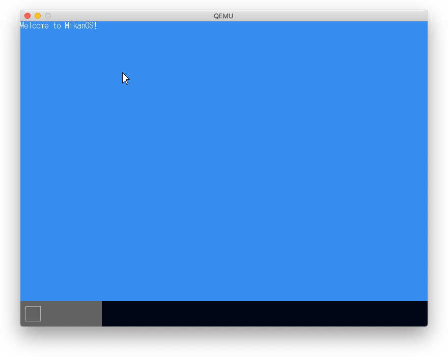
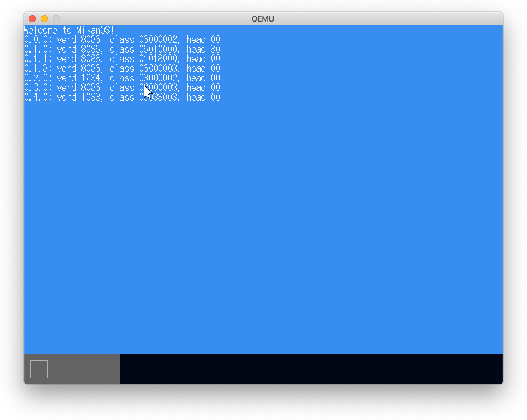
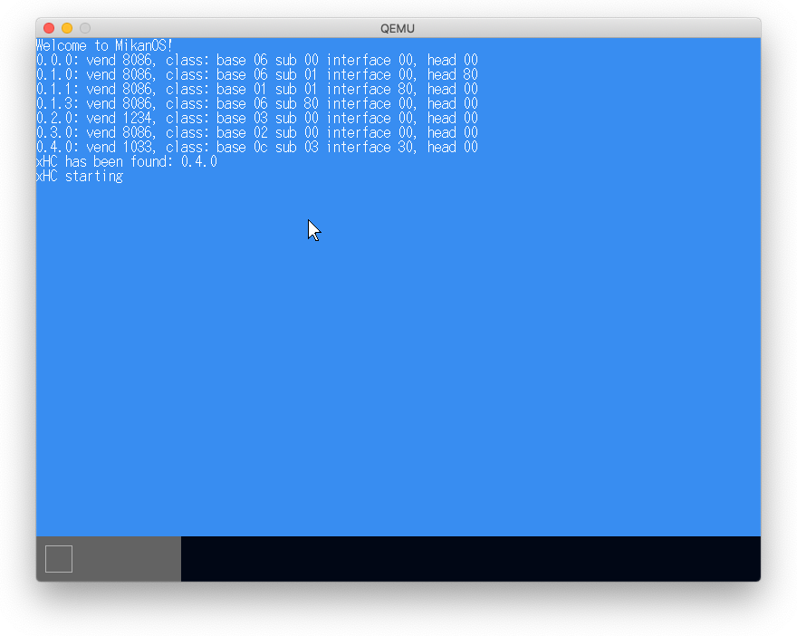

# 6.1 マウスカーソル

この章からはMacで開発。

## c++のテンプレート

例としてあげてある下の構造体定義で`<T>`と`<U>`に違う型を使用したらエラーになると思われるが
エラーになるのが正しいということか？

```
template <typename T>
struct Vector2D {
    T x, y;

    template <typename U>
    vecotor2D<T>& operator +=(const Vector2D<U>& rhs) {
        x += rhs.x;
        y += rhs.y;
        return this;
    }
};
```



# 6.2 USBホストドライバ

- USBホストドライバを作成
- ドライバは3階層（その下位層にPCIバスドライバがある）構造
  - クラスドライバ => USBターゲットごとに作成
  - USBバスドライバ => USB APIを提供
  - ホストコントローラドライバ => USB規格ごとに作成
    - USBの規格はバージョンごとにあるが3.x用のxHCIだけ作成。
      - 1.1用のOHCI, UHCI
      - 2.0用のEHCI
      - 3.x用のxHCI

# 6.3 PCIデバイスの探索

## PCIコンフィギュレーション

- 先頭40バイトが共通ヘッダ。4バイトオフセットでアクセス
- CONFIG_ADDRESS(0x0cf8)とCONFIG_DATA(0x0cfc)はI/Oアドレス空間の
  レジスタ経由でアクセス(in, out命令を使うのでアセンブラで実装)
- アドレスはbus, device, function, 4byte-offsetから構成(MakeAddress())

## すべてのPCIデバイスを探索するための関数呼び出し

```
ScanAllBus()
    ScanBus(bus)
        ScanDevice(bus, device)
            ScanFunction(bus, device, function) # ここで発見して追加
                ReadHeaderType(bus, device, function)
                AddDevice(bus, device, function, header_type)
                    devices[num_device] = Device{bus, device, function, header_type}
                ReadClassCode(bus, device, function)
                    ReadBusNumbers(bus, device, function)
                        ScanBus(2nd_bus)
```

**注** `ScanAllBus()`だけはpci名前空間に、その他の関数は`using namespace pci`な無名名前空間に分けられている。



**参考** [PCIからNICの情報を取得する](http://yuma.ohgami.jp/x86_64-Jisaku-OS-4/01_pci.html)

# 6.4 ポーリングでマウス入力

USBマウスのxHCを探す。これは、クラスコードが0x0c(Serial bus controller), 0x03(USB controller), 0x30(XHCI)のデバイス。

MacのQEMUのxhcはIntel製ではない（`vendor_id=0x1033`）。

**参考** [The PCI ID Repository: PCI Device Classes](https://pci-ids.ucw.cz/read/PD/)



### usbディレクトリを写経。

マウスが動いた。


### QEMUでusb関係の情報を見る

```
(qemu) info usbhost
  Bus 20, Addr 9, Port 2.2, Speed 1.5 Mb/s
    Class 00: USB device 05ac:0251, Apple Keyboard
  Bus 20, Addr 4, Port 1, Speed 1.5 Mb/s
    Class 00: USB device 045e:00cb, Microsoft USB Optical Mouse
  Bus 20, Addr 3, Port 4, Speed 1.5 Mb/s
    Class 00: USB device 05ac:8242, IR Receiver
(qemu) info usb
  Device 0.1, Port 1, Speed 480 Mb/s, Product QEMU USB Mouse
  Device 0.2, Port 2, Speed 480 Mb/s, Product QEMU USB Keyboard
(qemu) info pci
  Bus  0, device   0, function 0:
    Host bridge: PCI device 8086:1237
      PCI subsystem 1af4:1100
      id ""
  Bus  0, device   1, function 0:
    ISA bridge: PCI device 8086:7000
      PCI subsystem 1af4:1100
      id ""
  Bus  0, device   1, function 1:
    IDE controller: PCI device 8086:7010
      PCI subsystem 1af4:1100
      BAR4: I/O at 0xc040 [0xc04f].
      id ""
  Bus  0, device   1, function 3:
    Bridge: PCI device 8086:7113
      PCI subsystem 1af4:1100
      IRQ 10, pin A
      id ""
  Bus  0, device   2, function 0:
    VGA controller: PCI device 1234:1111
      PCI subsystem 1af4:1100
      BAR0: 32 bit prefetchable memory at 0x80000000 [0x80ffffff].
      BAR2: 32 bit memory at 0x81020000 [0x81020fff].
      BAR6: 32 bit memory at 0xffffffffffffffff [0x0000fffe].
      id ""
  Bus  0, device   3, function 0:
    Ethernet controller: PCI device 8086:100e
      PCI subsystem 1af4:1100
      IRQ 11, pin A
      BAR0: 32 bit memory at 0x81000000 [0x8101ffff].
      BAR1: I/O at 0xc000 [0xc03f].
      BAR6: 32 bit memory at 0xffffffffffffffff [0x0003fffe].
      id ""
  Bus  0, device   4, function 0:
    USB controller: PCI device 1033:0194
      PCI subsystem 1af4:1100
      IRQ 11, pin A
      BAR0: 64 bit memory at 0x800000000 [0x800003fff].
      id "xhci"
```
