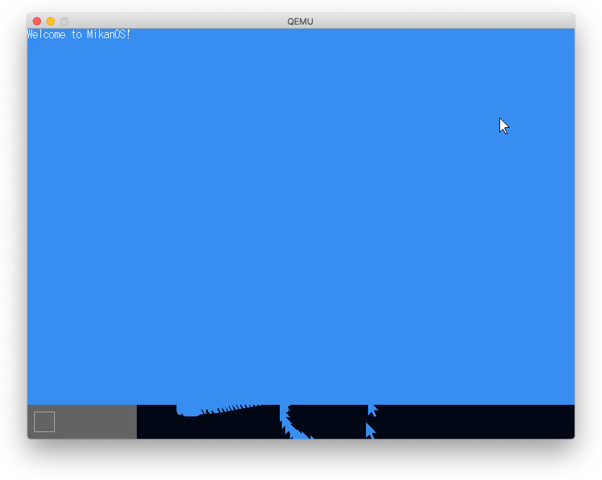
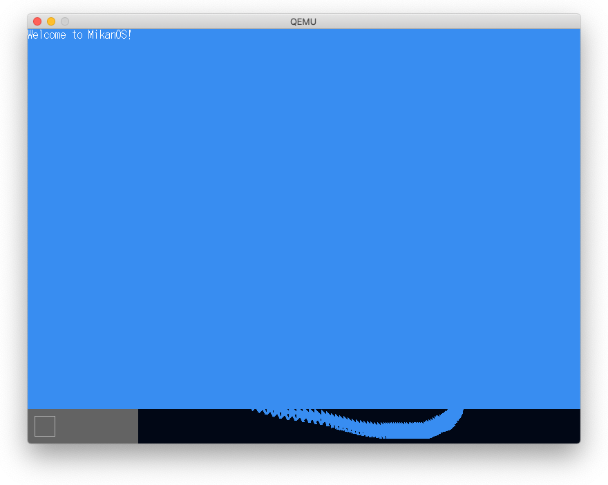

# 7.1 割り込み

- 割り込みハンドラ: `__attribute__((interrupt))`
- 割り込み処理終了通知: `0xfee000b0`番地にデータ書き込み
- 256個の割り込みベクタ
- IDT（割り込み記述子テーブル） `std::array<InterruptDescriptor, 256> idt`
- InterruptDescriptor: 16バイトからなる
- `lidt`命令によるIDTの登録

## MSI割り込み

メモリバス(Message Address)に32ビット値データ（Message Data）を書き込ことにより割り込みを発生させる。

# 7.7 割り込みハンドラの高速化

## FIFOリングバッファによるQueueの実装

- capacity, count, read_pos, write_posでdata[]を管理
- count == 0 でQueueは空, count=capacityでQueueはフル
- `if (++read_pos == capacity) { read_pos = 0; }`
- `if (++write_pos == capacity) { write_pos = 0; }`
- Front() + Pop()でデータ取得、Push()でデータ追加

