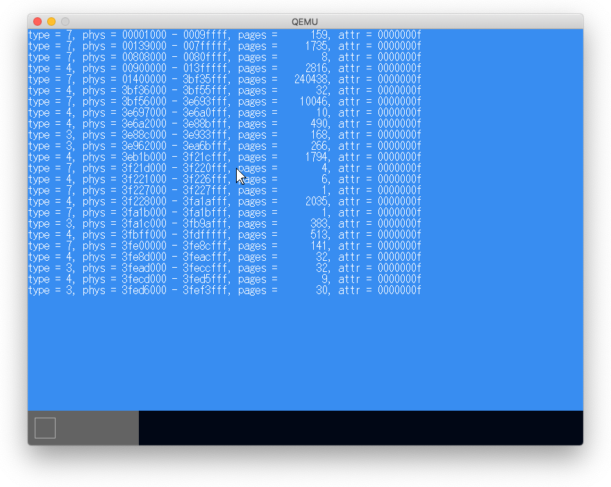

# UEFIメモリマップ

UEFIのメモリマップをカーネルに渡す。

```
typedef void __attribute__((sysv_abi)) EntryPointType(
    const struct FrameBufferConfig *,
    const struct MemoryMap *);
EntryPointType *entry_point = (EntryPointType *)entry_addr;
entry_point(&config, &memmap);
```



# データ構造の移動

ここからいよいよOSを開発する感じになってきた。

必要なデータ構造をOS所有メモリ領域に移動

1. スタック領域
2. セグメンテーションの設定: GDT (Global Descriptor Table)の再構築
3. ページテーブルの設定

## スタック領域の設定

```cpp
#vi main.cpp
alignas(16) uint8_t kernel_main_stack[1024 * 1024]  # スタック領域を定義

extern "C" void KernelMainNewStack(                 # KernelMainからこの関数が呼び出される
    const FrameBufferConfig &frame_buffer_config_ref,
    const MemoryMap &memory_map_ref)
```

```s
$vi asmfunc.asm
global KernelMain
KernelMain:                                         # UEFIはこの関数を呼び出す
    mov rsp, kernel_main_stack + 1024 * 1024        # スタックポインタを設定（スタック領域の最上位）
    call KernelMainNewStack                         # main.cpp#KernelMainNewStack()を呼び出す
                                                    #   引数はそのままrdi, rsiに残っている
```

## セグメンテーションの設定

### GDTの構築

```cpp
$vi segment.cpp
void SetupSegments() {                                                      # GDTは3要素
    gdt[0].data = 0;                                                        # [0]はNull Descriptor
    SetCodeSegment(gdt[1], DescriptorType::kExecuteRead, 0, 0, 0xfffff);    # [1]はコードセグメント
    SetDataSegment(gdt[2], DescriptorType::kReadWrite, 0, 0, 0xfffff);      # [2]はデータセグメント
    LoadGDT(sizeof(gdt) - 1, reinterpret_cast<uintptr_t>(&gdt[0]));         # lgdt命令で登録
}
$vi main.cpp
const uint16_t kernel_cs = 1 << 3;
const uint16_t kernel_ss = 2 << 3;
SetDSAll(0);                            # ds, es, fs, gsの各セグメントを設定
SetCSSS(kernel_cs, kernel_ss);          # cs, ssの各セグメントを設定
```

### セグメントの設定

```s
global SetCSSS  ; void SetCSSS(uint16_t cs, uint16_t ss);
SetCSSS:
    push rbp
    mov rbp, rsp
    mov ss, si                          # ssはmovで設定可能
    mov rax, .next                      # csはmovで設定できない。far callを模して、far return時に
    push rdi        ; CS                # スタックに積んだcsがセットされることを利用して設定。
    push rax        ; RIP               #
    o64 retf                            # far return: スタックの先頭アドレス（rip=rax=[.next])にジャンプ
.next:
    mov rsp, rbp                        # SetCSSSの終了処理をして
    pop rbp
    ret                                 # SetCSSSをreturn
```

## ページテーブルの設定

1. ページマップレベル4テーブル          : 512要素
2. ページディレクトリポインタテーブル   : 512要素
3. ページディレクトリ                   : 512要素
4. ページテーブル                       : 2MiBページ

ページマップレベル4テーブルのアドレスをCR3に設定することで有効になる。

```s
global SetCR3   ; void SetCR3(uint64_t value);
SetCR3:
    mov cr3, rdi
    ret
```


**[エラー]** カーネル起動で繰り返しリセットがかかる現象が発生した。

ページテーブルの各要素にビット和する値を`0x083`ではなく`0x003`としていた。bit7をたてることで2MiBページにするのにビットをたてなかったのでメモリ計算がおかしくなったためだと思われる。


# 8.7 メモリ管理

- BitmapMemoryManager: 物理メモリを4KiB単位のフレームに分け、各フレームに1bitを割り当てて使用済みか否かを管理する。
- Managerは、まず、使用できないメモリを使用済みとしてマークする。
- Memory Allocate: 必要なメモリをフレーム数で指定する。
  - Managerはその数だけ連続して使用可能なメモリ領域を探し、使用済みとしてマークして、先頭のFrameIDを返す。
- Memory Free: Allocate時に返されたFrameIDと返すフレーム数を指定する。
  - Managerは指定されたFrameからフレーム数だけ未使用としてマークする。

## テスト

本には全く説明はないが、osbook_day08cで単体テストが追加されていた。とりあえず実行したが、Macでは成功せず、Linuxでも修正が必要だった。

### Mac上でMach-Oで実行

これはQemu上で実行するものではないので、targetをMacとし、Mac用のCppUTestを導入して実行してみた。当たり前かもしれないがテストは失敗（2つ成功しているようだが）して、最後はSegmentation faultで異常終了した。

```
$ brew install cpputest
$ make run
clang++ -I. -I.. -I/usr/local/include/CppUTest -I/usr/local/include -O2 -Wall -g -std=c++2a -c ../memory_manager.cpp -o /Users/dspace/mikan/mikanos/kernel/test/memory_manager.o
clang++ -O2 -Wall -g -std=c++2a -I. -I.. -I/usr/local/include/CppUTest -I/usr/local/include  -c -o main.o main.cpp
clang++ -O2 -Wall -g -std=c++2a -I. -I.. -I/usr/local/include/CppUTest -I/usr/local/include  -c -o logger.o logger.cpp
clang++ -O2 -Wall -g -std=c++2a -I. -I.. -I/usr/local/include/CppUTest -I/usr/local/include  -c -o test_memory_manager.o test_memory_manager.cpp
clang++ -L/usr/local/lib -o test.run /Users/dspace/mikan/mikanos/kernel/test/memory_manager.o main.o logger.o test_memory_manager.o -lCppUTest -lCppUTestExt -lpthread
./test.run

test_memory_manager.cpp:66: error: Failure in TEST(MemoryManager, SetmemoryRange)
	expected <10>
	but was  <18446744073709551615>
	difference starts at position 1 at: <         18446744073>
	                                               ^

.
test_memory_manager.cpp:57: error: Failure in TEST(MemoryManager, MarkAllocated)
	expected <64>
	but was  <0>
	difference starts at position 0 at: <          0         >
	                                               ^

.make: *** [run] Segmentation fault: 11
```

### Mac上でELFで実行

`-target=--target=x86_64-elf`としてコンパイルし、Linuxから持ってきたCppUTestを使うようにしたがコンパイルしたオブジェクトファイルとライブラリの形式が違うようでtest.runを作成できなかった。そもそもMac上でELFは実行できないはず。

```
ld: warning: ignoring file /Users/dspace/mikan/mikanos/kernel/test/memory_manager.o, building for macOS-x86_64 but attempting to link with file built for unknown-unsupported file format ( 0x7F 0x45 0x4C 0x46 0x02 0x01 0x01 0x00 0x00 0x00 0x00 0x00 0x00 0x00 0x00 0x00 )

ld: warning: ignoring file /Users/dspace/mikan/osbook/devenv/x86_64-elf/lib/libCppUTestExt.a, building for macOS-x86_64 but attempting to link with file built for unknown-unsupported file format ( 0x21 0x3C 0x61 0x72 0x63 0x68 0x3E 0x0A 0x2F 0x20 0x20 0x20 0x20 0x20 0x20 0x20 )
Undefined symbols for architecture x86_64:
  "_main", referenced from:
     implicit entry/start for main executable
ld: symbol(s) not found for architecture x86_64
clang-11: error: linker command failed with exit code 1 (use -v to see invocation)
```

### Linuxで実行。

CppUTestをインストールして、Makefileを少し修正するとテストが実行でき、全テストが成功した。

```
$ sudo apt install libcpputest-dev
$ make run
clang++ -I. -I.. -O2 -Wall -g -fPIC -std=c++2a -c ../memory_manager.cpp -o /home/vagrant/mikan/mikanos/kernel/test/memory_manager.o
clang++ -O2 -Wall -g -fPIC -std=c++2a -I. -I..  -c -o main.o main.cpp
clang++ -O2 -Wall -g -fPIC -std=c++2a -I. -I..  -c -o logger.o logger.cpp
clang++ -O2 -Wall -g -fPIC -std=c++2a -I. -I..  -c -o test_memory_manager.o test_memory_manager.cpp
clang++ -o test.run /home/vagrant/mikan/mikanos/kernel/test/memory_manager.o main.o logger.o test_memory_manager.o -lCppUTest -lCppUTestExt -lpthread
./test.run
.......
OK (7 tests, 7 ran, 13 checks, 0 ignored, 0 filtered out, 40 ms)
```

Makefileの修正は次の通り。テストに必要なファイルだけコンパイルするようにした。

```
$ git diff Makefile
diff --git a/kernel/test/Makefile b/kernel/test/Makefile
index a536a5f..f8a7a4c 100644
--- a/kernel/test/Makefile
+++ b/kernel/test/Makefile
@@ -1,5 +1,6 @@
 TARGET = test.run
-OBJS = $(shell make -f print-objs --quiet print-objs)
+#OBJS = $(shell make -f print-objs --quiet print-objs)
+OBJS = memory_manager.o
 EXCLUDE_OBJS = main.o logger.o newlib_support.o

 OBJROOT = $(PWD)
```

### オリジナルのMakefileではエラーが止まらない

1. usb/配下のファイルもコンパイラされ、kernel/test配下にディレクトリ構造を伴って作成されるようだが、kernel/testにusbディレクトリがないのでエラーとなる

```
clang++ -I. -I.. -O2 -Wall -g -fPIC -std=c++2a -c ../usb/memory.cpp -o /home/vagrant/mikan/mikanos/kernel/test/usb/memory.o
error: unable to open output file
      '/home/vagrant/mikan/mikanos/kernel/test/usb/memory.o': 'No such file or directory'
1 error generated.
Makefile:34: recipe for target '/home/vagrant/mikan/mikanos/kernel/test/usb/memory.o' failed
make: *** [/home/vagrant/mikan/mikanos/kernel/test/usb/memory.o] Error 1
```

2. ディレクトリを作成して実行すると`std::find_if`が`std`名前空間にないというエラーが発生。

```
$ mkdir -p usb usb/xhci usb/classdriver
$ make
touch /home/vagrant/mikan/mikanos/kernel/test/.hankaku.d
clang++ -I. -I.. -O2 -Wall -g -fPIC -std=c++2a -c ../usb/memory.cpp -o /home/vagrant/mikan/mikanos/kernel/test/usb/memory.o
clang++ -I. -I.. -O2 -Wall -g -fPIC -std=c++2a -c ../usb/device.cpp -o /home/vagrant/mikan/mikanos/kernel/test/usb/device.o
clang++ -I. -I.. -O2 -Wall -g -fPIC -std=c++2a -c ../usb/xhci/ring.cpp -o /home/vagrant/mikan/mikanos/kernel/test/usb/xhci/ring.o
clang++ -I. -I.. -O2 -Wall -g -fPIC -std=c++2a -c ../usb/xhci/trb.cpp -o /home/vagrant/mikan/mikanos/kernel/test/usb/xhci/trb.o
clang++ -I. -I.. -O2 -Wall -g -fPIC -std=c++2a -c ../usb/xhci/xhci.cpp -o /home/vagrant/mikan/mikanos/kernel/test/usb/xhci/xhci.o
../usb/xhci/xhci.cpp:287:31: error: no member named 'find_if' in namespace 'std'
    auto ext_usblegsup = std::find_if(
                         ~~~~~^
1 error generated.
Makefile:34: recipe for target '/home/vagrant/mikan/mikanos/kernel/test/usb/xhci/xhci.o' failed
make: *** [/home/vagrant/mikan/mikanos/kernel/test/usb/xhci/xhci.o] Error 1
```

3. `#include <algorithm>`を追加せよということなので追加するとまた別のエラーが。

```
$ vi ../usb/xhci/xchi.cpp
#include <algorithm>
$ make
/usr/bin/../lib/gcc/x86_64-linux-gnu/7.5.0/../../../../include/c++/7.5.0/bits/stl_algo.h:162:10: error:
      no matching function for call to '__iterator_category'
                       std::__iterator_category(__first));
                       ^~~~~~~~~~~~~~~~~~~~~~~~
```

ここで諦めて単体テストに必要なファイルだけコンパイルするようにしたら実行できたのだが、単体テストに関係するファイルで上のエラーが発生したらどうなるのだろうか。
