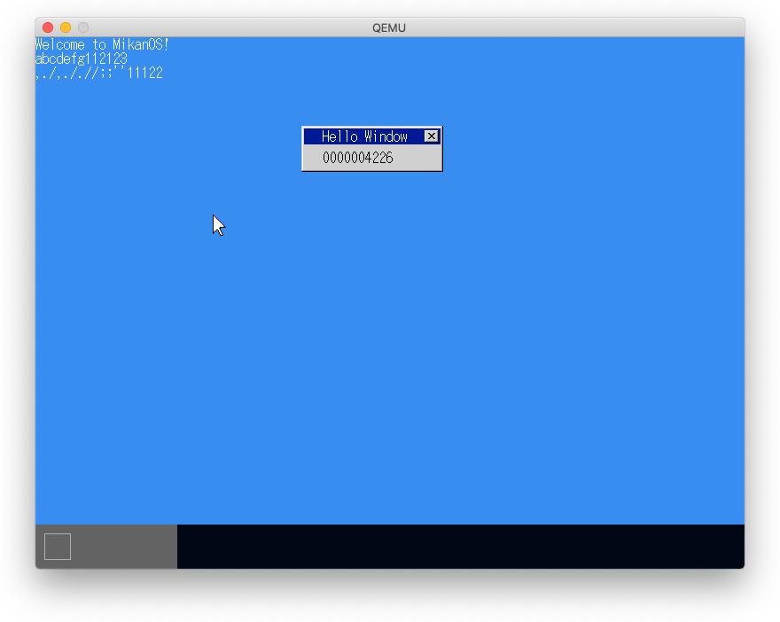
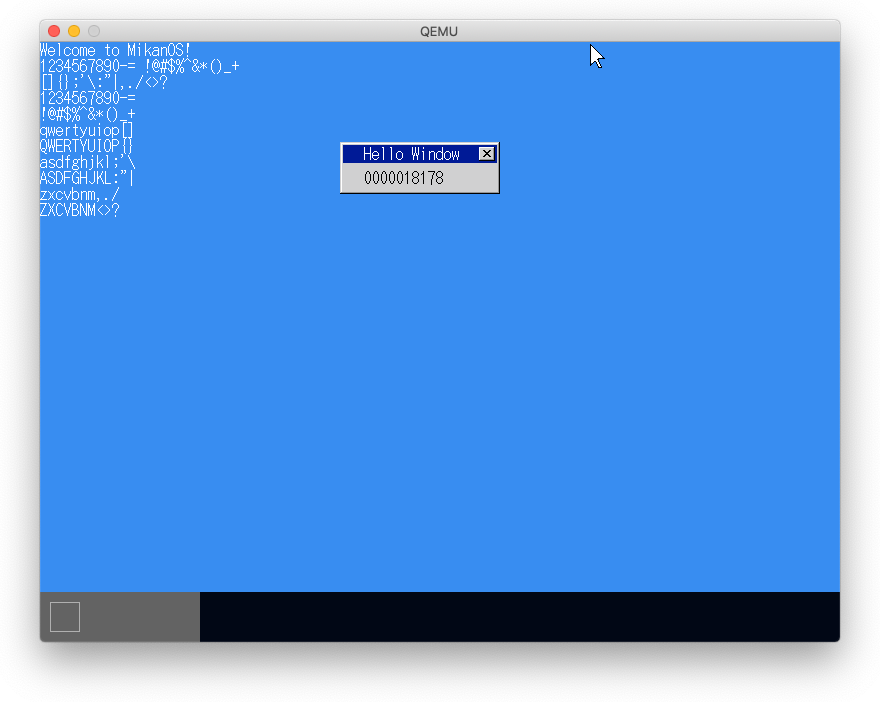
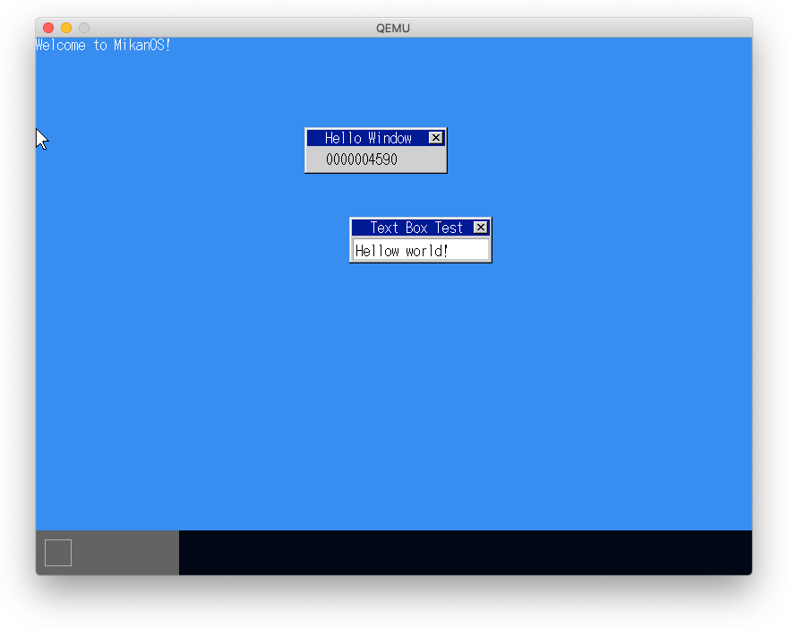

# 12.3 USBキーボードドライバ

- US ASCIIキーボード配列
- JISキーボードに合わせて`keycode_map`と`keycode_map_shifted`を変更してもキーコードの割当がないため、'_'が入力できない。'|'と'\'はキーコード100に割り当てられているのでテーブルを変更すれば対応できる。
- 規格にはそのような変更はするなとある。

# 12.4 モディファイアキー

# 12.5 テキストボックス

# 12.6 カーソル

