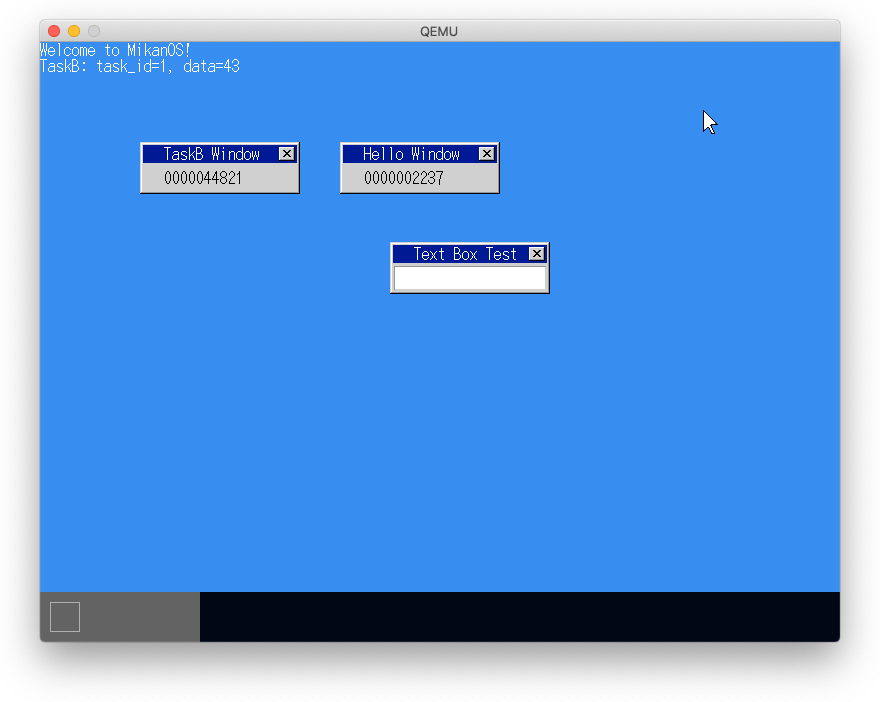
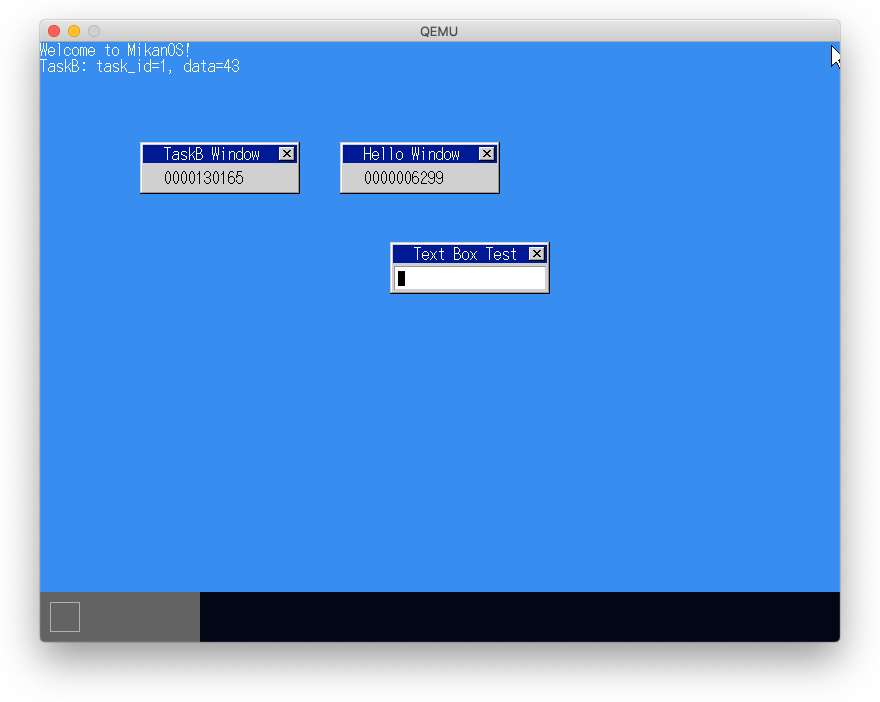
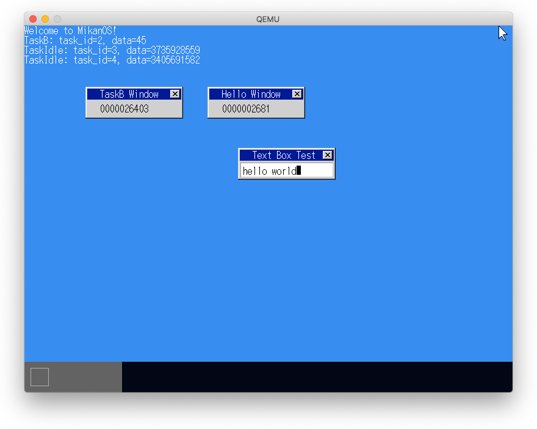

# 13.1, 13.2 協調的マルチタスク

- マルチタスクを行うにはあるタスクのコンテキスト（レジスタ情報、スタック情報など）を保存して、別のタスクのコンテキストを復帰すれば良い（コンテキストスイッチ）。
- 協調的マルチタスクは各タスクが自発的にCPUを明け渡すことでコンテキストスィッチが起きる。
- 行儀が悪い、あるいはバグのあるタスクがCPUを独占する可能性がある。

# 13.3-13.5 プリエンプティブマルチタスク

- タイムスライスなどで強制的にコンテキストスイッチを発生させる。

