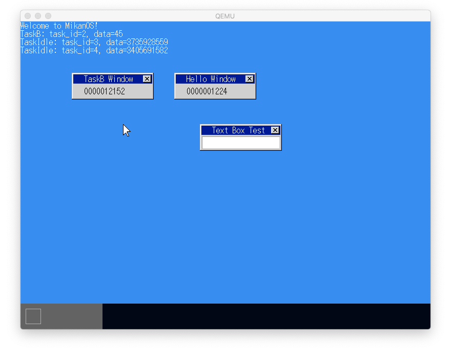
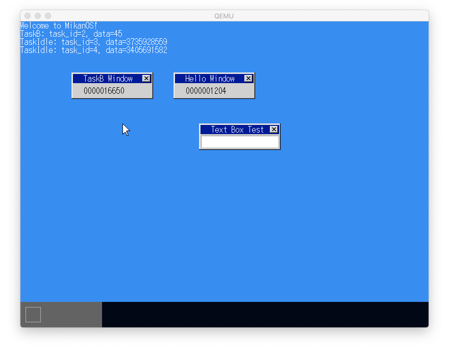

# 14.1 SleepとWakeup

- ランキューを作成し、実行可能なタスクを入れておく。
- ランキューの先頭が現在実行中のタスク。
- タスクの切り替えはランキュー上のタスクを順に切り変える。
- タスクをSleepさせるには、このランキューからタスクを外す。
- タスクをWakeupさせるには、このランキューにタスクを入れる。

# 14.2 イベントによりWakeup

- Taskにメッセージキューをもたせる。
- <std::optional<Message> Task::ReceiveMessage(): メッセージを受け取る。メッセージはなくても良いので、メッセージの有無で処理を分けられる。
- Task::SendMessage(): メッセージを送ってWakupさせる。
- TaskManager::SendMessage(task_id, Message)で特定のタスクにメッセージを送信できる。
  - たとえば、割り込みハンドラから直接メインタスクにメッセージを送信できる。

# 14.3 性能測定

`16650 / 12152 = 1.37`

# 14.4 タスクに優先順位

- 優先順位のレベルごとにランキューを持つ
- より上位レベルのランキューのタスクを実行し、そのレベルで実行可能タスクがなくなったら下位レベルのランキューのタスクを実行する。

# 15.5 アイドルタスクの導入

- すべての優先順位のランキューで実行可能タスクがなくなるのを防ぐため、常に`hlt`しているアイドルタスクを作成して、最低レベルのランキューに入れておく。
