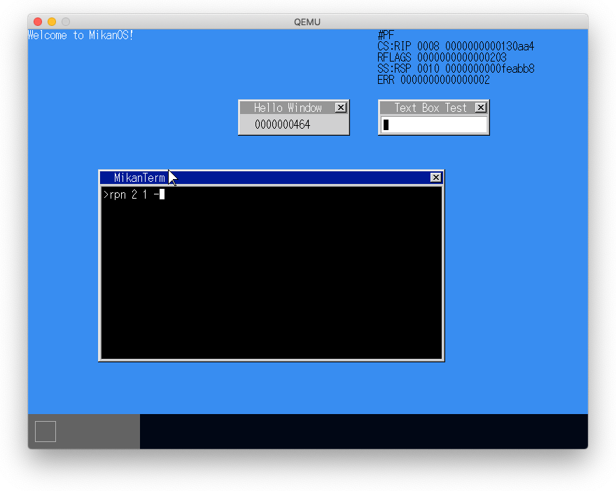
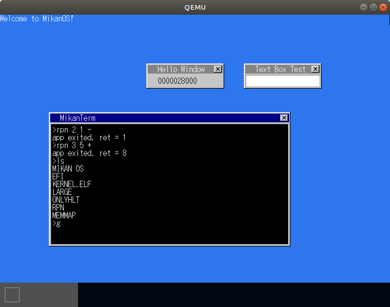
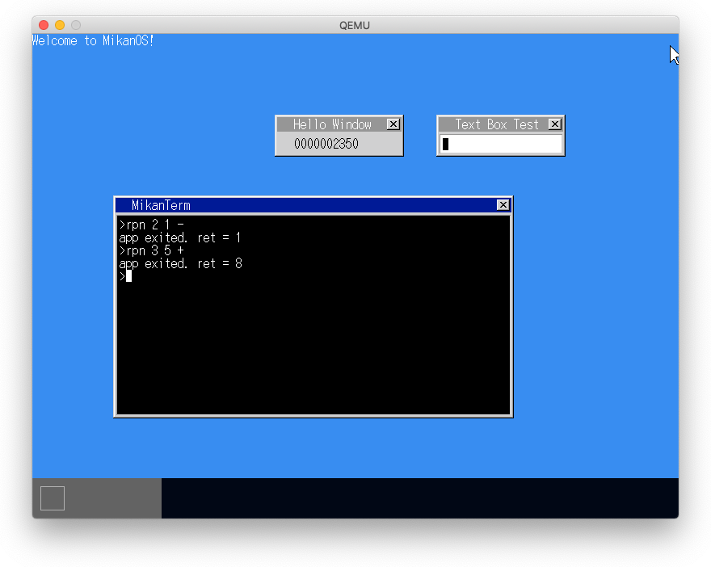

# 19.1 実行ファイルとメモリアドレス

```
$ llvm-objdump -d -C -S --x86-asm-syntax=intel apps/rpn/rpn
;         if (strcmp(argv[i], "+") == 0) {
    10a2: 49 8b 3c dc                   mov rdi, qword ptr [r12 + 8*rbx]
    10a6: be 62 01 00 00                mov esi, 354
    10ab: e8 b0 00 00 00                call    0x1160 <strcmp>
    10b0: 85 c0                         test    eax, eax
    10b2: 74 bc                         je  0x1070 <main+0x30>
;         } else if (strcmp(argv[i], "-") == 0) {
    10b4: 49 8b 3c dc                   mov rdi, qword ptr [r12 + 8*rbx]
    10b8: be 60 01 00 00                mov esi, 352
    10bd: e8 9e 00 00 00                call    0x1160 <strcmp>
    10c2: 85 c0                         test    eax, eax
    10c4: 74 2a                         je  0x10f0 <main+0xb0>

$ hexdump -C -s 0x160 -n 4 apps/rpn/rpn
00000160  2d 00 2b 00                                       |-.+.|
00000164
```

```
$ llvm-readelf -a apps/rpn/rpn
ELF Header:
  Magic:   7f 45 4c 46 02 01 01 00 00 00 00 00 00 00 00 00
  Class:                             ELF64
  Data:                              2's complement, little endian
  Version:                           1 (current)
  OS/ABI:                            UNIX - System V
  ABI Version:                       0
  Type:                              EXEC (Executable file)
  Machine:                           Advanced Micro Devices X86-64
  Version:                           0x1
  Entry point address:               0x1040
  Start of program headers:          64 (bytes into file)
  Start of section headers:          16600 (bytes into file)
  Flags:                             0x0
  Size of this header:               64 (bytes)
  Size of program headers:           56 (bytes)
  Number of program headers:         5
  Size of section headers:           64 (bytes)
  Number of section headers:         18
  Section header string table index: 16
There are 18 section headers, starting at offset 0x40d8:

Program Headers:
  Type           Offset   VirtAddr           PhysAddr           FileSiz  MemSiz   Flg Align
  PHDR           0x000040 0x0000000000000040 0x0000000000000040 0x000118 0x000118 R   0x8
  LOAD           0x000000 0x0000000000000000 0x0000000000000000 0x0004ec 0x0004ec R   0x1000
  LOAD           0x001000 0x0000000000001000 0x0000000000001000 0x0003f0 0x0003f0 R E 0x1000
  LOAD           0x002000 0x0000000000002000 0x0000000000002000 0x000768 0x000aa0 RW  0x1000
  GNU_STACK      0x000000 0x0000000000000000 0x0000000000000000 0x000000 0x000000 RW  0x0

 Section to Segment mapping:
  Segment Sections...
   00
   01     .rodata .eh_frame
   02     .text
   03     .data .data.rel.ro .got .bss
   04

$ llvm-readelf -a rpn/rpn
ELF Header:
  Magic:   7f 45 4c 46 02 01 01 00 00 00 00 00 00 00 00 00
  Class:                             ELF64
  Data:                              2's complement, little endian
  Version:                           1 (current)
  OS/ABI:                            UNIX - System V
  ABI Version:                       0
  Type:                              EXEC (Executable file)
  Machine:                           Advanced Micro Devices X86-64
  Version:                           0x1
  Entry point address:               0xFFFF800000001550
  Start of program headers:          64 (bytes into file)
  Start of section headers:          10904 (bytes into file)
  Flags:                             0x0
  Size of this header:               64 (bytes)
  Size of program headers:           56 (bytes)
  Number of program headers:         5
  Size of section headers:           64 (bytes)
  Number of section headers:         18
  Section header string table index: 16
There are 18 section headers, starting at offset 0x2a98:

Elf file type is EXEC (Executable file)
Entry point 0xffff800000001550
There are 5 program headers, starting at offset 64

Program Headers:
  Type           Offset   VirtAddr           PhysAddr           FileSiz  MemSiz   Flg Align
  PHDR           0x000040 0xffff800000000040 0xffff800000000040 0x000118 0x000118 R   0x8
  LOAD           0x000000 0xffff800000000000 0xffff800000000000 0x0004ec 0x0004ec R   0x1000
  LOAD           0x0004f0 0xffff8000000014f0 0xffff8000000014f0 0x000450 0x000450 R E 0x1000
  LOAD           0x000940 0xffff800000002940 0xffff800000002940 0x000768 0x000aa0 RW  0x1000
  GNU_STACK      0x000000 0x0000000000000000 0x0000000000000000 0x000000 0x000000 RW  0x0

 Section to Segment mapping:
  Segment Sections...
   00
   01     .rodata .eh_frame
   02     .text
   03     .data .data.rel.ro .got .bss
   04
```

# アプリのロードと実行

## rpn実行でOSがリセットする問題が再度発生

- Ubuntuでは問題なし
- Macにはclang++に`-mcmodel=large`がない模様    => そんなことはなかった
- Macでは2GB以上の物理アドレスが扱えない?       => そんなことはなかった
- appsのimage-baseを0x40000000にするとリセットはしないがだんまりとなる(cpu=100%)

### 第20章のデバッグ出力をさせると次のようになった（エラーアドレスは少し違う）



### Ubuntuでは問題なし



**メモ**: ubuntuでの画面キャプチャ

```
$ gnome-screenshot -d 3 --window
```

## `image-base=0x40000000`

```
$ llvm-objdump -d -C -S --x86-asm-syntax=intel rpn
;         if (strcmp(argv[i], "+") == 0) {
40001592: 49 8b 3c dc                   mov rdi, qword ptr [r12 + 8*rbx]
40001596: be 62 01 00 40                mov esi, 1073742178
4000159b: e8 b0 00 00 00                call    0x40001650 <strcmp>
400015a0: 85 c0                         test    eax, eax
400015a2: 74 bc                         je  0x40001560 <main+0x30>
;         } else if (strcmp(argv[i], "-") == 0) {
400015a4: 49 8b 3c dc                   mov rdi, qword ptr [r12 + 8*rbx]
400015a8: be 60 01 00 40                mov esi, 1073742176
400015ad: e8 9e 00 00 00                call    0x40001650 <strcmp>
400015b2: 85 c0                         test    eax, eax
400015b4: 74 2a                         je  0x400015e0 <main+0xb0>
```

## `image-base=0xffff800000000000`

```
;         if (strcmp(argv[i], "+") == 0) {
ffff8000000015d0: 4a 8b 3c fb           mov rdi, qword ptr [rbx + 8*r15]
ffff8000000015d4: 48 be 62 01 00 00 00 80 ff ff movabs  rsi, -140737488354974
ffff8000000015de: 41 ff d5              call    r13
ffff8000000015e1: 85 c0                 test    eax, eax
ffff8000000015e3: 74 bb                 je  0xffff8000000015a0 <main+0x50>
;         } else if (strcmp(argv[i], "-") == 0) {
ffff8000000015e5: 4a 8b 3c fb           mov rdi, qword ptr [rbx + 8*r15]
ffff8000000015e9: 48 be 60 01 00 00 00 80 ff ff movabs  rsi, -140737488354976
ffff8000000015f3: 4d 89 ec              mov r12, r13
ffff8000000015f6: 41 ff d5              call    r13
ffff8000000015f9: 85 c0                 test    eax, eax
ffff8000000015fb: 74 33                 je  0xffff800000001630 <main+0xe0>
```

# lldbでデバッグ

## qemuをserverモードで立ち上げる

```
$ vi kernel/Makefile
CXXFLAGS += -O0 -Wall -g --target=x86_64-elf -ffreestanding -mno-red-zone \
            -fno-exceptions -fno-rtti -std=c++17    # 最適化しない
$ cd mikanos
$ QEMU_OPTS="-S -s" ./build.sh run
```

別の端末で

```
$ cd mikanos/kernel && lldb kernel.elf
(lldb) gdb-remote 1234
Process 1 stopped
* thread #1, stop reason = signal SIGTRAP
    frame #0: 0x000000000000fff0
->  0xfff0: addb   %al, (%rax)
    0xfff2: addb   %al, (%rax)
    0xfff4: addb   %al, (%rax)
    0xfff6: addb   %al, (%rax)
(lldb) br s -f terminal.cpp -l 412
(lldb) continue
....                                  # rpn 2 1 -
Process 1 stopped
* thread #1, stop reason = breakpoint 2.1
    frame #0: 0x0000000000118f6a kernel.elf`Terminal::ExecuteFile(this=0x0000000000fedf20, file_entry=0x000000003d8240d8, command="rpn", first_arg="2 1 -") at terminal.cpp:412:46
   409
   410 	Error Terminal::ExecuteFile(const fat::DirectoryEntry &file_entry, char *command, char *first_arg)
   411 	{
-> 412 	    std::vector<uint8_t> file_buf(file_entry.file_size);
   413 	    fat::LoadFile(&file_buf[0], file_buf.size(), file_entry);
   414
   415 	    auto elf_header = reinterpret_cast<Elf64_Ehdr *>(&file_buf[0]);

# この後のmemcpyでi=3(.data, .bssセクション）の時にエラー発生することがわかる

    Error CopyLoadSegments(Elf64_Ehdr *ehdr)
    {
        auto phdr = GetProgramHeader(ehdr);
        for (int i = 0; i < ehdr->e_phnum; ++i) {
            if (phdr[i].p_type != PT_LOAD) continue;

            LinearAddress4Level dest_addr;
            dest_addr.value = phdr[i].p_vaddr;
            const auto num_4kpages = (phdr[i].p_memsz + 4095) / 4096;

            if (auto err = SetupPageMaps(dest_addr, num_4kpages)) {
                return err;
            }

            const auto src = reinterpret_cast<uint8_t *>(ehdr) + phdr[i].p_offset;
            const auto dst = reinterpret_cast<uint8_t *>(phdr[i].p_vaddr);
            memcpy(dst, src, phdr[i].p_filesz);   ＃ <= ここでエラー発生
            memset(dst + phdr[i].p_filesz, 0, phdr[i].p_memsz - phdr[i].p_filesz);
        }
        return MAKE_ERROR(Error::kSuccess);
    }
```

```
(lldb) gdb-remote 1234
(lldb) br set -f terminal.cpp -l 152
(lldb) continue
(lldb) continue
(lldb) continue
((lldb) p i
(int) $6 = 3
(lldb) p src
(unsigned char *const) $7 = 0x00000000010de5a0 "\x98)"
(lldb) p dst
(unsigned char *const) $8 = 0xffff800000002990 ""
(lldb) p phdr[3].p_filesz
(Elf64_Xword) $9 = 1896
(lldb) p phdr[3].p_memsz
(Elf64_Xword) $10 = 2720
(lldb) p phdr[3].p_offset
(Elf64_Off) $11 = 2448
(lldb) p ehdr
(Elf64_Ehdr *) $12 = 0x00000000010ddc10
(lldb) p phdr[0]
((anonymous struct)) $14 = {
  p_type = 6
  p_flags = 4
  p_offset = 64
  p_vaddr = 18446603336221196352  # 0xffff_8000_0000_0040
  p_paddr = 18446603336221196352
  p_filesz = 280
  p_memsz = 280
  p_align = 8
}
(lldb) p phdr[1]
((anonymous struct)) $15 = {
  p_type = 1
  p_flags = 4
  p_offset = 0
  p_vaddr = 18446603336221196288  # 0xffff_8000_0000_0000
  p_paddr = 18446603336221196288
  p_filesz = 1260
  p_memsz = 1260
  p_align = 4096
}
(lldb) p phdr[2]
((anonymous struct)) $16 = {
  p_type = 1
  p_flags = 5
  p_offset = 1264
  p_vaddr = 18446603336221201648  # 0xffff_8000_0000_14f0
  p_paddr = 18446603336221201648
  p_filesz = 1184
  p_memsz = 1184
  p_align = 4096
}
(lldb) p phdr[3]
((anonymous struct)) $17 = {
  p_type = 1
  p_flags = 6
  p_offset = 2448
  p_vaddr = 18446603336221206928  # 0xffff_8000_0000_2990
  p_paddr = 18446603336221206928
  p_filesz = 1896
  p_memsz = 2720
  p_align = 4096
}
(lldb) p phdr[4]
((anonymous struct)) $18 = {
  p_type = 1685382481
  p_flags = 6
  p_offset = 0
  p_vaddr = 0
  p_paddr = 0
  p_filesz = 0
  p_memsz = 0
  p_align = 0
}
(lldb) step
                   <= RESET
```

```
(lldb) p i
(int) $1 = 2
(lldb) p src
(unsigned char *const) $2 = 0x00000000010df100 "UH\x89\xe5H\xb8"
(lldb) p dst
(unsigned char *const) $3 = 0xffff8000000014f0 ""
(lldb) p *src
(unsigned char) $4 = 'U'  # 0x55
(lldb) p *(src+1)
(unsigned char) $5 = 'H'  # 0x48
(lldb) p *(src+2)
(unsigned char) $6 = '\x89'
(lldb) c
(lldb) p i
(lldb) $1 = 3
(lldb) p *(uint8_t*)(0xffff8000000014f0)  # i=2のmemcpyは正しく行われている
(uint8_t) $7 = 'U'
(lldb) p *(uint8_t*)(0xffff8000000014f1)
(uint8_t) $8 = 'H'
(lldb) p *(uint8_t*)(0xffff8000000014f2)
(uint8_t) $9 = '\x89'
(lldb) p *src                             # i=3のsrcの中身
(unsigned char) $10 = '\x98'
(lldb) p *(src+1)
(unsigned char) $11 = ')'
(lldb) p *(src+2)
(unsigned char) $12 = '\0'
                                          # image_base 0x7000_0000に変更
(lldb) br set -f terminal.cpp -l 431
(lldb) continue
(lldb) step
(lldb) p f
(int (*)(int, char **)) $2 = 0x0000000070001550
(lldb) me read -s8 -fx -c16 0x70001550            # 32bit以上は見られない?
error: memory read failed for 0x70001400
(lldb) bt
* thread #1, stop reason = step in
  * frame #0: 0x00000000001344ff kernel.elf`Terminal::ExecuteFile(this=0x0000000000fedf20, file_entry=0x000000003d8240d8, command="rpn", first_arg="2") at terminal.cpp:432:16
    frame #1: 0x000000000013408c kernel.elf`Terminal::ExecuteLine(this=0x0000000000fedf20) at terminal.cpp:403:31
    frame #2: 0x00000000001336c9 kernel.elf`Terminal::InputKey(this=0x0000000000fedf20, modifier='\0', keycode='(', ascii='\n') at terminal.cpp:277:9
    frame #3: 0x0000000000134c42 kernel.elf`TaskTerminal(task_id=3, data=0) at terminal.cpp:541:49
(lldb) step                                       # だんまり(cpu=100%)
(lldb) bt
error: invalid thread
(lldb) thread list
error: Process is running.  Use 'process interrupt' to pause execution.
(lldb) process interrupt
Process 1 stopped
* thread #1, stop reason = signal SIGINT
    frame #0: 0x0000000070cf5ce8
error: memory read failed for 0x70cf5c00
(lldb) thread list
Process 1 stopped
* thread #1: tid = 0x0001, 0x0000000070cf5ce8, stop reason = signal SIGINT

# f(argv.size(), &argv[0])を呼び出したところ、f = 0x0000000070001550
Process 1 stopped
* thread #1, stop reason = instruction step into
    frame #0: 0x0000000070001550
error: memory read failed for 0x70001400
```

## 原因判明: 3つ目のロードセグメントがページ境界になく、セグメント全体を収めるだけのメモリが割り当てられていないためだった。

```
(lldb) br set -f terminal.cpp -l 167
*
(lldb) c
Process 1 resuming
Process 1 stopped
* thread #1, stop reason = breakpoint 1.1
    frame #0: 0x00000000001368e1 kernel.elf`(anonymous namespace)::CopyLoadSegments(ehdr=0x00000000010ddc10) at terminal.cpp:167:12
   164
   165      const auto src = reinterpret_cast<uint8_t*>(ehdr) + phdr[i].p_offset;
   166      const auto dst = reinterpret_cast<uint8_t*>(phdr[i].p_vaddr);
-> 167      memcpy(dst, src, phdr[i].p_filesz);  # <= このmemcpyの途中でPF
   168      memset(dst + phdr[i].p_filesz, 0, phdr[i].p_memsz - phdr[i].p_filesz);
   169    }
   170    return MAKE_ERROR(Error::kSuccess);
(lldb) fr v
(Elf64_Ehdr *) ehdr = 0x00000000010ddc10
((anonymous struct) *) phdr = 0x00000000010ddc50
(int) i = 3     # 3つ目のLOADセグメント
(LinearAddress4Level) dest_addr = {
  value = 18446603336221206976           # 0xffff_8000_0000_29c0
  parts = (offset = 2496, page = 2, dir = 0, pdp = 0, pml4 = 256)
}       #  ^^^^^^^^^^^^^ LOADセグメントの先頭の仮想アドレスがページ境界にない。
(const unsigned long) num_4kpages = 1    # memsz=2720なので4Kページは1つだけ確保
        #             ^^^^^^^^^^^^^^^
(unsigned char *const) src = 0x00000000010de5d0 "\xc8)"
(unsigned char *const) dst = 0xffff8000000029c0 ""
(lldb) p phdr[3]
((anonymous struct)) $2 = {
  p_type = 1
  p_flags = 6
  p_offset = 2496
  p_vaddr = 18446603336221206976        # 0xffff_8000_0000_29c0
  p_paddr = 18446603336221206976
  p_filesz = 1896                 # offset + filesz = 2496 + 1896 = 4392 > 4096
  p_memsz = 2720                  # 4K 1ページでは296バイト足りない
  p_align = 4096                  # 1601バイト以降のメモリが確保されていないのに
                                  # コピーしようとしたのでページフォルト発生
}
(lldb) c
Process 1 resuming
```

## 解決策 1: 各LOADセグメントをページ境界に置く（採用）

LDFLAGSにオプション `-z separate-code` を指定する。

```
$ git diff mikanos/apps/Makefile.elfapp
 CPPFLAGS += -I.
 CFLAGS   += -O2 -Wall -g --target=x86_64-elf -ffreestanding -mcmodel=large
 CXXFLAGS += -O2 -Wall -g --target=x86_64-elf -ffreestanding -mcmodel=large \
            -fno-exceptions -fno-rtti -std=c++17
-LDFLAGS  += --entry main -z norelro --image-base 0xffff800000000000 --static
+LDFLAGS  += --entry main -z norelro -z separate-code --image-base 0xffff800000000000 --static
```

## 解決策 2: ロードセグメントの仮想アドレスのoffsetを考慮してページを取得する

```
$ git diff mikanos/kernel/terminal.cpp
-            //const auto num_4kpages = (phdr[i].p_memsz + 4095) / 4096;
+            const auto num_4kpages = (dest_addr.Part(0) + phdr[i].p_memsz + 4095) / 4096;
```



## Linux

-O0だとリセットがかかり実行できなかった。-O2に戻して実行。また、lldbではうまく行かなかった。

```
$ gdb kerlnel.elf
>>> break terminal.cpp:152
>>> continue
>>> continue
>>> continue
arg ehdr = <optimized out>
loc dest_addr = {value = 18446603336221204480, parts = {offset = 0, page = 2, dir = 0, pdp = 0, pml4 = 256}}, num_4kpages = 1, src = <optimized out>, dst = <optimized out>, i = 3, phdr = <optimized out>, addr_first = <optimized out>, s = '\000' <repeats 12 times>, "\202\000\000\000\323\020\020\000\000\000\000\000P\254\376\000\000\000\00…, elf_header = 0x10ddc10: {e_ident = "\177ELF\002\001\001\000\000\000\000\000\000\000\000", e_type = 2, …, argv = {<std::__1::__vector_base<char*, std::__1::allocator<char*> >> = {<std::__1::__vector_base_common<tr…, ret = <optimized out>
```
