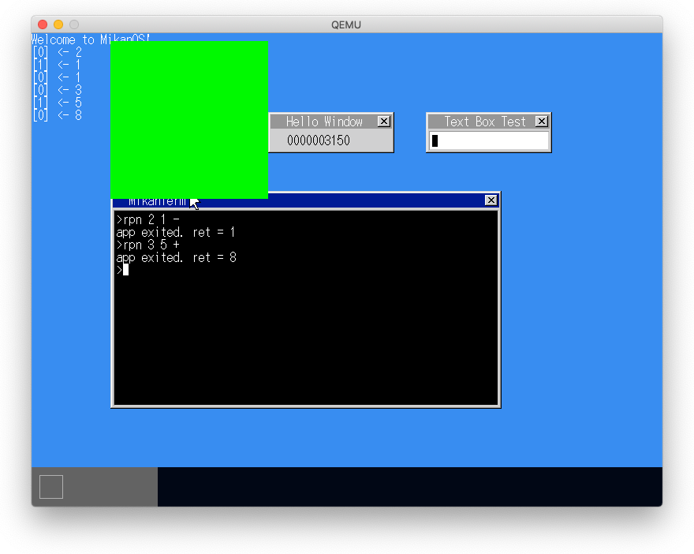
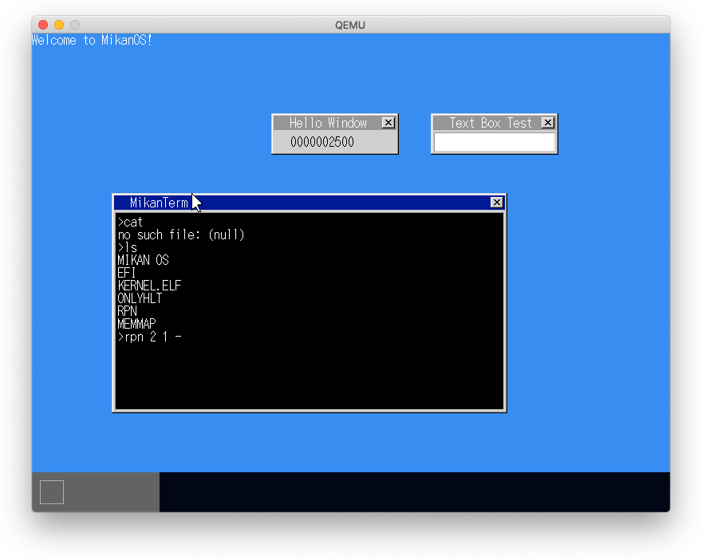
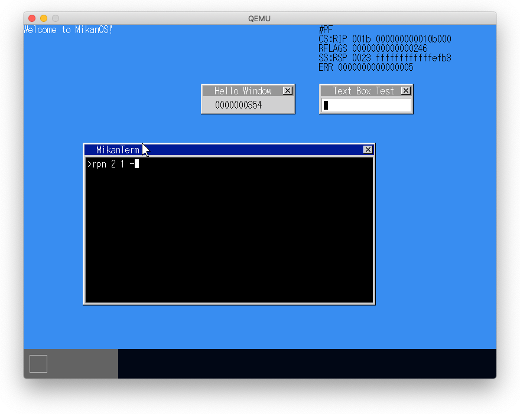

# 20.1 アプリからOSの機能を使う

```
$ cd mikanos/kernel
$ llvm-nm -C kernel.elf | grep printk
000000000010b000 T printk(char const*, ...)
$ llvm-nm -C kernel.elf | grep FillRectangle
000000000010c180 T FillRectangle(PixelWriter&, Vector2D<int> const&, Vector2D<int> const&, PixelColor const&)
$ llvm-nm -C kernel.elf | grep screen_writer
000000000024d058 B screen_writer
```



# 20.2 カーネルとユーザの分離

- アプリ用セグメントディスクリプタの作成
- far return を用いたCSセグメントの切り替えによる特権モードの変更
- ユーザ用に割り当てた物理ページのuserフラグに1をセットしてユーザが使えるようにする
- ユーザアプリ用のスタック、argv用の物理ページの割当
- `CallApp(argc, argv, cs, ss, rip, rsp)`の呼び出しによるアプリケーションの実行




```
(lldb) continue
Process 1 resuming
* # rpn 2 1 -を実行
(lldb) br set -f interrupt.cpp -l 43
Breakpoint 3: where = kernel.elf`(anonymous namespace)::IntHandlerLAPICTimer(InterruptFrame*) + 136 at interrupt.cpp:45:9, address = 0x000000000010eb18
Process 1 stopped
* thread #1, stop reason = breakpoint 3.1
    frame #0: 0x000000000010eb18 kernel.elf`(anonymous namespace)::IntHandlerLAPICTimer(frame=0xffff800000001170) at interrupt.cpp:45:9
   42       __attribute__((interrupt))
   43       void IntHandlerLAPICTimer(InterruptFrame *frame)
   44       {
-> 45           LAPICTimerOnInterrupt();
   46       }
   47   }
   48
(lldb) register read rsp
     rsp = 0xfffffffffffffe80       # <= スタックポインタ侵食
```

# 20.3 TSS (Task State Segment)の設定

- 特権レベル0-2のスタックポインタなどを保存する108バイトの領域
- 現時点まではTSSを設定していなかったため実行環境依存のTSS.RS0値で実行されていた
- カーネルでTSSを作成し、特権レベル0用のスタック領域を割り当て、TSS.RS0に設定し、GDT[5]に配置する
- `ltr`命令でTRレジスタにTSSセグメントセレクタ値(5)を設定する
- コンテキストスイッチが実行される際のRSPの値を調整する

```
(lldb) br set -f segment.cpp -l 90
Breakpoint 1: where = kernel.elf`InitializeTSS() + 52 at segment.cpp:90:12, address = 0x000000000010edd4
(lldb) continue
Process 1 resuming
(lldb) fr v
error: invalid thread
Process 1 stopped
* thread #1, stop reason = breakpoint 1.1
    frame #0: 0x000000000010edd4 kernel.elf`InitializeTSS() at segment.cpp:90:12
   87       }
   88       uint64_t rsp0 =
   89           reinterpret_cast<uint64_t>(stack0.Frame()) + kBytesPerFrame * 4096;
-> 90       tss[1] = rsp0 & 0xffffffff;
   91       tss[2] = rsp0 >> 32;
   92
   93       uint64_t tss_addr = reinterpret_cast<uint64_t>(&tss[0]);
(lldb) p rsp0
(uint64_t) $0 = 16781312    # rsp0 = 0x1001000
(lldb) continue
Process 1 resuming
(lldb) br set -n IntHandlerLAPICTimer
Breakpoint 2: where = kernel.elf`IntHandlerLAPICTimer, address = 0x000000000010e7be
Process 1 stopped
* thread #1, stop reason = breakpoint 2.1
    frame #0: 0x000000000010e7be kernel.elf`IntHandlerLAPICTimer
kernel.elf`IntHandlerLAPICTimer:
->  0x10e7be <+0>:  pushq  %rbp
    0x10e7bf <+1>:  movq   %rsp, %rbp
    0x10e7c2 <+4>:  subq   $0x200, %rsp              ; imm = 0x200
    0x10e7c9 <+11>: fxsave (%rsp)
(lldb) register read rsp
     rsp = 0x0000000001000fd8  # <= 設定したRS0が使われている
```

# 20.4 例外ハンドラの設定

- 例外ハンドラを作成して、IDTに登録する
- `lidt`命令でIDTの先頭アドレスとサイズをIDTRレジスタに登録



# 20.5 システムコール

- MSR (Model Sepcific Register)を介したsyscall
  - IA32_EFER: 0x0501
  - IA32_LSTAR: 呼び出す関数のエントリポイント
  - IA32_STAR: syscall時に[47:32]がCS、[47:32]+8がSSに（カーネル用）、
               sysret時に[63:48]+16がCS、[63:48]+8がSS（アプリ用）　に設定される
  - IA32_FMAK: RFLAGのマスク値、0とすることで特権レベル0へ

## SyscallLogString()の呼び出し

```
apps/rpn/syscall.asm#SyscallLogString
    eax <= 0 (syscall番号)
    syscall
kernel/syscall.cpp
    WriteMSR(kIA32_LSTAR, SyscallEntry);
kernel/asmfunc.asm#SyscallEntry
    call [syscall_table + 8 * eax]
syscall.cpp
    syscall_table = { syscall::LogString };
syscall.cpp
    syscall {
        LogString(arg1, arg2, ...) {
            Log(arg1, "%s", arg2);
        }
    }
```


