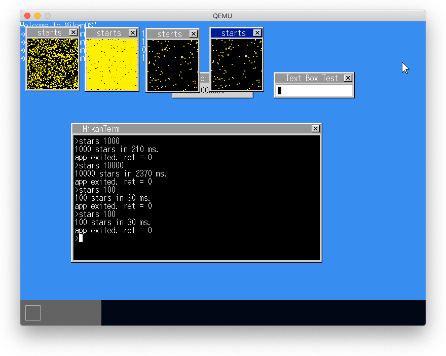
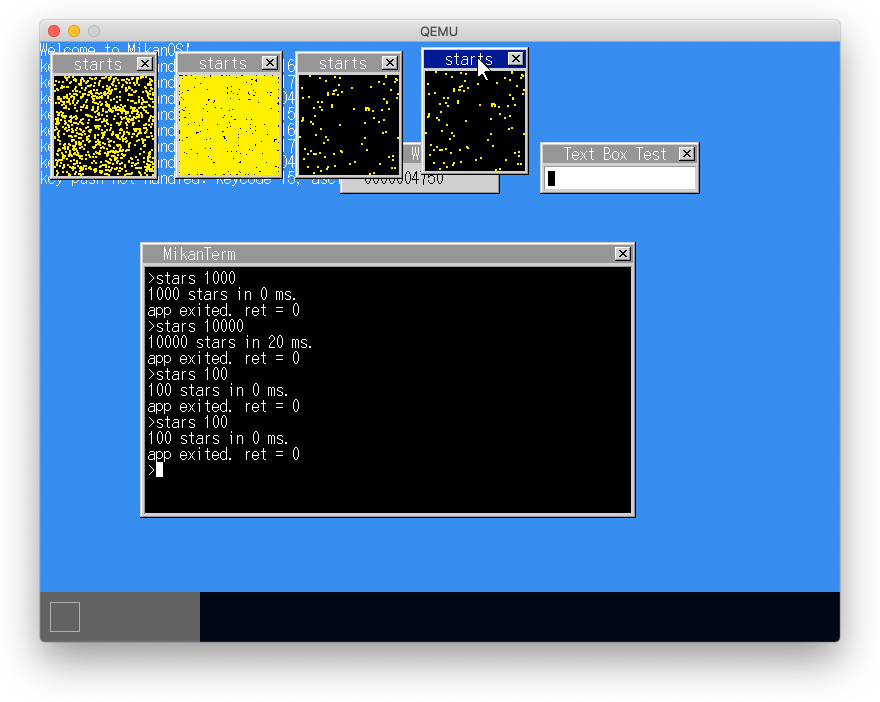
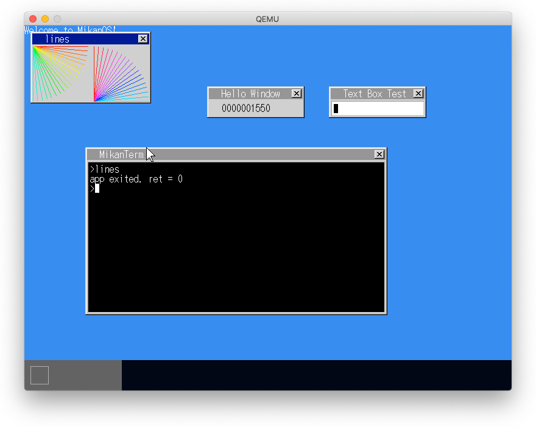
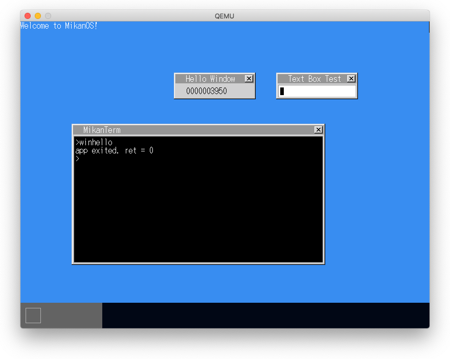

# 22.1 exit()

- newlib_support.c に `_exit(int)` を作成して
- アプリケーションからは`exit(int)`で終了する

# 22.2-3 点を描く

- rectangleを描くシステムコールを作成
- 時間を測定するためのCurrentTickを取得するシステムコールを作成

# 22.4 描画の最適化

- 描画用の汎用関数に描画の有無を示すフラグを設ける
- 再描画用のシステムコールを作成

## 100倍以上速度向上

# 22.5 線を描く

- 線を描くためのシステムコールを作成
- 画面に線を描くためのアルゴリズム

## パラメタを間違えた際の描画

# 22.6 キー入力によるウィンドウのクローズ

- 指定されたレイヤを削除すシステムコールを作成
- イベントを取得するシステムコールを作成
- タスクとレイヤのマッピングテーブルにウィンドウ情報を入れる
- システムコール実行時にOS用のスタックに入れ替える

