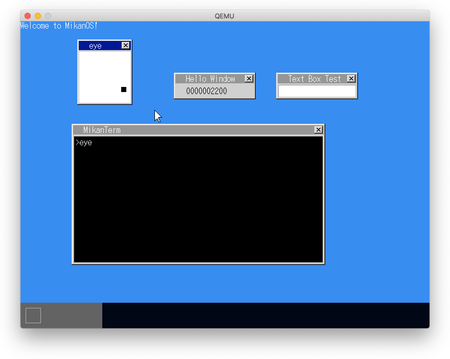
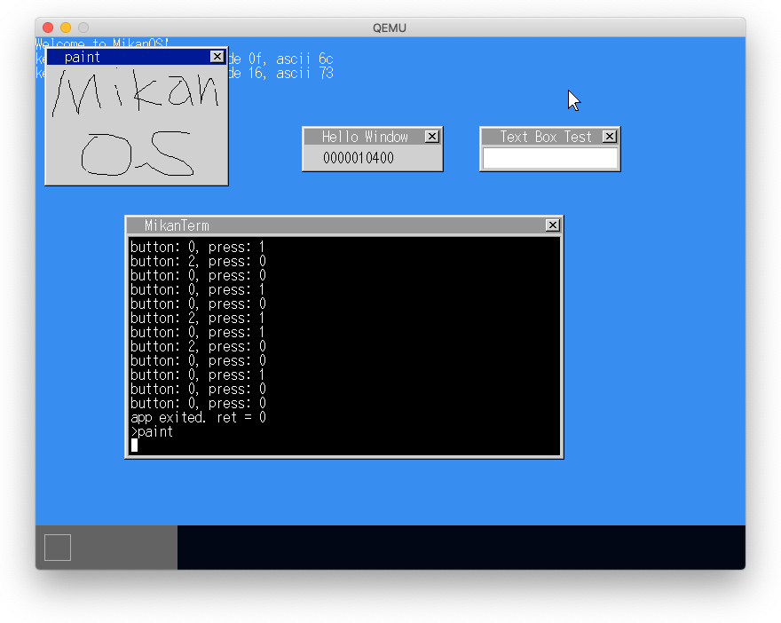
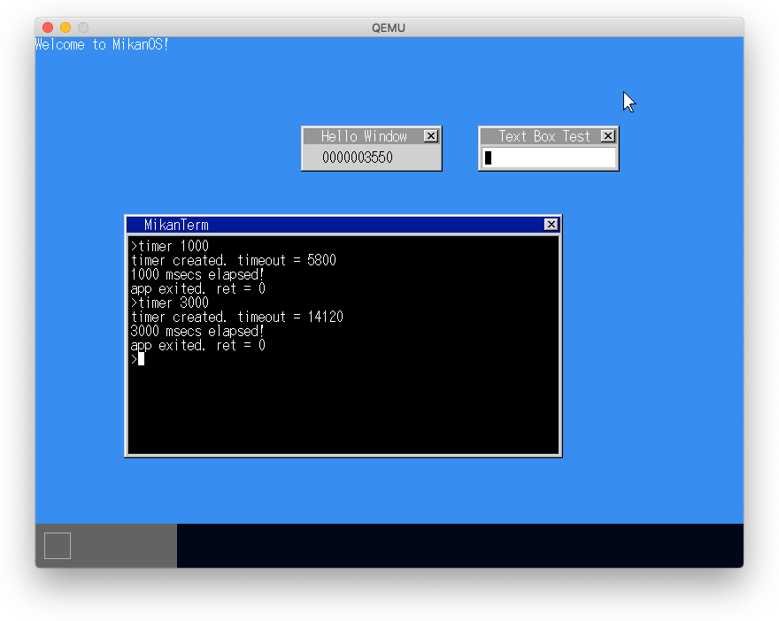
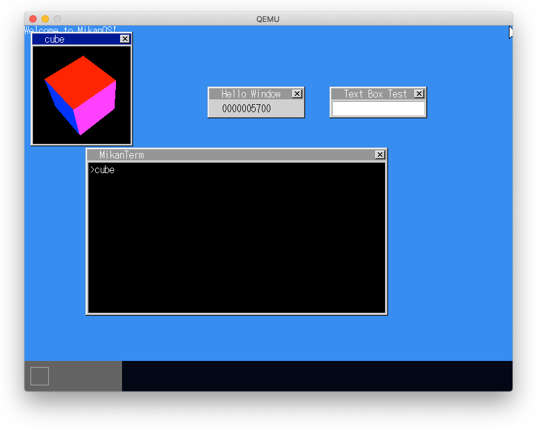
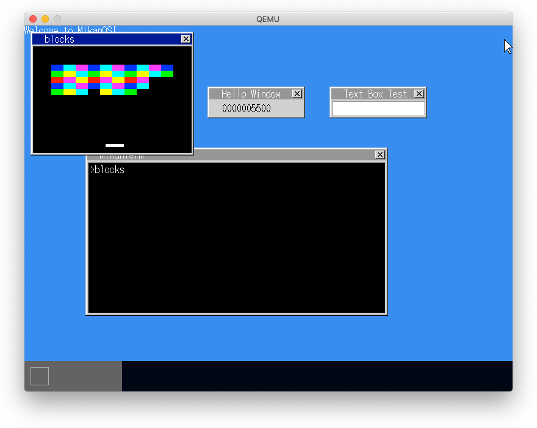

# 23.1 マウス入力

- マウス操作をアクティブウィンドウにイベントで通知



# 23.2 お絵かきソフト

- クリックしたままドラッグを検知して線画アプリを作成



# 23.3 タイマコマンド

- TimerクラスにタスクIDをもたせて、タイムアウトを送信できるようにする



# 23.4 アニメーション

- タイマを使ったアニメーション



# 23.5 ブロック崩し

- キー押下をイベントで通知できるようにする




# paint で線がひけない現象

```
(lldb) br set -f syscall.cpp -l 270
(lldb)
Process 1 stopped
* thread #1, stop reason = step in
    frame #0: 0x000000000011e67d kernel.elf`syscall::ReadEvent(arg1=18446744073709547440, arg2=1, arg3=<unavailable>, arg4=<unavailable>, arg5=<unavailable>, arg6=<unavailable>) at syscall.cpp:270:21
   267                      app_events[i].arg.mouse_button.y = msg->arg.mouse_button.y;
   268                      app_events[i].arg.mouse_button.press = msg->arg.mouse_button.press;
   269                      app_events[i].arg.mouse_button.button = msg->arg.mouse_button.button;
-> 270                      ++i;
   271                      break;
   272                  default:
   273                      Log(kInfo, "uncaught event type: %u\n", msg->type);
(lldb) p app_events[0]
(AppEvent) $0 = {
  type = kMouseMove     # <= おかしい。kMouseButtonでなければならない
  arg = {
    mouse_move = (x = 63, y = 41, dx = 1, dy = 0, buttons = '\0')
    mouse_button = (x = 63, y = 41, press = 1, button = 0)
  }
}
```

## app_events[i].type = AppEvent::kMouseButton; 行の書き忘れだった

```
(lldb) p app_events[0]
(AppEvent) $0 = {
  type = kMouseButton
  arg = {
    mouse_move = (x = 36, y = 46, dx = 1, dy = 0, buttons = '\0')
    mouse_button = (x = 36, y = 46, press = 1, button = 0)
  }
}
```
