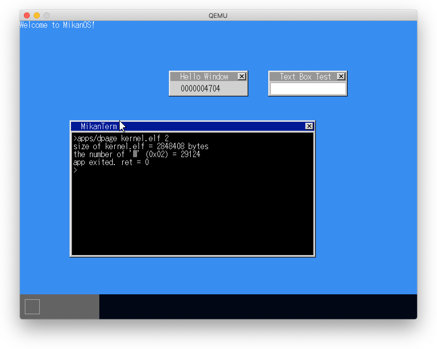
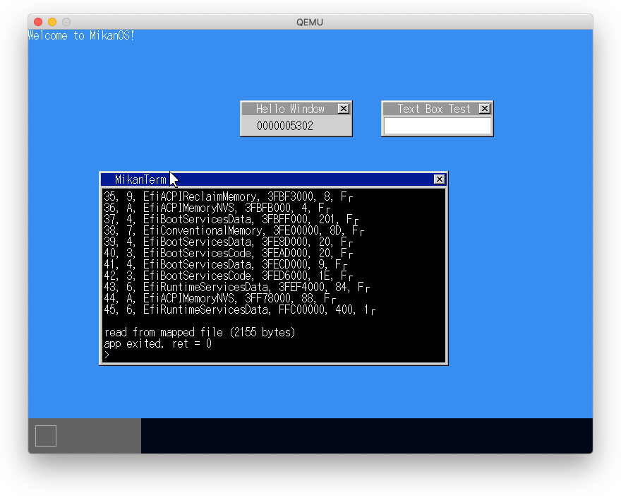
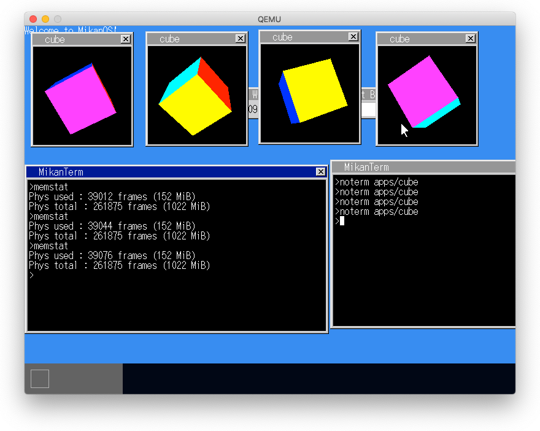
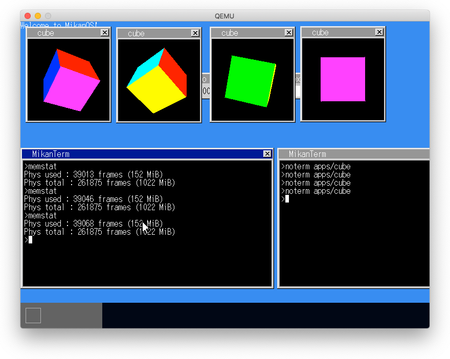

# 27.1 デマンドページング

1. すべてのページエントリのpresent=0とする
2. ページアクセスでページフォルト発生
3. ページフォルトの例外ハンドラでフレームを割り当てる
   - 例外ハンドラには例外理由を示すerror_code（表27.1）が渡される
   - CR2レジスタには原因となるメモリアドレスが記録されている
   - 予めデマンドページのアドレス範囲を指定し、範囲外はエラーとする
     - デマンドページングをsbrk()に適用
   - DemandPages()システムコールでデマンドページ用領域を拡大する
     - デマンドページ用の領域はELFファイルの直後（4KBアライン）からプラス方向に伸びる
4. ページフォルトの原因となった命令から再実行

# 27.2 メモリマップトファイル

1. ファイルのキャッシュを物理ページに作成し、アプリの仮想アドレス空間にマップする
2. アドレス単位にアクセスできるのでランダムアクセスに効果を発揮する
3. タスクにファイルマッピング構造体を持たせる
4. MapFile()システムコールでファイルマッピングを登録
    - メモリマップファイルはスタック上端からマイナス方向に伸びる
5. ページフォルト時にファイルをマップする

# 27.3 メモリ使用量を測る

# 27.4 コピーオンライト

1. 同一アプリを複数回実行する場合、各アプリが同一の物理アドレスを指すようにすれば良いが、データ領域はアプリごとに持つ必要がある。
2. ページを読み込み専用で作成することで、書き込み時にページフォルトを発生させ、その例外ハンドラでページを書き込み可能でコピーして利用する。
3. アプリのロード状態を表現するAppLoadInfo構造体を作成する。
4. DirectoryEntryをキーにAppLoadInfoを値とするマップでロード済みアプリを管理する。
5. アプリを実行する際、ロード済みであれば階層構造体をコピーする（読み込み専用となっている）。
6. 書き込みでページフォルトが発生したらそのページをコピーし、書き込み可能とする。
7. 書き込み可能でコピーをしたページはTLBをクリアする。

