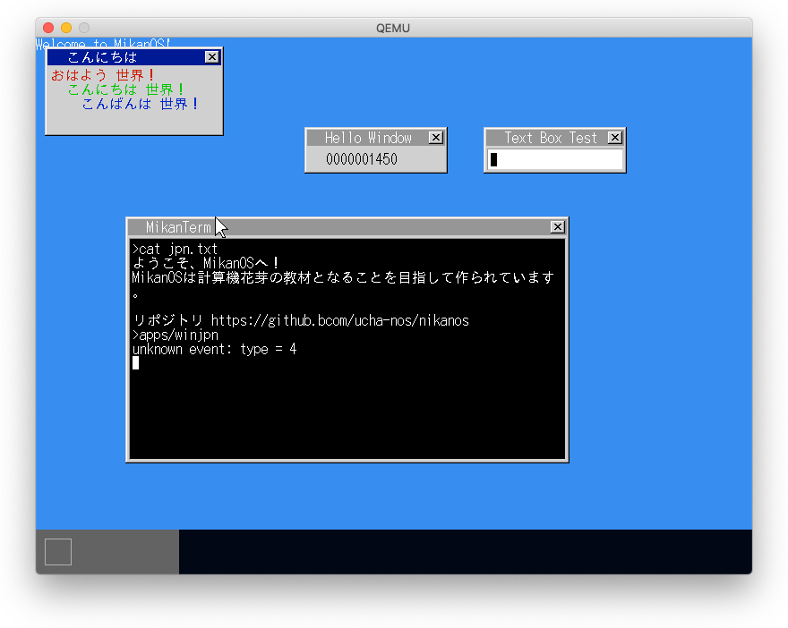
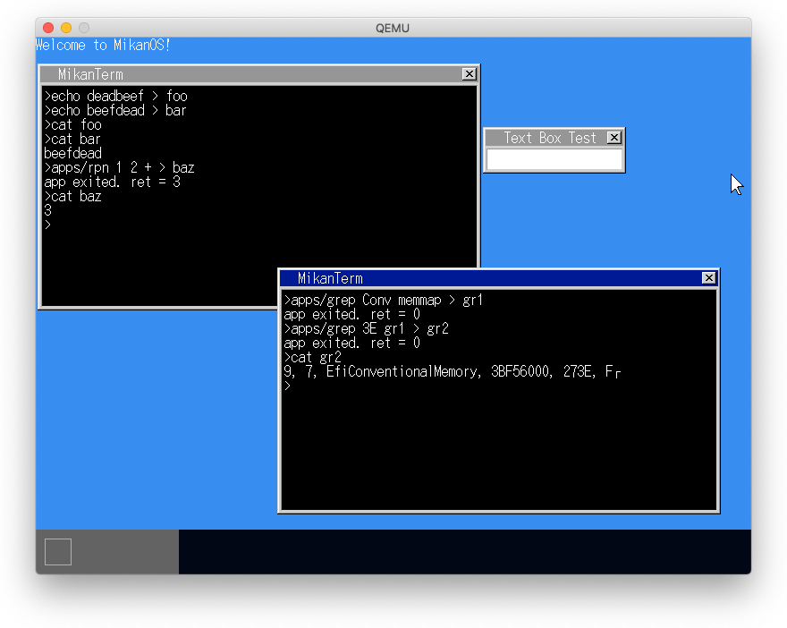
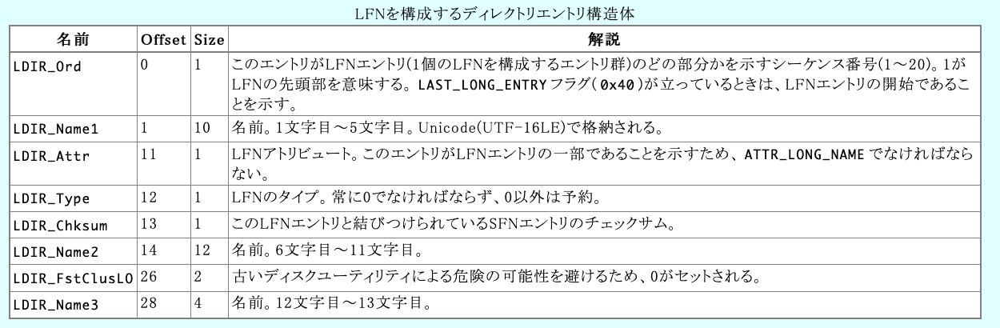
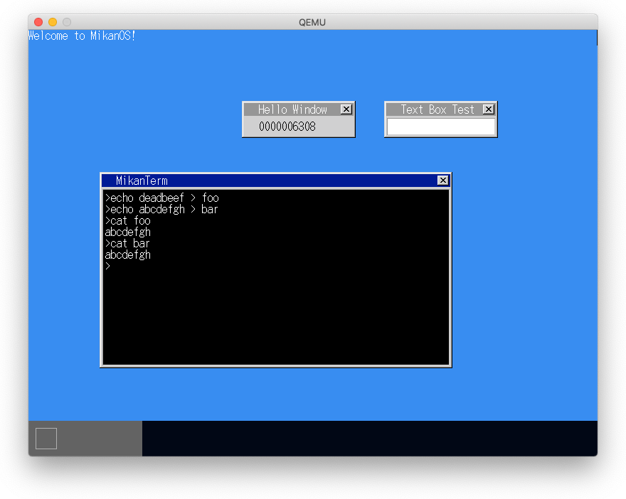

# 28.1, 28.2 日本語を表示する

- 文字コードにはUTF-8を使用する
- 内部的には0x7f以下はasciiとして、それ以上はchar32_tに変換して出力。
- FreeTypeを使用してTrueType日本語フォントを表示する。



# 28.3 リダイレクト

- ファイルに出力するためのPrintToFD()を作成する
- ターミナルにfiles[3]を持ち、stdin, stdout, stderrとする。
- コマンドラインで'>'で出力先を指定した場合、stdoutをそのファイルのfdで置き換える



## 最初のechoコマンドのリダイレクトファイルが表示されないのは26章と同じ問題。

# 最初のファイル作成がうまく行かない問題を解決する



<center>出典: [FAT長いファイル名の解説](http://elm-chan.org/docs/fat.html#lfn)</center>

```
(fat::DirectoryEntry) $3 = {
  name = {
    [0] = '\xe5'
    [1] = '.'                   # LDIR_Name1 ".fsev" UTF16LE
    [2] = '\0'
    [3] = 'f'
    [4] = '\0'
    [5] = 's'
    [6] = '\0'
    [7] = 'e'
    [8] = '\0'
    [9] = 'v'
    [10] = '\0'
  }
  attr = kLongName              # LDIR_Attr
  ntres = '\0'                  # LDIR_Type = 0
  create_time_tenth = '\xda'    # LDIR_Chksum
  create_time = 101             # Name[6] = 'e'
  create_date = 110             # Name[7] = 'n'
  last_access_date = 116        # Name[8] = 't'
  first_cluster_high = 115      # Name[9] = 's'
  write_time = 100              # Name[10] = 'd'
  write_date = 0                # Name[11] = '\0'
  first_cluster_low = 0         # DIR_FstClustL0 = 0
  file_size = 4294967295        # Name[12-13] = 0xffffffff
}
```

```
    struct DirectoryEntry {
        unsigned char   name[11];
        Attribute       attr;
        uint8_t         ntres;
        uint8_t         create_time_tenth;
        uint16_t        create_time;
        uint16_t        create_date;
        uint16_t        last_access_date;
        uint16_t        first_cluster_high;
        uint16_t        write_time;
        uint16_t        write_date;
        uint16_t        first_cluster_low;
        uint32_t        file_size;

        uint32_t FirstCluster() const
        {
            return first_cluster_low |
                (static_cast<uint32_t>(first_cluster_high) << 16);
        }
    } __attribute__((packed));
```

## 1. 空きエントリがkLongNameの場合は、フィールドをすべて0クリアしてから使用する。

**駄目**: kLongNameのエントリを使用したファイルはその短名のファイルのリンクになっている。エントリをゼロクリアしてもその効果は残っている。



## 2. 空きエントリがkLongNameの場合は、使用しない

**駄目**: 結果は変わらなかった。

### echo deadbeef > foo

```
(fat::DirectoryEntry) $1 = {
  name = {
    [0] = 'F'
    [1] = 'O'
    [2] = 'O'
    [3] = ' '
    [4] = ' '
    [5] = ' '
    [6] = ' '
    [7] = ' '
    [8] = ' '
    [9] = ' '
    [10] = ' '
  }
  attr = kArchive
  ntres = '\0'
  create_time_tenth = 'M'
  create_time = 19637
  create_date = 21159
  last_access_date = 21159
  first_cluster_high = 0
  write_time = 19637
  write_date = 21159
  first_cluster_low = 17
  file_size = 0
}

(lldb) fr v
(Terminal *) this = 0x00000000015eef20
(char *) command = 0x00000000015eef50 "cat"
(char *) first_arg = 0x00000000015eef54 "foo"
(char *) redir_char = 0x0000000000000000
(std::shared_ptr<FileDescriptor>) original_stdout = std::__1::shared_ptr<FileDescriptor>::element_type @ 0x00000000015ef088 {
  __ptr_ = 0x00000000015ef088
  __cntrl_ = 0x00000000015ef070
}
(std::pair<fat::DirectoryEntry *, bool>)  = {
  first = 0x000000003c824078
  second = false
}
(fat::FileDescriptor) fd = {
  fat_entry_ = 0x0000000001679fb8
  rd_off_ = 22993776
  rd_cluster_ = 23968784
  rd_cluster_off_ = 317827579982
  wr_off_ = 22993792
  wr_cluster_ = 1313322
  wr_cluster_off_ = 22912664
}
(char [5]) u8buf = "\U00000001"
```

### echo abcdefgh > bar

```
(fat::DirectoryEntry) $3 = {
  name = {
    [0] = 'B'
    [1] = 'A'
    [2] = 'R'
    [3] = ' '
    [4] = ' '
    [5] = ' '
    [6] = ' '
    [7] = ' '
    [8] = ' '
    [9] = ' '
    [10] = ' '
  }
  attr = kArchive
  ntres = '\0'
  create_time_tenth = '\0'
  create_time = 0
  create_date = 0
  last_access_date = 0
  first_cluster_high = 0
  write_time = 0
  write_date = 0
  first_cluster_low = 0
  file_size = 0
}

(lldb) fr v
(Terminal *) this = 0x00000000015eef20
(char *) command = 0x00000000015eef50 "cat"
(char *) first_arg = 0x00000000015eef54 "bar"
(char *) redir_char = 0x0000000000000000
(std::shared_ptr<FileDescriptor>) original_stdout = std::__1::shared_ptr<FileDescriptor>::element_type @ 0x00000000015ef088 {
  __ptr_ = 0x00000000015ef088
  __cntrl_ = 0x00000000015ef070
}
(std::pair<fat::DirectoryEntry *, bool>)  = {
  first = 0x000000003c824178
  second = false
}
(fat::FileDescriptor) fd = {
  fat_entry_ = 0x00000000016897b8
  rd_off_ = 22993776
  rd_cluster_ = 23968784
  rd_cluster_off_ = 455266533454
  wr_off_ = 22993792
  wr_cluster_ = 1313322
  wr_cluster_off_ = 22913040
}
(char [5]) u8buf = "\U00000001"
```

## 3. 空きエントリのname[0]=0xe5場合は、フィールドをすべて0クリアしてから使用する。

うまく行った模様。


### echo deadbeef > foo

```
(fat::DirectoryEntry) $0 = {        # 再利用前のエントリ
  name = {
    [0] = '\xe5'
    [1] = '.'
    [2] = '\0'
    [3] = 'f'
    [4] = '\0'
    [5] = 's'
    [6] = '\0'
    [7] = 'e'
    [8] = '\0'
    [9] = 'v'
    [10] = '\0'
  }
  attr = kLongName
  ntres = '\0'
  create_time_tenth = '\xda'
  create_time = 101
  create_date = 110
  last_access_date = 116
  first_cluster_high = 115
  write_time = 100
  write_date = 0
  first_cluster_low = 0
  file_size = 4294967295
}

(fat::DirectoryEntry) $1 = {        # 再利用後のエントリ
  name = {
    [0] = 'F'
    [1] = 'O'
    [2] = 'O'
    [3] = ' '
    [4] = ' '
    [5] = ' '
    [6] = ' '
    [7] = ' '
    [8] = ' '
    [9] = ' '
    [10] = ' '
  }
  attr = kArchive
  ntres = '\0'
  create_time_tenth = '\0'
  create_time = 0
  create_date = 0
  last_access_date = 0
  first_cluster_high = 0
  write_time = 0
  write_date = 0
  first_cluster_low = 0
  file_size = 0
}

(lldb) fr v                                 # cat foo時の各変数値
(Terminal *) this = 0x00000000015eef20
(char *) command = 0x00000000015eef50 "cat"
(char *) first_arg = 0x00000000015eef54 "foo"
(char *) redir_char = 0x0000000000000000
(std::shared_ptr<FileDescriptor>) original_stdout = std::__1::shared_ptr<FileDescriptor>::element_type @ 0x00000000015ef088 {
  __ptr_ = 0x00000000015ef088
  __cntrl_ = 0x00000000015ef070
}
(std::pair<fat::DirectoryEntry *, bool>)  = {
  first = 0x000000003c824058
  second = false
}
(fat::FileDescriptor) fd = {
  fat_entry_ = 0x0000000001679fb8
  rd_off_ = 22993776
  rd_cluster_ = 23968784
  rd_cluster_off_ = 317827579982
  wr_off_ = 22993792
  wr_cluster_ = 1313322
  wr_cluster_off_ = 22912648
}
(char [5]) u8buf = "\U00000001"
```

### echo abcdefg > bar

```
(fat::DirectoryEntry) $2 = {        # 再利用前のエントリ
  name = {
    [0] = '\xe5'
    [1] = 'S'
    [2] = 'E'
    [3] = 'V'
    [4] = 'E'
    [5] = 'N'
    [6] = '~'
    [7] = '1'
    [8] = ' '
    [9] = ' '
    [10] = ' '
  }
  attr = kHidden | kDirectory
  ntres = '\0'
  create_time_tenth = '|'
  create_time = 20135
  create_date = 21159
  last_access_date = 21159
  first_cluster_high = 0
  write_time = 20135
  write_date = 21159
  first_cluster_low = 17
  file_size = 0
}

(fat::DirectoryEntry) $3 = {        # 再利用後のエントリ
  name = {
    [0] = 'B'
    [1] = 'A'
    [2] = 'R'
    [3] = ' '
    [4] = ' '
    [5] = ' '
    [6] = ' '
    [7] = ' '
    [8] = ' '
    [9] = ' '
    [10] = ' '
  }
  attr = kArchive
  ntres = '\0'
  create_time_tenth = '\0'
  create_time = 0
  create_date = 0
  last_access_date = 0
  first_cluster_high = 0
  write_time = 0
  write_date = 0
  first_cluster_low = 0
  file_size = 0
}

(lldb) fr v                                 # cat foo時の各変数値
(Terminal *) this = 0x00000000015eef20
(char *) command = 0x00000000015eef50 "cat"
(char *) first_arg = 0x00000000015eef54 "bar"
(char *) redir_char = 0x0000000000000000
(std::shared_ptr<FileDescriptor>) original_stdout = std::__1::shared_ptr<FileDescriptor>::element_type @ 0x00000000015ef088 {
  __ptr_ = 0x00000000015ef088
  __cntrl_ = 0x00000000015ef070
}
(std::pair<fat::DirectoryEntry *, bool>)  = {
  first = 0x000000003c824078
  second = false
}
(fat::FileDescriptor) fd = {
  fat_entry_ = 0x00000000016897b8       #
  rd_off_ = 22993776
  rd_cluster_ = 23968784
  rd_cluster_off_ = 455266533454
  wr_off_ = 22993792
  wr_cluster_ = 1313322
  wr_cluster_off_ = 22912968
}
(char [5]) u8buf = "\U00000001"
```
