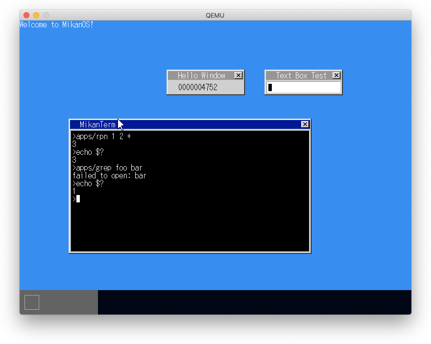
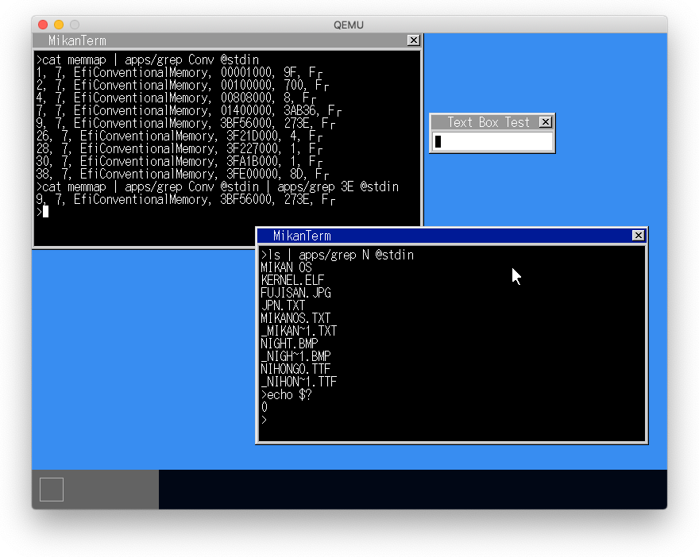

# 29.1 終了コード

- ターミナルクラスに終了コードを表す変数を作成
- `echo $?`で終了コードを表示（一般的な$変数を定義するわけではない。echo時の$?を特別扱いするだけ）

# 29.2 パイプ

1. TerminalDescriptor構造体がstdin, stdout, stderrを持つ
2. FileDescriptorの子クラスであるPipeDescriptorクラスを作成
3. コマンドラインに'|'があったら、
   - 右側のコマンドのために新規タスクを作成し、これに紐づくPipeDescriptorを作成してstdinとする。
   - オリジナルタスク（左側のコマンド用）のstdoutをこのPipeDescriptorとする。
4. PipeDescriptorのRead, WriteはkPipeメッセージとしてデータを送受信することで実装。

**fork & dup**という方式ではない。

# 29.3 ターミナルの起動と終了

- TerminalDescriptor構造体にコマンド実行後に終了するか否かのフラグを持たせる。
- TaskTerminalクラスがTerminalDecriptorを受け取り、このフラグが真の時、タスクを終了させる。
- TaskクラスもTerminalDescriptorを初期データとして受け取り、stdin, stdout, stderrを設定する。

# 29.4 タスクの終了

- TaskManagerクラスに終了したタスクと、そのタスクの終了を待つタスクを表す配列を持つ。
- 終了するタスク（右側）はランキューとタスクキューから自分を削除し、終了タスク配列に登録し、自分を待っているタスクを起床させる。
- 終了を待つタスク（左側）は終了待機配列に登録し、終了を待つ。起床させられたら終了タスク配列を見て、終了コードを取得する。

